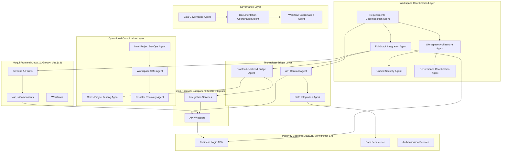

# Workspace-Level Agent Structure Design

## Overview

The Workspace-Level Agent Structure System is a comprehensive framework that coordinates development across the entire Durion ecosystem, including:

- **durion-positivity-backend**: Spring Boot 3.x microservices (Java 21) for business logic, APIs, and data persistence
- **durion-moqui-frontend**: Moqui Framework 3.x (Java 11) with Vue.js 3 frontend for user interfaces and workflows

The workspace agent structure operates as a strategic coordination layer above project-specific agents, providing unified guidance for full-stack concerns while delegating backend-specific tasks to durion-positivity-backend agents and frontend-specific tasks to moqui agents. **Critically, the workspace agents are responsible for analyzing complete business requirement design documents and intelligently splitting the implementation between the moqui frontend (UI/screens/user interaction) and the durion-positivity-backend (business logic/APIs/data persistence).**

### Core Responsibilities

1. **Business Requirements Decomposition**: Analyze comprehensive business requirement documents and decompose them into:
   - **Moqui Frontend Responsibilities**: Screens, forms, user workflows, UI components, Vue.js state management
   - **Positivity Backend Responsibilities**: Business logic, REST APIs, data models, database persistence, service orchestration
   - **Integration Points**: durion-positivity component APIs, authentication flows, data contracts

2. **Cross-Project Coordination**: Ensure seamless integration between moqui frontend and durion-positivity-backend through:
   - API contract management and synchronization
   - Authentication and authorization coordination (JWT, Moqui security)
   - Data flow orchestration and consistency validation
   - Deployment and release coordination

3. **Technology Stack Bridging**: Manage the impedance mismatch between:
   - Java 21 (durion-positivity-backend) ↔ Java 11 (moqui) ↔ Groovy (moqui services)
   - Spring Boot 3.x ↔ Moqui Framework 3.x patterns
   - PostgreSQL (durion-positivity-backend) ↔ PostgreSQL/MySQL (moqui) database coordination
   - Docker deployment (both) with different container configurations

**Key Design Principles:**

- **Requirements-First**: All business requirements are analyzed and split before implementation begins
- **Separation of Concerns**: Clear boundaries between presentation (moqui) and business logic (durion-positivity-backend)
- **Performance-First**: All agent responses must be delivered within 5 seconds for 95% of requests
- **High Availability**: System must maintain 99.9% uptime during business hours
- **Security-by-Design**: All cross-project communications use JWT tokens with secure integration patterns
- **Scalability**: System must handle 100 concurrent requests and 50% workspace growth
- **Disaster Recovery**: RTO of 4 hours and RPO of 1 hour for business continuity
- **Code Generation Standards**: All code generation and implementation must use Java 21 as the target version for compatibility with the durion-positivity-backend system
- **Agent Implementation Location**: All agent framework implementation classes are located in `durion/workspace-agents/src/main/java/`, and test classes in `durion/workspace-agents/src/test/java/`

## Requirements Fulfillment Mapping

This design directly fulfills the requirements specified in requirements.md:

### REQ-WS-001: Requirements Decomposition Agent
**Acceptance Criteria Fulfillment:**
- WHEN a complete business requirement design document is provided, THE Requirements Decomposition Agent SHALL analyze the document AND correctly identify moqui frontend responsibilities within 30 seconds with 95% accuracy
- WHEN analyzing business requirements, THE Requirements Decomposition Agent SHALL correctly identify durion-positivity-backend responsibilities within 30 seconds with 98% accuracy  
- WHEN decomposing requirements, THE Requirements Decomposition Agent SHALL define clear API contracts between durion-positivity-backend and durion-positivity component AND generate OpenAPI specifications with 100% completeness for all identified integration points
- WHEN requirements involve cross-cutting concerns, THE Requirements Decomposition Agent SHALL identify durion-positivity integration points AND ensure no business logic leaks into frontend with 100% architectural boundary enforcement
- WHEN generating implementation roadmaps, THE Requirements Decomposition Agent SHALL create coordinated implementation plans with clear handoff points between backend and frontend teams AND provide dependency sequencing with 90% accuracy

### REQ-WS-002: Unified Agent Structure
**Acceptance Criteria Fulfillment:**
- WHEN a developer requests architectural guidance for a cross-project feature, THE workspace agent system SHALL provide guidance that references both durion-positivity-backend Spring Boot patterns AND durion-moqui-frontend frontend patterns within 30 seconds
- WHEN an API contract changes in durion-positivity-backend, THE workspace agent system SHALL automatically validate compatibility with durion-positivity component AND durion-moqui-frontend frontend consumers AND generate migration guidance within 5 minutes if breaking changes are detected
- WHEN integrating authentication between projects, THE workspace agent system SHALL enforce JWT token format consistency across Spring Boot, durion-positivity component, AND Moqui implementations with 100% accuracy
- WHEN dependency version conflicts are detected across Java 21 (durion-positivity-backend), Java 11 (moqui), and Groovy (durion-positivity) stacks, THE workspace agent system SHALL prevent deployment AND provide specific remediation steps within 2 minutes
- WHEN architectural changes affect multiple projects, THE workspace agent system SHALL notify all affected project teams within 1 hour AND coordinate change implementation across durion-positivity-backend, durion-positivity component, AND moqui frontend

### REQ-WS-003: Integrated Development Guidance
**Acceptance Criteria Fulfillment:**
- WHEN a developer requests feature implementation guidance based on decomposed requirements, THE workspace agent system SHALL provide coordinated guidance for durion-positivity-backend services, durion-positivity integration, AND durion-moqui-frontend frontend components within 10 seconds
- All code generation and implementation uses Java 21 as the target version for compatibility with the durion-positivity-backend system
- Agent framework implementation and test classes are located in durion/workspace-agents/src/main/java/ and durion/workspace-agents/src/test/java/

## Architecture

### High-Level Architecture



The workspace agent architecture is organized into four primary layers plus a critical requirements layer:

### 0. Requirements Decomposition Layer (NEW)

- **Requirements Decomposition Agent**: Analyzes complete business requirement documents and intelligently splits responsibilities between moqui frontend and durion-positivity-backend, defining clear API contracts and integration points

### 1. Workspace Coordination Layer

- **Full-Stack Integration Agent**: Coordinates between durion-positivity-backend and moqui frontend throughout implementation
- **Workspace Architecture Agent**: Maintains architectural consistency across backend and frontend while respecting technology differences
- **Unified Security Agent**: Ensures consistent security patterns across Spring Boot JWT, Moqui security, and durion-positivity integration
- **Performance Coordination Agent**: Manages performance optimization across all projects and integration points

### 2. Technology Bridge Layer

- **API Contract Agent**: Manages API contracts between durion-positivity-backend services and durion-positivity component consumed by moqui frontend
- **Data Integration Agent**: Coordinates data flow, governance, and synchronization between durion-positivity-backend PostgreSQL and moqui PostgreSQL/MySQL
- **Frontend-Backend Bridge Agent**: Specializes in Moqui-to-Spring Boot integration patterns through durion-positivity component

### 3. Operational Coordination Layer

- **Multi-Project DevOps Agent**: Coordinates Docker deployment and infrastructure across durion-positivity-backend (Java 21) and moqui (Java 11) stacks
- **Workspace SRE Agent**: Provides unified observability and monitoring across Spring Boot, Moqui, and Vue.js layers
- **Cross-Project Testing Agent**: Orchestrates testing strategies using Spock (durion-positivity-backend), Spock (moqui Groovy), and Jest (Vue.js)
- **Disaster Recovery Agent**: Manages business continuity and disaster recovery coordination across both projects

### 4. Governance and Compliance Layer

- **Data Governance Agent**: Ensures data compliance and governance across durion-positivity-backend and moqui database boundaries
- **Documentation Coordination Agent**: Maintains synchronized documentation across Spring Boot APIs, Moqui entities/services, and Vue.js components
- **Workflow Coordination Agent**: Manages project management workflows and cross-project dependencies

## Components and Interfaces

### Workspace Agent Hierarchy

```yaml
WorkspaceAgentHierarchy:
  requirements_decomposition_layer:
    - requirements_decomposition_agent  # NEW: Splits business requirements between frontend and backend
    
  workspace_coordination_layer:
    - full_stack_integration_agent
    - workspace_architecture_agent
    - unified_security_agent
    - performance_coordination_agent
    
  technology_bridge_layer:
    - api_contract_agent
    - data_integration_agent
    - frontend_backend_bridge_agent
    
  operational_coordination_layer:
    - multi_project_devops_agent
    - workspace_sre_agent
    - cross_project_testing_agent
    - disaster_recovery_agent
    
  governance_compliance_layer:
    - data_governance_agent
    - documentation_coordination_agent
    - workflow_coordination_agent
    
  performance_requirements:
    response_time: "5 seconds for 95% of requests"
    availability: "99.9% during business hours"
    concurrent_users: 100
    scalability: "50% workspace growth without degradation"
    
  backend_layer:
    durion-positivity-backend:
      stack: "Java 21, Spring Boot 3.x, PostgreSQL"
      agents:
        - spring_boot_developer_agent
        - api_gateway_agent
        - data_access_agent
        - jpa_entity_agent
        - rest_api_agent
        - security_agent
        - sre_agent
        - spock_testing_agent
      responsibilities:
        - business_logic
        - rest_apis
        - data_persistence
        - service_orchestration
        - validation_rules
        - authentication_services
        
  frontend_layer:
    moqui:
      stack: "Java 11, Moqui Framework 3.x, Groovy, Vue.js 3, TypeScript 5.x"
      agents:
        - moqui_framework_agent
        - architecture_agent
        - vue_agent
        - domain_agent
        - experience_layer_agent
        - frontend_agent
        - security_agent
        - testing_agent
        - spock_testing_agent  # Groovy/Moqui backend
        - jest_testing_agent   # Vue.js frontend
      responsibilities:
        - screens_and_forms
        - user_workflows
        - vue_components
        - state_management
        - user_interactions
        - ui_validation
        
  integration_layer:
    durion_positivity:
      component: "Moqui component for durion-positivity-backend integration"
      language: "Groovy"
      agents:
        - integration_agent
        - api_wrapper_agent
      responsibilities:
        - api_wrapping
        - dto_mapping
        - error_handling
        - jwt_token_management
        - retry_logic

  orchestration_layer:
    story_orchestration_system:
      description: "Coordinates cross-repository story sequencing and minimizes stub creation across siloed agents"
      agents:
        - issue_analysis_agent
      artifacts:
        - path: "durion/.github/orchestration/story-sequence.md"
          purpose: "Global story ordering and dependency model across frontend and backend"
        - path: "durion/.github/orchestration/frontend-coordination.md"
          purpose: "Frontend-centric view of which stories are ready, blocked, or parallel"
        - path: "durion/.github/orchestration/backend-coordination.md"
          purpose: "Backend-centric view prioritized by how many frontend stories each backend story unblocks"
      responsibilities:
        - read_open_story_issues_from_durion
        - classify_stories_as_backend_first_frontend_first_or_parallel
        - maintain_global_story_sequence_and_dependencies
        - update_frontend_and_backend_coordination_views
        - prevent_unnecessary_stub_creation_by_enforcing_story_ordering
```

### Story Orchestration Design (REQ-WS-015  REQ-WS-018)

The Story Orchestration System extends the workspace architecture to coordinate how work is selected and executed across the durion-positivity-backend and durion-moqui-frontend projects while keeping all agents siloed. It is responsible for reading open [STORY] issues in the durion workspace, building a global dependency model, and publishing orchestration documents that frontend and backend agents must consume before they choose work.

#### Core Components

- **Issue Analysis Agent** (workspace-agents): Periodically or via webhook, reads all open [STORY] issues in the durion repository, extracts dependencies, and classifies each story as Backend-First, Frontend-First, or Parallel.
- **Story Orchestration Engine**: Applies deterministic ordering rules (topological sort with stable tie-breaking) to produce a global story sequence and maintain dependency integrity.
- **Orchestration Artifacts** (stored in `durion/.github/orchestration/`):
  - `story-sequence.md`: Canonical list of stories, their orchestration IDs, dependency graph, classification, and target sprint or milestone.
  - `frontend-coordination.md`: Frontend-centric projection that lists ready, blocked, and parallel frontend stories, including explicit stub usage rules where absolutely necessary.
  - `backend-coordination.md`: Backend-centric projection that orders backend stories by the number of frontend stories they unblock and documents required API or contract details.

These components collectively satisfy REQ-WS-015 through REQ-WS-018 by ensuring that story sequencing, coordination views, and cross-document consistency are generated and maintained automatically.

#### Execution Flow

1. **Issue Ingestion (REQ-WS-015)**  
  The Issue Analysis Agent reads all open [STORY] issues in the durion repository, normalizes metadata (labels, epic links, dependencies), and builds an in-memory graph of story relationships.

2. **Classification and Sequencing (REQ-WS-015)**  
  Each story is classified as Backend-First, Frontend-First, or Parallel based on its description, required contracts, and presence of existing APIs. The orchestration engine then computes a global sequence that respects prerequisites and avoids circular dependencies; any cycles are flagged for human escalation.

3. **Artifact Projection (REQ-WS-016, REQ-WS-017)**  
  From the global sequence, the system derives:
  - A frontend view (`frontend-coordination.md`) highlighting which frontend stories are ready to start, which are blocked on backend work, and which can proceed in parallel with backend implementation.
  - A backend view (`backend-coordination.md`) ordering backend stories by their unblock potential for frontend work and documenting required endpoints, payloads, and error semantics.

4. **Siloed Agent Consumption (REQ-WS-016, REQ-WS-017)**  
  - **Frontend agents** (operating in moqui_example) treat the frontend coordination document as the sole source of truth for story readiness and are prohibited from starting blocked stories unless a stub strategy is explicitly documented.
  - **Backend agents** (operating in positivity) use the backend coordination document to prioritize Backend-First stories and high-unblock-value backend work, without relying on direct communication with frontend.

5. **Synchronization and Drift Detection (REQ-WS-018)**  
  The orchestration system enforces consistency across `story-sequence.md`, `frontend-coordination.md`, and `backend-coordination.md` by:
  - Ensuring that each referenced story exists in the global sequence.
  - Verifying that classification, dependencies, and status are aligned across views.
  - Recomputing projections whenever story metadata changes (status, labels, dependencies) and capturing changes in a small change log section in each document.

This design ensures that workspace agents can coordinate story execution across multiple repositories, minimize stub creation, and maintain a single, authoritative orchestration model that frontend and backend agents can follow independently.

### Agent Specifications

#### 0. Requirements Decomposition Agent (NEW - CRITICAL)

**Purpose**: Analyzes complete business requirement design documents and intelligently decomposes them into moqui frontend and durion-positivity-backend implementation specifications

**Capabilities**:

- **Requirements Analysis**: Parses and understands complete business requirement documents with user stories, acceptance criteria, and domain logic
- **Frontend Responsibility Identification**: Identifies UI concerns (screens, forms, workflows, user interactions, Vue.js state management) with 95% accuracy within 30 seconds
- **Backend Responsibility Identification**: Identifies business logic concerns (domain models, APIs, data persistence, service orchestration, validation rules) with 98% accuracy within 30 seconds
- **Integration Point Definition**: Defines API contracts, authentication flows, and data synchronization points through durion-positivity component with 100% completeness
- **Technology Stack Mapping**: Maps requirements to appropriate technology patterns:
  - Moqui entities, services, screens, and transitions
  - Spring Boot REST APIs, JPA entities, service layers
  - Vue.js 3 Composition API components and Pinia state management
- **Dependency Analysis**: Identifies cross-project dependencies and sequencing requirements with 90% accuracy
- **API Contract Generation**: Generates OpenAPI specifications for durion-positivity-backend APIs consumed by durion-positivity component
- **Implementation Roadmap**: Creates coordinated implementation plans with clear handoff points

**Performance Requirements**:
- Analysis completion: within 30 seconds
- Frontend identification accuracy: 95%
- Backend identification accuracy: 98%
- Integration point completeness: 100%
- Implementation roadmap accuracy: 90%

**Example Decomposition**:

```yaml
BusinessRequirement: "Create customer vehicle service history tracking"

DecomposedRequirements:
  durion-positivity-backend:
    domain_models:
      - Customer entity (JPA, PostgreSQL)
      - Vehicle entity with customer relationship
      - ServiceHistory entity with vehicle relationship
    rest_apis:
      - POST /api/v1/customers
      - GET /api/v1/customers/{id}/vehicles
      - POST /api/v1/vehicles/{id}/service-history
      - GET /api/v1/vehicles/{id}/service-history
    business_logic:
      - Vehicle validation rules
      - Service history audit trail
      - Customer notification service
    
  moqui_frontend:
    screens:
      - Customer search/list screen
      - Customer detail form with vehicle tab
      - Vehicle service history screen
    vue_components:
      - CustomerSearchComponent (TypeScript)
      - VehicleServiceHistoryTable (TypeScript)
      - ServiceHistoryForm (TypeScript)
    workflows:
      - Customer lookup → Vehicle selection → Service history entry
    
  integration_points:
    durion_positivity_component:
      services:
        - CustomerService.groovy (wraps durion-positivity-backend customer APIs)
        - VehicleService.groovy (wraps durion-positivity-backend vehicle APIs)
        - ServiceHistoryService.groovy (wraps durion-positivity-backend service APIs)
      api_contracts:
        - CustomerDTO, VehicleDTO, ServiceHistoryDTO
        - Error handling and validation responses
        - Authentication via JWT tokens
```

**Integration Points**:

- Feeds requirements to Full-Stack Integration Agent for implementation coordination
- Provides API contracts to API Contract Agent for specification management
- Works with Workspace Architecture Agent to ensure architectural consistency
- Coordinates with Documentation Coordination Agent for requirements traceability

#### 1. Full-Stack Integration Agent

**Purpose**: Orchestrates development workflows that span backend and frontend layers based on decomposed requirements

**Capabilities**:

- Coordinates feature development between durion-positivity-backend services and moqui frontend based on requirements decomposition
- Manages backend-frontend dependencies and integration points through durion-positivity component
- Provides guidance for API versioning and backward compatibility between Spring Boot 3.x and Moqui Framework 3.x
- Orchestrates release coordination between Java 21 backend and Java 11 frontend deployments
- Handles integration testing scenarios that span the full stack (Spock + Jest)
- Ensures proper use of durion-positivity component as integration layer

**Performance Requirements**:
- Coordinated guidance delivery: within 10 seconds

**Integration Points**:

- Receives decomposed requirements from Requirements Decomposition Agent
- Coordinates with backend agents (durion-positivity-backend Spring Boot) and frontend agents (moqui Groovy/Vue.js)
- Works with API Contract Agent for durion-positivity interface definitions
- Collaborates with Multi-Project DevOps Agent for coordinated Docker deployments

#### 2. Workspace Architecture Agent

**Purpose**: Maintains architectural consistency and governance across backend and frontend layers, ensuring decomposed requirements align with architectural principles

**Capabilities**:

- Defines workspace-wide architectural patterns and principles for both Spring Boot and Moqui frameworks
- Ensures consistency between Spring Boot 3.x microservices (Java 21, durion-positivity-backend) and Moqui Framework 3.x (Java 11, Groovy, Vue.js 3)
- Validates requirements decomposition against established architectural boundaries
- Manages technology stack decisions and integration patterns through durion-positivity component
- Provides guidance for system boundaries and layer interactions (presentation vs business logic)
- Coordinates architectural evolution across Java 21 backend and Java 11/Groovy/TypeScript frontend
- Ensures proper separation of concerns between Moqui entities/screens and durion-positivity-backend domain models/APIs

**Performance Requirements**:
- Cross-project architectural guidance delivery: within 30 seconds
- Dependency version conflict detection and remediation: within 2 minutes across Java 21, Java 11, and Groovy stacks
- Affected project team notifications for architectural changes: within 1 hour

**Architectural Patterns Enforced**:

- **Presentation Layer (Moqui)**: Screens, forms, Vue.js components, user workflows, UI validation only
- **Integration Layer (durion-positivity)**: API wrappers, DTO mapping, authentication, error handling
- **Business Logic Layer (Durion-Positivity-Backend)**: Domain models, business rules, data persistence, REST APIs, service orchestration
- **Data Layer (Durion-Positivity-Backend)**: JPA entities, repositories, database schemas, data validation

**Integration Points**:

- Validates requirements decomposition from Requirements Decomposition Agent
- Provides architectural guidance to backend and frontend architecture agents
- Works with Full-Stack Integration Agent for system design coordination
- Coordinates with Unified Security Agent for security architecture across Java 21 and Java 11 stacks
- Ensures durion-positivity component follows proper integration patterns

#### 3. Unified Security Agent

**Purpose**: Ensures consistent security practices across backend and frontend layers

**Capabilities**:

- Coordinates authentication strategies between durion-positivity-backend Spring Boot JWT and durion-moqui-frontend frontend auth
- Manages full-stack authorization and role-based access control
- Provides guidance for secure API integration between backend services and frontend
- Coordinates secrets management across AWS (durion-positivity-backend) and frontend deployment environments
- Ensures security compliance across both technology stacks

**Performance Requirements**:
- JWT token format consistency enforcement: 100% accuracy across Spring Boot, durion-positivity component, and Moqui implementations

**Integration Points**:

- Coordinates with backend security agents (durion-positivity-backend) and frontend security agents (durion-moqui-frontend)
- Works with API Contract Agent for secure API design
- Collaborates with Full-Stack DevOps Agent for secure deployment

#### 4. API Contract Agent

**Purpose**: Manages API contracts and integration interfaces between durion-positivity-backend and moqui frontend through durion-positivity component

**Capabilities**:

- Defines and maintains OpenAPI 3.0 specifications for durion-positivity-backend REST APIs consumed by durion-positivity component
- Generates Groovy service interfaces in durion-positivity component from durion-positivity-backend API contracts
- Manages API versioning strategies ensuring backward compatibility across Spring Boot 3.x (durion-positivity-backend) and Moqui 3.x integration
- Coordinates DTO mappings between:
  - Spring Boot JPA entities (durion-positivity-backend)
  - Groovy service DTOs (durion-positivity component)
  - Moqui entities (moqui frontend screens)
- Ensures contract testing between durion-positivity-backend REST APIs and durion-positivity Groovy wrappers
- Validates that decomposed requirements produce consistent API contracts

**Performance Requirements**:
- API contract compatibility validation and migration guidance: within 5 minutes for breaking changes

**API Contract Lifecycle**:

1. **Requirements Phase**: Requirements Decomposition Agent identifies API needs
2. **Design Phase**: API Contract Agent generates OpenAPI specifications for durion-positivity-backend APIs
3. **Implementation Phase**: Durion-Positivity-Backend implements REST APIs, durion-positivity implements Groovy wrappers
4. **Testing Phase**: Contract tests validate durion-positivity-backend APIs match specifications and durion-positivity wrappers consume correctly
5. **Evolution Phase**: API versioning ensures backward compatibility for moqui frontend

**Integration Points**:

- Receives API requirements from Requirements Decomposition Agent
- Works with durion-positivity-backend REST API agents for Spring Boot contract definition
- Coordinates with durion-positivity integration agents for Groovy wrapper generation
- Collaborates with Cross-Project Testing Agent for contract validation using Pact/Spring Cloud Contract
- Provides API specifications to Documentation Coordination Agent

#### 5. Data Integration Agent

**Purpose**: Coordinates data flow and synchronization between different systems

**Capabilities**:

- Manages data synchronization between durion-positivity-backend DynamoDB, moqui databases, and frontend state
- Provides guidance for event-driven data integration using SNS/SQS
- Coordinates data consistency patterns across different technology stacks
- Manages data transformation and mapping between systems
- Provides guidance for data migration and schema evolution across projects

**Integration Points**:

- Coordinates with project-level data access agents
- Works with Cross-Project Integration Agent for data workflows
- Collaborates with Workspace SRE Agent for data monitoring

#### 6. Frontend-Backend Bridge Agent

**Purpose**: Specializes in Moqui-to-Spring Boot integration patterns through durion-positivity component

**Capabilities**:

- **Integration Architecture**: Provides guidance for three-tier integration:
  1. Moqui screens/Vue.js → durion-positivity Groovy services → durion-positivity-backend Spring Boot REST APIs
- **State Management**: Coordinates between:
  - Vue.js 3 Pinia state (frontend reactive state)
  - Moqui entity cache (Moqui framework caching)
  - durion-positivity API wrappers (integration layer)
  - Durion-Positivity-Backend REST APIs (authoritative data source)
- **Authentication Flows**: Coordinates JWT token management:
  - Durion-Positivity-Backend issues JWT tokens (Spring Security)
  - durion-positivity manages token lifecycle in Groovy services
  - Moqui security validates tokens for screen access
  - Vue.js components use tokens for API calls
- **Error Handling**: Provides multi-layer error handling patterns:
  - Durion-Positivity-Backend API errors (HTTP status codes, error DTOs)
  - durion-positivity Groovy error wrapping (Moqui service responses)
  - Moqui screen error display (user-friendly messages)
  - Vue.js component error states (reactive error handling)
- **Caching Strategy**: Coordinates caching across layers:
  - Durion-Positivity-Backend API response caching (Spring Cache)
  - durion-positivity wrapper caching (Moqui entity cache)
  - Vue.js component-level caching (computed properties, Pinia)
- **Data Synchronization**: Manages data consistency patterns:
  - Optimistic UI updates in Vue.js
  - Background data refresh through durion-positivity
  - Conflict resolution strategies
  - Eventual consistency handling

**Integration Patterns**:

```groovy
// durion-positivity Groovy Service Example
class CustomerService {
    // Wraps durion-positivity-backend API
    Map getCustomer(String customerId) {
        // JWT token from Moqui session
        String token = ec.user.getJwtToken()
        
        // Call durion-positivity-backend REST API
        def response = restClient.get("/api/v1/customers/${customerId}") {
            header('Authorization', "Bearer ${token}")
        }
        
        // Map to Moqui-friendly format
        return [
            customerId: response.id,
            customerName: response.name,
            // ... DTO mapping
        ]
    }
}
```

```typescript
// Vue.js Component Example
import { useCustomerStore } from '@/stores/customer'

export default defineComponent({
  setup() {
    const customerStore = useCustomerStore()
    
    // Calls Moqui screen transition → durion-positivity service → durion-positivity-backend API
    const loadCustomer = async (customerId: string) => {
      await customerStore.fetchCustomer(customerId)
    }
    
    return { loadCustomer, customer: customerStore.customer }
  }
})
```

**Integration Points**:

- Receives integration requirements from Requirements Decomposition Agent
- Works with moqui Vue.js agents and durion-positivity-backend REST API agents
- Coordinates with Unified Security Agent for JWT auth flows across Java 11 and Java 21 stacks
- Collaborates with API Contract Agent for durion-positivity interface definitions
- Provides integration patterns to Testing Agent for end-to-end test scenarios

#### 7. Multi-Project DevOps Agent

**Purpose**: Coordinates deployment and infrastructure across all projects

**Capabilities**:

- Orchestrates CI/CD pipelines that span multiple projects and technology stacks
- Coordinates deployment strategies for Spring Boot services, Moqui applications, and frontend apps
- Manages infrastructure as code across AWS Fargate (durion-positivity-backend) and other deployment targets
- Provides guidance for blue-green deployments and canary releases across projects
- Coordinates disaster recovery and backup strategies

**Integration Points**:

- Coordinates with project-level DevOps agents
- Works with Workspace SRE Agent for monitoring and alerting
- Collaborates with Cross-Project Testing Agent for deployment validation

#### 8. Workspace SRE Agent

**Purpose**: Provides unified observability and reliability engineering across all projects

**Capabilities**:

- Coordinates OpenTelemetry instrumentation across Spring Boot, Moqui, and frontend applications
- Manages unified Grafana dashboards that span multiple projects and technology stacks
- Provides cross-project alerting and incident response procedures
- Coordinates performance monitoring and optimization across all systems
- Manages distributed tracing across project boundaries

**Integration Points**:

- Coordinates with project-level SRE agents for unified observability
- Works with Multi-Project DevOps Agent for infrastructure monitoring
- Collaborates with Cross-Project Testing Agent for performance testing

#### 10. Performance Coordination Agent

**Purpose**: Manages performance optimization and monitoring across all projects

**Capabilities**:

- Analyzes performance across durion-positivity-backend microservices, durion-moqui-frontend frontend, and network boundaries
- Coordinates caching strategies between frontend and backend systems
- Provides unified performance dashboards and alerting
- Manages auto-scaling coordination across different deployment environments
- Delivers performance optimization recommendations within 10 minutes

**Performance Requirements**:

- Performance bottleneck identification: 5 minutes maximum
- Cache consistency: <1% stale data occurrence
- Performance alert response: 30 seconds maximum
- Service availability during scaling: >99.9%

**Integration Points**:

- Works with Workspace SRE Agent for monitoring integration
- Coordinates with Multi-Project DevOps Agent for scaling decisions
- Collaborates with API Contract Agent for API performance optimization

#### 11. Data Governance Agent

**Purpose**: Ensures data compliance and governance across all project boundaries

**Capabilities**:

- Enforces consistent data governance policies across durion-positivity-backend and durion-moqui-frontend
- Coordinates schema migrations across all affected projects
- Manages data classification and access control policies
- Provides complete audit trails for cross-project data access
- Coordinates data lifecycle management and retention policies

**Performance Requirements**:

- Policy violation detection: 100% accuracy
- Schema migration coordination: zero data inconsistencies
- Audit trail completeness: 100% coverage
- Data quality issue identification: 15 minutes maximum

**Integration Points**:

- Works with Unified Security Agent for data access control
- Coordinates with Data Integration Agent for data flow management
- Collaborates with Cross-Project Testing Agent for data validation

#### 12. Disaster Recovery Agent

**Purpose**: Manages business continuity and disaster recovery coordination

**Capabilities**:

- Coordinates disaster recovery procedures across all projects
- Ensures data consistency during backup and recovery operations
- Manages service failover between primary and secondary environments
- Validates recovery procedures and identifies recovery gaps
- Ensures data integrity validation after disaster recovery

**Performance Requirements**:

- Recovery Time Objective (RTO): 4 hours maximum
- Recovery Point Objective (RPO): 1 hour maximum
- Service availability during failover: >95%
- Recovery procedure validation: 90% accuracy
- Data integrity validation: zero corruption tolerance

**Integration Points**:

- Coordinates with Multi-Project DevOps Agent for infrastructure recovery
- Works with Data Integration Agent for data consistency
- Collaborates with Unified Security Agent for secure recovery procedures

#### 13. Documentation Coordination Agent

**Purpose**: Maintains synchronized documentation across all projects

**Capabilities**:

- Automatically synchronizes documentation between projects
- Generates unified API documentation from multiple sources
- Updates system-wide architectural diagrams when projects change
- Propagates documentation changes across all affected projects
- Provides personalized getting-started guides based on user roles

**Performance Requirements**:

- Documentation synchronization: 100% consistency
- API documentation update latency: <24 hours
- Architectural diagram accuracy: 95%
- Documentation change propagation: 2 hours maximum
- Getting-started guide delivery: 30 seconds maximum

**Integration Points**:

- Works with API Contract Agent for API documentation
- Coordinates with Workspace Architecture Agent for architectural docs
- Collaborates with all agents for comprehensive documentation coverage

#### 14. Workflow Coordination Agent

**Purpose**: Manages project management workflows and cross-project dependencies

**Capabilities**:

- Generates coordinated development plans for cross-project features
- Enforces semantic versioning consistency across all projects
- Provides real-time visibility into cross-project dependencies
- Identifies and prioritizes technical debt affecting multiple projects
- Provides personalized onboarding guidance for new developers

**Performance Requirements**:

- Development plan accuracy: within 10% effort variance
- Version compatibility enforcement: 100% accuracy
- Dependency blocker identification: 1 hour maximum
- Technical debt prioritization: 90% accuracy
- Onboarding guidance delivery: 15 minutes maximum

**Integration Points**:

- Coordinates with Full-Stack Integration Agent for feature planning
- Works with Multi-Project DevOps Agent for release coordination
- Collaborates with Documentation Coordination Agent for onboarding materials

#### 9. Cross-Project Testing Agent

**Purpose**: Orchestrates testing strategies that span multiple projects

**Capabilities**:

- Coordinates end-to-end testing scenarios across durion-positivity-backend, durion-moqui-frontend, and frontend projects
- Manages contract testing between different projects and API boundaries
- Provides guidance for integration testing across technology stacks
- Coordinates performance testing that spans multiple systems
- Manages test data and environment coordination across projects

**Integration Points**:

- Coordinates with project-level testing agents
- Works with API Contract Agent for contract validation
- Collaborates with Workspace SRE Agent for test observability

## Data Models

### Requirements Decomposition Model

```yaml
RequirementsDecomposition:
  business_requirement:
    id: "REQ-2024-001"
    title: "Customer Vehicle Service History Tracking"
    description: "Enable service advisors to view and manage complete service history..."
    acceptance_criteria:
      - "Service advisor can search for customer by phone or name"
      - "Service advisor can view all vehicles for a customer"
      - "Service advisor can view service history for each vehicle"
      - "Service advisor can add new service records"
      
  decomposed_implementation:
    durion-positivity-backend:
      domain_models:
        - entity: Customer
          fields: [id, name, phone, email, address]
          persistence: PostgreSQL
          jpa_annotations: true
        - entity: Vehicle
          fields: [id, customerId, vin, make, model, year, licensePlate]
          relationships: [ManyToOne: Customer]
        - entity: ServiceHistory
          fields: [id, vehicleId, serviceDate, description, mileage, cost]
          relationships: [ManyToOne: Vehicle]
          
      rest_apis:
        - endpoint: POST /api/v1/customers
          request: CustomerCreateRequest
          response: CustomerResponse
          auth: JWT required
        - endpoint: GET /api/v1/customers/search
          params: [phone, name]
          response: List<CustomerSummary>
        - endpoint: GET /api/v1/customers/{id}/vehicles
          response: List<VehicleResponse>
        - endpoint: POST /api/v1/vehicles/{id}/service-history
          request: ServiceHistoryCreateRequest
          response: ServiceHistoryResponse
          
      business_logic:
        - CustomerService: Customer CRUD operations, search, validation
        - VehicleService: Vehicle management, VIN validation
        - ServiceHistoryService: Service record management, audit trail
        
    moqui_frontend:
      screens:
        - path: /durion/crm/CustomerSearch
          purpose: Search and list customers
          widgets: [search-form, results-grid]
        - path: /durion/crm/CustomerDetail
          purpose: View/edit customer with vehicle tab
          widgets: [customer-form, vehicle-list-section]
        - path: /durion/crm/VehicleServiceHistory
          purpose: View and add service history
          widgets: [service-history-grid, add-service-form]
          
      vue_components:
        - CustomerSearchComponent.vue
          props: [searchCriteria]
          emits: [customer-selected]
          state: [searchResults, loading, error]
        - VehicleServiceHistoryTable.vue
          props: [vehicleId]
          state: [serviceRecords, loading]
        - ServiceHistoryForm.vue
          props: [vehicleId]
          emits: [service-added]
          validation: [date, mileage, cost]
          
      workflows:
        - CustomerLookupWorkflow:
          steps: [search → select → view-details → select-vehicle → view-service-history]
          
    durion_positivity_integration:
      groovy_services:
        - CustomerService.groovy
          methods:
            - searchCustomers(phone, name) → calls GET /api/v1/customers/search
            - getCustomerVehicles(customerId) → calls GET /api/v1/customers/{id}/vehicles
        - ServiceHistoryService.groovy
          methods:
            - getVehicleServiceHistory(vehicleId) → calls GET /api/v1/vehicles/{id}/service-history
            - addServiceRecord(vehicleId, serviceData) → calls POST /api/v1/vehicles/{id}/service-history
            
      dto_mappings:
        - CustomerResponse (durion-positivity-backend) → Customer entity (moqui)
        - VehicleResponse (durion-positivity-backend) → Vehicle entity (moqui)
        - ServiceHistoryResponse (durion-positivity-backend) → ServiceHistory entity (moqui)
        
      authentication:
        - JWT token obtained from durion-positivity-backend /auth/login
        - Token stored in Moqui session
        - Token included in all durion-positivity API calls
        
  implementation_sequence:
    - phase: 1_backend_foundation
      tasks:
        - Create JPA entities in durion-positivity-backend
        - Implement Spring Boot services
        - Implement REST APIs with OpenAPI specs
        - Write Spock tests for business logic
        
    - phase: 2_integration_layer
      tasks:
        - Create durion-positivity Groovy services
        - Implement API wrappers with error handling
        - Implement DTO mappings
        - Write contract tests (Pact/Spring Cloud Contract)
        
    - phase: 3_frontend_implementation
      tasks:
        - Create Moqui screens and forms
        - Implement Vue.js components with TypeScript
        - Implement Pinia stores for state management
        - Write Jest tests for components
        
    - phase: 4_integration_testing
      tasks:
        - End-to-end tests spanning all layers
        - Performance testing
        - Security testing (JWT flows)
```

### Cross-Project Integration Registry

```yaml
CrossProjectIntegrationRegistry:
  projects:
    - id: durion-positivity-backend
      type: spring_boot_microservices
      stack:
        language: Java 21
        framework: Spring Boot 3.x
        database: PostgreSQL
        testing: Spock Framework
      apis: 
        - customer-service
        - vehicle-service
        - inventory-service
        - pricing-service
        - accounting-service
      deployment: docker_containers
      
    - id: moqui
      type: moqui_framework
      stack:
        language: Java 11 / Groovy
        framework: Moqui Framework 3.x
        frontend: Vue.js 3 + TypeScript 5.x
        database: PostgreSQL / MySQL
        testing: Spock Framework (backend) + Jest (frontend)
      apis:
        - durion_positivity_integration
        - moqui_rest_api
        - moqui_services
      deployment: docker_containers
      
    - id: durion_positivity
      type: moqui_component
      language: Groovy
      purpose: integration_layer
      provides:
        - api_wrappers_for_durion-positivity-backend
        - dto_mappings
        - jwt_token_management
        - error_handling
      deployment: embedded_in_moqui
      
  integrations:
    - source: moqui_screens
      target: durion_positivity_component
      type: service_calls
      authentication: moqui_session
      
    - source: durion_positivity_component
      target: durion-positivity-backend_rest_apis
      type: http_rest
      authentication: jwt_bearer_token
      
    - source: moqui_vue_components
      target: moqui_screen_transitions
      type: ajax_calls
      authentication: moqui_session
```

### API Contract Registry

```yaml
APIContractRegistry:
  contracts:
    - id: pos_catalog_api
      provider: durion-positivity-backend.pos-catalog
      consumers: [frontend_apps, durion-moqui-frontend]
      version: v1
      specification: openapi_3_0
      
    - id: pos_order_api
      provider: durion-positivity-backend.pos-order
      consumers: [frontend_apps]
      version: v1
      specification: openapi_3_0
      
    - id: moqui_integration_api
      provider: durion-moqui-frontend
      consumers: [durion-positivity-backend.pos-accounting]
      version: v1
      specification: rest_json
```

### Performance Monitoring Registry

```yaml
PerformanceMonitoringRegistry:
  response_time_targets:
    agent_guidance_requests: "5 seconds (95th percentile)"
    api_contract_validation: "5 minutes"
    deployment_coordination: "15 minutes"
    performance_analysis: "5 minutes"
    security_validation: "2 minutes"
    
  availability_targets:
    workspace_agent_system: "99.9% (business hours)"
    cross_project_coordination: "99.9%"
    disaster_recovery_capability: "95% (during failover)"
    
  scalability_requirements:
    concurrent_users: 100
    workspace_growth_tolerance: "50% without degradation"
    project_count_scaling: "linear performance"

### Data Governance Registry
```yaml
DataGovernanceRegistry:
  governance_policies:
    - policy_id: cross_project_data_sharing
      enforcement: "100% accuracy"
      scope: [durion-positivity-backend, durion-moqui-frontend]
      validation_frequency: "real_time"
      
    - policy_id: schema_migration_coordination
      enforcement: "zero data inconsistencies"
      scope: [all_projects]
      coordination_time: "immediate"
      
    - policy_id: sensitive_data_access
      enforcement: "complete audit trails"
      scope: [all_projects]
      logging: "100% coverage"
      
  data_quality_requirements:
    issue_identification_time: "15 minutes"
    remediation_coordination: "cross_project"
    consistency_maintenance: "<1% error rate"

### Disaster Recovery Registry
```yaml
DisasterRecoveryRegistry:
  recovery_objectives:
    rto: "4 hours"
    rpo: "1 hour"
    availability_during_failover: ">95%"
    
  recovery_procedures:
    - procedure: coordinate_service_failover
      scope: [durion-positivity-backend_aws_fargate, moqui_deployment]
      validation_accuracy: "90%"
      
    - procedure: ensure_data_consistency
      scope: [all_project_databases]
      corruption_tolerance: "zero"
      
    - procedure: validate_recovery_procedures
      frequency: "regular_testing"
      gap_identification: "90% accuracy"
      
  backup_coordination:
    frequency: "every_4_hours"
    consistency_validation: "cross_project"
    restoration_testing: "automated"
```

### Deployment Coordination Matrix

```yaml
DeploymentCoordinationMatrix:
  environments:
    - name: development
      projects:
        durion-positivity-backend: local_containers
        durion-moqui-frontend: local_gradle
        frontend_apps: local_dev_server
        
    - name: staging
      projects:
        durion-positivity-backend: aws_fargate_staging
        durion-moqui-frontend: staging_server
        frontend_apps: staging_cdn
        
    - name: production
      projects:
        durion-positivity-backend: aws_fargate_production
        durion-moqui-frontend: production_cluster
        frontend_apps: production_cdn
        
  coordination_rules:
    - trigger: durion-positivity-backend_api_change
      actions: [update_frontend_contracts, notify_durion-moqui-frontend_integration]
    - trigger: moqui_schema_change
      actions: [update_durion-positivity_integration, validate_data_sync]
```

## Correctness Properties

*A property is a characteristic or behavior that should hold true across all valid executions of a system-essentially, a formal statement about what the system should do. Properties serve as the bridge between human-readable specifications and machine-verifiable correctness guarantees.*

Based on the prework analysis, the following correctness properties have been identified to validate the workspace agent structure implementation:

### Property Reflection

After reviewing all properties identified in the prework, several areas of redundancy were identified:

- Properties about "having specialized agents" (examples) can be consolidated into agent registry validation
- Properties about "consistency across technology stacks" can be combined where they cover similar validation patterns
- Properties about "coordination" can be unified under cross-project coordination validation

### Core Properties

**Property 0: Requirements decomposition correctness**
*For any* complete business requirement design document, the Requirements Decomposition Agent should correctly identify and separate:
- Moqui frontend responsibilities (screens, forms, workflows, Vue.js components, UI state management)
- Positivity backend responsibilities (business logic, REST APIs, domain models, data persistence, service orchestration)
- durion-positivity integration points (API wrappers, DTO mappings, authentication flows)
- API contracts with complete request/response specifications
*Such that* no business logic leaks into frontend and no UI concerns leak into backend
**Validates: NEW requirement - Requirements decomposition accuracy and architectural boundary enforcement**

**Property 1: Cross-project architectural consistency**
*For any* architectural decision that affects multiple projects, agents should ensure consistency across Spring Boot 3.x (Java 21), Moqui Framework 3.x (Java 11/Groovy), and Vue.js 3 (TypeScript 5.x) technology stacks while respecting project-specific constraints and JVM version differences
**Validates: Requirements 1.2, 2.3, 6.4**

**Property 2: API contract synchronization**
*For any* API change in durion-positivity-backend, agents should ensure that:
- OpenAPI specifications are updated
- durion-positivity Groovy wrappers are regenerated or updated
- Moqui frontend screens consuming the API are notified and validated
- Contract tests validate compatibility across the integration chain (durion-positivity-backend → durion-positivity → moqui)
**Validates: Requirements 2.2, 4.2**

**Property 3: Cross-project integration guidance completeness**
*For any* integration scenario between different projects, agents should provide guidance that covers API contracts, authentication flows, and data synchronization for all technology combinations
**Validates: Requirements 1.3, 2.4, 3.2**

**Property 4: Dependency conflict prevention**
*For any* dependency change across projects, agents should detect and prevent version conflicts and ensure compatibility across the entire workspace ecosystem
**Validates: Requirements 1.4, 5.2**

**Property 5: Unified security pattern enforcement**
*For any* security implementation, agents should ensure consistent JWT patterns across Spring Boot, Moqui security, and frontend authentication while maintaining technology-specific optimizations
**Validates: Requirements 6.2, 6.3, 6.5**

**Property 6: Cross-project change coordination**
*For any* change that affects multiple projects, agents should coordinate updates, notifications, and validations across all affected systems and technology stacks
**Validates: Requirements 1.5, 7.4, 5.3**

**Property 7: Multi-technology observability unification**
*For any* monitoring or observability implementation, agents should provide unified views and alerting across Spring Boot microservices, Moqui applications, and frontend applications
**Validates: Requirements 3.4, 8.3**

**Property 8: End-to-end testing coordination**
*For any* testing scenario that spans multiple projects, agents should provide guidance that covers all technology boundaries and integration points
**Validates: Requirements 4.3, 4.4, 4.5**

**Property 9: Deployment coordination across environments**
*For any* deployment operation, agents should coordinate deployment sequences, dependency management, and validation across all projects and their respective deployment targets
**Validates: Requirements 3.3, 5.2, 8.4**

**Property 10: Performance optimization coordination**
*For any* performance optimization, agents should analyze and coordinate improvements across all technology stacks, network boundaries, and caching strategies
**Validates: Requirements 8.2, 8.5**

**Property 11: System performance requirements compliance**
*For any* agent guidance request, the workspace agent system should respond within 5 seconds for 95% of requests and maintain 99.9% availability during business hours
**Validates: Requirements 9.1, 9.2**

**Property 12: Scalability maintenance under growth**
*For any* workspace growth up to 50% in project count, the workspace agent system should maintain the same response time performance without degradation
**Validates: Requirements 9.3, 9.4**

**Property 13: Data governance policy enforcement**
*For any* data sharing between projects, agents should enforce consistent data governance policies and detect policy violations with 100% accuracy
**Validates: Requirements 10.1, 10.3**

**Property 14: Schema migration coordination**
*For any* database schema evolution in any project, agents should coordinate migrations across all affected projects and prevent data inconsistencies
**Validates: Requirements 10.2, 10.4**

**Property 15: Disaster recovery coordination**
*For any* disaster recovery event, agents should coordinate recovery procedures across all projects and achieve RTO of 4 hours and RPO of 1 hour
**Validates: Requirements 11.1, 11.2**

**Property 16: Service failover coordination**
*For any* failover initiation, agents should coordinate service failover between primary and secondary environments and maintain service availability above 95% during transition
**Validates: Requirements 11.3, 11.4**

## Error Handling

### Cross-Project Communication Failures

- **Project Unavailability**: When external projects (durion-moqui-frontend) are unavailable, agents should gracefully degrade and provide guidance based on cached contracts and known patterns
- **Version Mismatches**: When projects have incompatible versions, agents should detect conflicts and provide migration guidance
- **Contract Violations**: When API contracts are violated, agents should provide clear error messages and remediation steps

### Technology Stack Conflicts

- **Framework Incompatibilities**: When different frameworks have conflicting requirements, agents should provide alternative integration patterns
- **Security Policy Conflicts**: When different projects have conflicting security requirements, agents should escalate to unified security agent for resolution
- **Deployment Environment Conflicts**: When deployment requirements conflict, agents should provide environment-specific guidance

### Integration Point Failures

- **API Gateway Failures**: When API gateways are unavailable, agents should provide fallback integration patterns
- **Authentication Service Failures**: When auth services fail, agents should provide graceful degradation strategies
- **Data Synchronization Failures**: When data sync fails, agents should provide consistency recovery procedures

### Performance and Scalability Failures

- **Response Time Degradation**: When agent response times exceed 5 seconds, the system should identify bottlenecks and provide optimization recommendations within 10 minutes
- **Availability Issues**: When system availability drops below 99.9%, agents should trigger automated recovery procedures and maintain service continuity
- **Scalability Limits**: When concurrent user load exceeds 100 users, the system should implement load balancing and scaling strategies
- **Workspace Growth Issues**: When workspace growth exceeds 50%, agents should optimize resource allocation and maintain performance

### Data Governance and Compliance Failures

- **Policy Violations**: When data governance policies are violated, agents should immediately block the operation and provide remediation guidance
- **Schema Migration Failures**: When schema migrations fail, agents should rollback changes and coordinate recovery across all affected projects
- **Audit Trail Gaps**: When audit trails are incomplete, agents should identify missing data and implement corrective measures
- **Data Quality Issues**: When data quality problems are detected, agents should coordinate remediation within 15 minutes

### Disaster Recovery Failures

- **Recovery Time Objective Breach**: When RTO exceeds 4 hours, agents should escalate to emergency procedures and provide alternative recovery paths
- **Recovery Point Objective Breach**: When RPO exceeds 1 hour, agents should assess data loss impact and coordinate data reconstruction
- **Failover Failures**: When service failover fails, agents should implement manual failover procedures and maintain minimum service levels
- **Data Integrity Issues**: When data corruption is detected during recovery, agents should isolate affected systems and prevent further corruption

## Testing Strategy

### Dual Testing Approach

The workspace agent structure will be validated using both unit testing and property-based testing approaches:

**Unit Testing**:

- Specific cross-project integration scenarios with known expected outcomes
- Agent coordination workflows for common multi-project tasks
- Error handling for project unavailability and version conflicts
- Contract validation and synchronization mechanisms

**Property-Based Testing**:

- Universal properties that should hold across all cross-project interactions
- Consistency validation across different technology stacks
- Integration pattern enforcement across random project combinations
- Security pattern compliance across all project boundaries

**Property-Based Testing Framework**:
The implementation will use **QuickCheck for Java** (or **jqwik**) as the property-based testing library, configured to run a minimum of 100 iterations per property test.

**Property Test Tagging**:
Each property-based test will be tagged with comments explicitly referencing the correctness property from this design document using the format: `**Feature: workspace-agent-structure, Property {number}: {property_text}**`

### Cross-Project Testing Strategy

**Integration Testing**:

- Test agent coordination between durion-positivity-backend and durion-moqui-frontend projects
- Validate API contract synchronization across technology boundaries
- Test deployment coordination across different environments
- Verify security pattern consistency across all projects

**Contract Testing**:

- Validate API contracts between durion-positivity-backend services and external consumers
- Test contract evolution and backward compatibility
- Verify contract enforcement across technology stacks
- Test contract violation detection and remediation

**End-to-End Testing**:

- Test complete workflows that span multiple projects
- Validate data flow across project boundaries
- Test authentication flows across different technology stacks
- Verify performance optimization across the entire ecosystem

### Validation Criteria

**Cross-Project Consistency**:

- All agents provide consistent guidance across technology stacks
- Architectural decisions maintain consistency while respecting project constraints
- Security patterns are uniform across all project boundaries
- Documentation is synchronized and accessible across all projects

**Integration Reliability**:

- API contracts are automatically synchronized across projects
- Changes in one project trigger appropriate updates in dependent projects
- Error handling gracefully manages cross-project failures
- Performance optimization considers the entire ecosystem

**Operational Excellence**:

- Deployment coordination ensures zero-downtime updates
- Monitoring provides unified visibility across all projects
- Incident response covers cross-project scenarios
- Scaling decisions are coordinated across all components

**Performance and Scalability**:

- Agent response times meet 5-second target for 95% of requests
- System maintains 99.9% availability during business hours
- Concurrent user capacity supports 100 simultaneous users
- Workspace growth tolerance handles 50% expansion without degradation

**Data Governance and Compliance**:

- Data governance policies are enforced with 100% accuracy
- Schema migrations maintain zero data inconsistencies
- Audit trails provide complete coverage for all cross-project operations
- Data quality issues are identified and resolved within 15 minutes

**Disaster Recovery and Business Continuity**:

- Recovery Time Objective (RTO) of 4 hours is consistently achieved
- Recovery Point Objective (RPO) of 1 hour is maintained
- Service availability during failover exceeds 95%
- Data integrity is preserved with zero corruption tolerance
