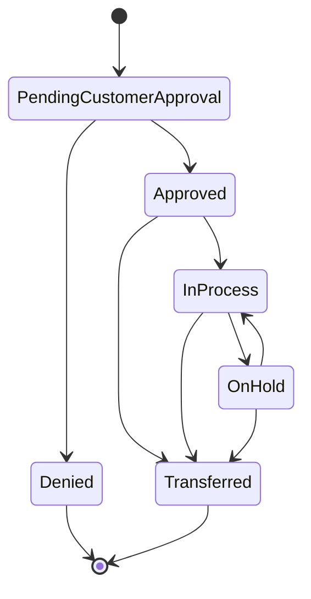

# Digital Customer Approval - Clarification Response

**Issue:** #207 - [BACKEND] [STORY] Approval: Capture Digital Customer Approval  
**Clarification Date:** 2026-01-08  
**Domain:** workexec  
**Type:** workflow clarification

## Executive Summary

This document captures the clarification decisions for the Digital Customer Approval feature. These answers resolve ambiguities in the original story and establish the technical and business requirements for implementation.

---

## Clarification Questions and Answers

### 1. Entity Type: Approval Scope

**Question:** Is the entity being approved always a Work Order, or could it also be an Estimate? Should the endpoint be generic (e.g., `/approvals`) or specific as proposed?

**Answer:** Approvals can be for **both Estimates and Work Orders**.

**Decision:**
- The approval system must be generic to handle multiple entity types
- Recommended endpoint structure: `/api/approvals` (generic)
- Each approval record should include:
  - `entityType`: enum indicating "ESTIMATE" or "WORK_ORDER"
  - `entityId`: reference to the specific estimate or work order
- API should support filtering by entity type

**Implementation Notes:**
```java
public enum ApprovalEntityType {
    ESTIMATE,
    WORK_ORDER
}

@Entity
public class CustomerApproval {
    @Id
    private Long id;
    
    @Enumerated(EnumType.STRING)
    private ApprovalEntityType entityType;
    
    private Long entityId;
    
    // ... other fields
}
```

---

### 2. Signature Data Format

**Question:** What is the exact data structure or format for `customerSignatureData`? Is it a Base64-encoded PNG, an SVG string, or a JSON object representing signature points?

**Answer:** **JSON + PNG format**

**Decision:**
The signature capture should support a dual format approach:
1. **PNG Image Data**: Base64-encoded PNG for display and archival purposes
2. **JSON Stroke Data**: Raw signature points/strokes for verification and re-rendering

**Implementation Notes:**
```java
@Entity
public class CustomerApproval {
    // ... other fields
    
    @Lob
    @Column(name = "signature_image_data", columnDefinition = "TEXT")
    private String signatureImageData; // Base64-encoded PNG
    
    @Lob
    @Column(name = "signature_json_data", columnDefinition = "TEXT")
    private String signatureJsonData; // JSON stroke data
    
    private String signatureMimeType; // e.g., "image/png"
}
```

**JSON Structure Example:**
```json
{
  "strokes": [
    {
      "points": [
        {"x": 100, "y": 150, "time": 1234567890},
        {"x": 102, "y": 152, "time": 1234567891}
      ]
    }
  ],
  "width": 400,
  "height": 200,
  "timestamp": "2026-01-08T18:00:00Z"
}
```

**Additional Details:**
Refer to the original issue #207 for the complete signature capture process description provided by the user.

---

### 3. State Model

**Question:** Please confirm the exact names for the pre-approval and post-approval states of a Work Order. Are there other relevant states?

**Answer:** The following state transitions are defined:

**Primary Approval Flow:**
- `Pending Customer Approval` → `Approved`

**Additional States:**
- `Denied` - **Must have cause/reason** recorded
- `In Process` - Work is actively being performed
- `On Hold` - Temporarily paused
- `Transferred` - Moved to a new version (see versioning rules)

**State Transition Rules:**



**Implementation Requirements:**

1. **Denied State:**
   - MUST capture `denialReason` (required field)
   - MUST capture `denialTimestamp`
   - MUST capture `deniedBy` (customer identifier)

2. **Transferred State:**
   - MUST capture reference to new estimate/work order version
   - MUST maintain audit trail of the transfer
   - See Section 5 (Versioning) for complete rules

**State Enum Implementation:**
```java
public enum WorkOrderStatus {
    PENDING_CUSTOMER_APPROVAL("Pending Customer Approval"),
    APPROVED("Approved"),
    DENIED("Denied"),
    IN_PROCESS("In Process"),
    ON_HOLD("On Hold"),
    TRANSFERRED("Transferred");
    
    private final String displayName;
    
    WorkOrderStatus(String displayName) {
        this.displayName = displayName;
    }
}
```

---

### 4. Legal Requirements

**Question:** Are there specific legal or compliance requirements (e.g., E-SIGN Act in the US) that dictate the storage format, retention policy, or metadata we must capture for this digital approval?

**Answer:** **Not explicitly answered in this clarification round.**

**Recommendation:**
Until specific legal requirements are provided, implement industry best practices:

1. **Minimum Metadata to Capture:**
   - Timestamp (with timezone)
   - IP address of the signer
   - User agent / device information
   - Geolocation (if available and permitted)
   - Authentication method used
   - Consent text version that was displayed

2. **Storage Requirements:**
   - Signatures should be immutable after creation
   - Maintain audit trail of all access
   - Implement retention policy configuration
   - Support data export for legal discovery

3. **Compliance Placeholder:**
   - Design system to be E-SIGN Act compatible
   - Prepare for GDPR/CCPA requirements (data portability, right to deletion)
   - Document the approval process for legal review

**Follow-up Required:**
The Story Authoring Agent should flag this as requiring additional clarification from legal or compliance teams before production deployment.

---

### 5. Versioning Rules

**Question:** What is the business process if a customer wants to change something after seeing the final estimate? Does this create a new version of the Work Order?

**Answer:** Comprehensive versioning rules have been provided:

#### Estimate Versioning Rules

1. **Editable Period:**
   - Estimates are **fully editable** until they reach `Approved` status
   - No versioning required during the editable period

2. **Post-Approval Changes:**
   - Changes to an estimate in `Approved` state **require a new version** of the estimate
   - The new version becomes a separate estimate entity with a version number

3. **Version Numbering:**
   - Suggested format: `EST-{base-id}-v{version}`
   - Example: EST-12345-v1, EST-12345-v2

#### Work Order Cascade Rules

**When a new estimate version is created:**

1. **Automatic Status Update:**
   - ALL work orders connected to the **old estimate version** MUST be updated to `Transferred` status

2. **Reference Requirements:**
   - Each transferred work order MUST include:
     - Reference to the **old estimate version** (for audit trail)
     - Reference to the **new estimate version** (for current context)
     - Timestamp of the transfer
     - Reason for transfer (optional but recommended)

3. **Work Order States Subject to Transfer:**
   - `Pending Customer Approval` → `Transferred`
   - `Approved` → `Transferred`
   - `In Process` → `Transferred`
   - `On Hold` → `Transferred`

#### Implementation Model

```java
@Entity
public class Estimate {
    @Id
    private Long id;
    
    private String baseEstimateId; // Groups versions together
    private Integer version;
    
    @Enumerated(EnumType.STRING)
    private EstimateStatus status; // DRAFT, APPROVED, SUPERSEDED
    
    private Long supersededBy; // Reference to new version
    
    // ... other fields
}

@Entity
public class WorkOrder {
    @Id
    private Long id;
    
    private Long currentEstimateId; // Current estimate version
    private Long originalEstimateId; // First estimate version
    
    @Enumerated(EnumType.STRING)
    private WorkOrderStatus status;
    
    private String transferReason;
    private Instant transferredAt;
    
    // ... other fields
}
```

#### Versioning Workflow Example

1. **Initial State:**
   - Estimate-v1 (Approved)
   - WorkOrder-A connected to Estimate-v1 (In Process)
   - WorkOrder-B connected to Estimate-v1 (Approved)

2. **Customer Requests Change:**
   - Create Estimate-v2 (starts in DRAFT status)
   - Apply changes to Estimate-v2

3. **Upon Estimate-v2 Approval:**
   - Estimate-v1.status = SUPERSEDED
   - Estimate-v1.supersededBy = Estimate-v2.id
   - WorkOrder-A.status = TRANSFERRED
   - WorkOrder-A.transferReason = "Estimate revised to v2"
   - WorkOrder-A.transferredAt = now()
   - WorkOrder-B.status = TRANSFERRED
   - WorkOrder-B.transferReason = "Estimate revised to v2"
   - WorkOrder-B.transferredAt = now()

4. **New Work Orders:**
   - New work orders can be created against Estimate-v2

---

## Implementation Priorities

Based on the clarifications, the following priorities are recommended:

### High Priority (Must Have)
1. Generic approval entity supporting Estimates and Work Orders
2. Signature capture with dual format (PNG + JSON)
3. Complete state model implementation with all defined states
4. Versioning logic for estimates and cascade to work orders
5. Denial reason capture for DENIED state

### Medium Priority (Should Have)
1. Audit trail for all state transitions
2. Metadata capture for legal compliance preparation
3. Version history and comparison features

### Low Priority (Nice to Have)
1. Legal compliance certification
2. Advanced signature verification
3. Automated retention policy enforcement

### Pending (Requires Additional Clarification)
1. Specific legal requirements and compliance framework
2. Retention policies and data lifecycle management

---

## Technical Architecture Recommendations

### Database Schema Additions

**New Entities:**
1. `CustomerApproval` - Generic approval records
2. `EstimateVersion` - Track estimate versions
3. `ApprovalAuditLog` - Complete audit trail

**Modified Entities:**
1. `WorkOrder` - Add versioning and transfer fields
2. `Estimate` - Add version tracking

### API Endpoints

**Approval Management:**
- `POST /api/approvals` - Create approval (generic)
- `GET /api/approvals/{id}` - Get approval details
- `GET /api/approvals?entityType={type}&entityId={id}` - Query approvals
- `POST /api/approvals/{id}/deny` - Deny with reason

**Versioning:**
- `POST /api/estimates/{id}/versions` - Create new version
- `GET /api/estimates/{baseId}/versions` - List all versions
- `GET /api/work-orders/{id}/transfer-history` - View transfer history

### Event Architecture

**Domain Events to Emit:**
1. `ApprovalCreated`
2. `ApprovalApproved`
3. `ApprovalDenied`
4. `EstimateVersionCreated`
5. `WorkOrderTransferred`

---

## Testing Requirements

### Unit Tests
- State transition validation
- Versioning logic
- Signature data format validation

### Integration Tests
- End-to-end approval workflow
- Estimate versioning with work order cascade
- Denial reason enforcement

### Acceptance Criteria
- All state transitions function correctly
- Versioning creates proper cascade to work orders
- Signature data stored in both formats
- Denial requires reason

---

## Next Steps for Story Authoring Agent

1. **Update Origin Story (#207):**
   - Incorporate all clarification answers
   - Remove `blocked:clarification` label
   - Add acceptance criteria based on these decisions

2. **Create Related Stories:**
   - Estimate versioning implementation
   - Work order transfer logic
   - Audit trail system

3. **Set Status:**
   - If no further questions: `status:ready-for-dev`
   - If legal requirements unclear: `status:needs-review` with legal team tag

---

## Appendix: References

- **Origin Story:** https://github.com/louisburroughs/durion-positivity-backend/issues/207
- **Domain:** workexec
- **Related Modules:** pos-work-order, pos-customer (future)
- **Clarification Request Date:** 2026-01-06
- **Clarification Response Date:** 2026-01-08

---

*This document is authoritative for implementation decisions. Any changes to these specifications should be reviewed and approved through the proper governance process.*
