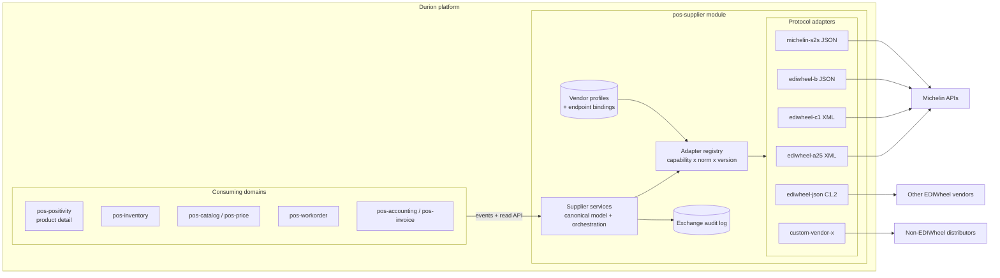

# Supplier Integration Architecture — EDIWheel and Beyond

**Status:** ACCEPTED DIRECTION — open questions resolved 2026-08-10 (see §12)
**Date:** 2026-08-10
**Author:** Architecture (drafted from `docs/ediwheel/` source specifications)
**Scope:** Outbound supplier connectivity for tire manufacturers using the EDIWheel standard (Michelin first), designed for reuse with any parts manufacturer or distributor.

---

## 1. Purpose

Durion needs to talk to the major tire manufacturers — Michelin, Continental, Goodyear, Pirelli, Bridgestone — that expose supplier connectivity through the **EDIWheel** standard (maintained by wdk, `ediwheel.net`). The near-term driver is the Michelin API suite documented in `docs/ediwheel/`.

This document proposes an implementation architecture with three explicit goals:

1. **Reusable modules with swappable endpoint information** — the same order/stock/price/invoice logic must talk to different vendors by changing configuration, not code.
2. **Reuse beyond EDIWheel** — the same architecture must extend to non-tire parts manufacturers and distributors with proprietary APIs.
3. **Deployment-level configurability** — every rollout is expected to be custom (different vendors, different capabilities, different credentials, different norm versions), so vendor wiring is data, not code.

A fourth constraint follows from the source specs themselves: **the same business service exists in multiple protocol versions** (EDIWheel norms A2.5, B2.1, B3.3, B4.0, C1.0, C1.1, C1.2), and vendors support different subsets. Multiple versions of the same service must coexist behind one interface.

## 2. Source Documents Reviewed

All files live in [`docs/ediwheel/`](../../ediwheel/).

| Document | Business service | Direction | Norm / version | Wire format | Auth |
| --- | --- | --- | --- | --- | --- |
| `EDIWHEEL Order Creation PROD_2 (2).yaml` | Create purchase orders in real time | Durion → vendor | A2.5, C1.0 | XML over HTTPS POST | Basic + API key |
| `EDIWHEEL Order Status API PROD_1.yaml` | Track order status by date or reference | Durion → vendor | A2.5, C1.0, C1.1 | XML over HTTPS POST | Basic + API key |
| `Swagger_UPX-Stock Inquiry PROD_1_2.yaml` | Real-time stock availability and quote | Durion → vendor | A2.5, C1.0 | XML over HTTPS POST | Basic + API key |
| `EDIWHEEL STOCK REPORT PROD_0 (1).yaml` | Snapshot of vendor stock at country level | Durion → vendor | B2.1, C1.0 | JSON / XML GET | Basic + API key |
| `EDIWheel Price Catalog PROD_0.yaml` | Purchasable products and prices (PRICAT) | Durion → vendor | B4.0 | JSON GET | Basic + API key |
| `EDIWHEEL Invoice PROD_0.yaml` | Retrieve AR transactions (vendor invoices) | Durion → vendor | B3.3 (B3.4 coming) | XML over HTTPS POST | Basic + API key |
| `ShipmentTrackingOAS_v1.yaml` | Shipment notice / tracking events (LEX) | Durion → vendor (mock today) | v1 | JSON | Bearer |
| `MKCAT_API_1.2.0.yaml` | EDIWheel marketing catalog (tread designs, suppliers, images) with change subscription | Durion → ediwheel.net | C1.2 | JSON REST + message-based | per implementation |
| `ediwheel-workorder-michelin-implementation_1.json` | S2S workorder authorization (fleet contracts, policies, vehicles, approval) | Durion → vendor | Michelin S2S v1/v2 | JSON REST | OAuth2 |
| `DOT_Spec_R2_Prod_0.yaml` | AI DOT-code recognition from sidewall image | Durion → vendor | v1 | JSON (base64 image) | OAuth2 + API key |
| `openapi_Prod_v2 (8) (1).yaml` | TireSnap sidewall scanner (tire spec from photo) | Durion → vendor | v1 | multipart JSON | OAuth2 + API key |
| `EDIWheel-XML_Order_C1.pdf`, `EDIWheel-XML_Order_Response_C1.pdf`, `EDIWHEEL-XML_Order_Status*.pdf` | Message implementation guidelines (element/occurrence definitions) for C1 XML payloads | n/a (spec) | C1, C1.1 | XML | n/a |

Key observations:

- **Everything currently in scope is outbound.** Durion is the API consumer; no spec in the folder requires Durion to host an inbound endpoint. Confirmed: workorders are always initiated in the service provider's system. Vendors may push appointment requests, but that is outside current scope (§12, decision 7).
- **Transport is consistent, payloads are not.** All services are HTTPS request/response, but payloads span three generations: A2.x XML (legacy), B-series JSON/XML report-style, C1.x XML (current guideline, defined in the PDFs), and C1.2 JSON (the emerging `ediwheel.net` resource+message API).
- **Party identification is a first-class config concern.** Every EDIWheel message carries `BuyerParty`/`PartyID`/`AgencyCode` (and often `SellerParty`, `OrderingParty`, `Consignee`) — these are per-deployment, per-vendor account identifiers.
- **Auth differs per vendor and even per service** within one vendor (Basic + API key for EDIWheel services; OAuth2 client credentials for the S2S workorder and AI services).

## 3. Goals and Non-Goals

### Goals

- One canonical, vendor-neutral supplier integration domain inside the Durion backend.
- Per-capability ports so each vendor can implement any subset (order, stock, price, invoice, shipment, workorder authorization, catalog, tire identification).
- Multiple protocol versions of the same capability selectable by configuration.
- Vendor onboarding = new adapter (only if a new wire format) + new configuration profile. Never a change to consuming domains.
- Full auditability: every outbound exchange persisted with raw payloads, correlation ID, and outcome.
- Alignment with existing platform policy: ADR-0044 (event-only domain walls), ADR-0026 (service contract boundary), ADR-0013/0027 (UUID identifiers), ADR-0014 (internal service security), ADR-0024 (timestamps), X-Correlation-Id plan.

### Non-Goals

- Building an inbound EDI endpoint (nothing reviewed requires one; revisit if a vendor pushes events to us).
- Implementing classic EDIFACT/X12 file-based EDI (EDIWheel API flavors are HTTP request/response; batch file EDI would be a new adapter family later).
- Frontend purchasing UX design (referenced only where the integration surfaces data).
- Selecting a specific integration middleware product; this is in-platform Spring Boot code.

## 4. Architectural Overview

The design is hexagonal (ports and adapters) with a configuration-driven adapter registry. A single new backend module owns the canonical model and orchestration; protocol adapters translate canonical requests to vendor wire formats; a vendor profile binds each capability to an endpoint, a norm version, and credentials.



### 4.1 The three layers

1. **Canonical layer (vendor-neutral).** DTOs and services expressing what Durion means: `SupplierPurchaseOrder`, `SupplierStockInquiry`, `SupplierPriceCatalogEntry`, `SupplierInvoice`, `SupplierShipmentEvent`, `SupplierWorkorderAuthorization`. Consuming domains only ever see this layer. Identifiers follow platform UUID policy; vendor-native references (`SupplierOrderNumber`, `DocumentID`) are carried as attributes, never as primary keys.
2. **Port (SPI) layer.** One Java interface per capability (§6). Ports are deliberately narrow and asynchronous-friendly. A vendor "supports" a capability if a binding exists for it in its profile — capability discovery is configuration, not reflection.
3. **Adapter layer.** One adapter per wire-format family, not per vendor. Michelin A2.5 order creation and (hypothetically) Continental A2.5 order creation share the `ediwheel-a25` adapter with different endpoint bindings. A vendor with a proprietary API gets its own adapter implementing the same ports.

### 4.2 Why one module, not one module per vendor

Pre-production policy favors clean, minimal structure. All supplier connectivity lives in a single deployable, `pos-supplier`, with adapters as internal packages structured for later extraction into libraries if adapter count or team ownership demands it. This keeps the blast radius of vendor onboarding inside one module and avoids premature microservice sprawl. The package layout (§5) enforces the seams that would make extraction mechanical.

## 5. Module Layout

New backend module in `durion-positivity-backend`: **`pos-supplier`** (working name; see open question 2). Follows platform layering and ADR-0026 (service package is contract-only interfaces).

```text
pos-supplier/
  src/main/java/com/positivity/supplier/
    service/                      # contract-only interfaces (ADR-0026)
      SupplierOrderService.java
      SupplierStockService.java
      SupplierPriceCatalogService.java
      SupplierInvoiceService.java
      SupplierShipmentService.java
      SupplierWorkorderAuthorizationService.java
      SupplierCatalogService.java         # MKCAT marketing catalog
      SupplierProfileAdminService.java
    domain/                       # canonical model + orchestration
      model/                      # canonical DTOs and entities
      orchestration/              # retries, outbox, idempotency, sagas
    spi/                          # capability ports adapters implement
      SupplierOrderPort.java
      SupplierStockInquiryPort.java
      SupplierStockReportPort.java
      SupplierPriceCatalogPort.java
      SupplierInvoicePort.java
      SupplierShipmentTrackingPort.java
      SupplierWorkorderAuthorizationPort.java
      SupplierCatalogPort.java
      TireIdentificationPort.java         # DOT / sidewall AI (optional)
    registry/                     # AdapterRegistry, VendorProfileResolver
    config/                       # profile loading, secret resolution
    adapter/
      ediwheel/
        a25/                      # A2.5 XML codecs + client
        c1/                       # C1.0 / C1.1 XML codecs + client
        bseries/                  # B2.1 / B3.3 / B4.0 codecs + client
        json/                     # C1.2 JSON (ediwheel.net MKCAT style)
      michelin/
        s2s/                      # S2S workorder authorization JSON
        airecognition/            # DOT + TireSnap (optional capability)
    web/                          # admin/read controllers (profiles, audit)
    events/                       # published event contracts
    persistence/                  # profiles, bindings, exchange audit, outbox
```

Rules:

- `adapter/**` may depend on `spi` and `domain/model`, never the reverse.
- Consuming modules depend only on `com.positivity.supplier.service..` per ADR-0026, and preferentially on **events** per ADR-0044 (§8).
- Codecs (XML/JSON binding classes generated or hand-written from the C1 PDFs and OpenAPI schemas) live entirely inside their adapter package; canonical DTOs never expose wire types.

## 6. Capability Ports and Version Strategy

### 6.1 Port catalog

| Port | Canonical operation(s) | EDIWheel service(s) covered | Michelin implementation today |
| --- | --- | --- | --- |
| `SupplierOrderPort` | `createOrder`, `parseOrderResponse` | Order (A2.5, C1.0) | `POST /order/A2_5/create`, `POST /order/C1_0/create` |
| `SupplierOrderStatusPort` | `queryOrderStatus` | Order Status (A2.5, C1.0, C1.1) | `POST /order/{norm}/status` |
| `SupplierStockInquiryPort` | `inquireAvailability` (real-time, quote) | Stock Inquiry / UPX (A2.5, C1.0) | `POST /stock/{norm}/inquiry` |
| `SupplierStockReportPort` | `fetchStockSnapshot` | Stock Report (B2.1, C1.0) | `GET /stock/B2_1/report` |
| `SupplierPriceCatalogPort` | `fetchPriceCatalog` | PRICAT (B4.0) | `GET /catalog/B4_0/pricat` |
| `SupplierInvoicePort` | `fetchInvoices` | Invoice (B3.3, B3.4 future) | `POST /invoice/B3_3/invoices` |
| `SupplierShipmentTrackingPort` | `sendShipmentEvents` / `fetchTracking` | Shipment tracking (LEX v1) | `POST /shipment-tracking` |
| `SupplierWorkorderAuthorizationPort` | `requestAuthorization`, `approveCompletion`, `getVehicle`, `getContracts`, `getPolicies` | Michelin S2S (not an EDIWheel norm) | `POST /api/v1/workOrders`, `PATCH /api/v1/workOrders/{id}/approve`, `GET vehicles/contracts/policies` |
| `SupplierCatalogPort` | `fetchMarketingCatalog`, `subscribeChanges` | MKCAT (C1.2 JSON) | `ediwheel.net` API |
| `TireIdentificationPort` | `recognizeDotCode`, `recognizeSidewall` | n/a (vendor value-add AI) | DOT Image Recognition, TireSnap |

Ports accept a `SupplierRef` (the vendor profile key), a `PartyContext` (billing account plus delivery location, resolved through the profile's account mappings — §7), and canonical request objects; they return canonical responses plus an `ExchangeMetadata` (correlation ID, norm used, raw-payload audit reference).

`TireIdentificationPort` is a **placeholder** in the initial build: DOT scanning is expected to be required by most service providers, so the port and registry slot are defined up front, but no adapter is implemented until the requirement is confirmed (§12, decision 10).

### 6.2 Multiple versions of one service

The registry resolves an implementation by `(capability, protocolFamily, version)`:

- Each adapter registers codec implementations, e.g. `EdiwheelOrderCodec` for `A2_5`, `C1_0`; `EdiwheelOrderStatusCodec` for `A2_5`, `C1_0`, `C1_1`.
- The vendor profile's endpoint binding names the version to use (§7). Switching Michelin order status from C1.0 to C1.1 is a one-line configuration change.
- New norm version = new codec class in the existing adapter, registered under the new version key. Canonical model changes only when the *business* capability grows, and codec for older norms simply ignores fields they cannot express (recorded in the exchange audit as `unmappedFields` for diagnosis).
- Version-specific request/response quirks (e.g. C1.1 adds `Geolocation` to `Consignee`, `ErrorHead` structures) stay inside the codec.

This is the mechanism that satisfies "multiple versions of the same services depending on the vendor" — versioning is a registry key, not a class-hierarchy fork of business logic.

## 7. Vendor Profile and Configuration Model

The unit of deployment customization is the **vendor profile**: one per supplier account per environment. Profiles are persisted (DB-backed, admin API + UI later) with an initial bootstrap path from YAML for the first deployments. Secrets are always indirect references resolved from the environment/secret store — never stored in profile rows or YAML (platform secrets rule).

```yaml
supplier:
  profiles:
    - key: michelin-eu            # SupplierRef used by ports
      displayName: "Michelin Europe"
      protocolDefaults:
        family: EDIWHEEL
        connectTimeoutMs: 5000
        readTimeoutMs: 30000
        retry: { maxAttempts: 3, backoff: EXPONENTIAL }
      accounts:                    # commercial account numbers (credentials live in auth)
        billing:                   # invoicing/settlement account (legal entity
          accountNumber: "0000012345"      # level, shared across locations)
          agencyCode: "31"         # e.g. EAN/GLN agency
        delivery:                  # Durion location -> delivery account number
          - locationId: 018f6b2e-...-uuid   # pos-location UUID
            accountNumber: "0000067890"
            agencyCode: "31"
          - locationId: 018f6b2e-...-uuid2
            accountNumber: "0000067891"
            agencyCode: "31"
        sellerPartyId: "MICHELIN"
        sellerAgencyCode: "91"
      auth:
        - name: ediwheel-basic
          type: BASIC_PLUS_APIKEY
          usernameRef: env:MICHELIN_EDI_USER      # secret indirection
          passwordRef: env:MICHELIN_EDI_PASSWORD
          apiKeyHeader: apikey
          apiKeyRef: env:MICHELIN_EDI_APIKEY
        - name: s2s-oauth
          type: OAUTH2_CLIENT_CREDENTIALS
          tokenUrlRef: env:MICHELIN_S2S_TOKEN_URL
          clientIdRef: env:MICHELIN_S2S_CLIENT_ID
          clientSecretRef: env:MICHELIN_S2S_CLIENT_SECRET
      bindings:                    # capability -> endpoint + version + auth
        - capability: ORDER_CREATE
          version: C1_0
          baseUrl: https://api.michelin.com/order
          path: /C1_0/create
          auth: ediwheel-basic
        - capability: ORDER_STATUS
          version: C1_1
          baseUrl: https://api.michelin.com/order
          path: /C1_1/status
          auth: ediwheel-basic
        - capability: STOCK_INQUIRY
          version: A2_5
          baseUrl: https://api.michelin.com/stock
          path: /A2_5/inquiry
          auth: ediwheel-basic
        - capability: PRICE_CATALOG
          version: B4_0
          baseUrl: https://api.michelin.com
          path: /catalog/B4_0/pricat
          auth: ediwheel-basic
          schedule: "0 0 4 * * *"          # nightly PRICAT sync
        - capability: INVOICE_FETCH
          version: B3_3
          baseUrl: https://api.michelin.com/invoice
          path: /B3_3/invoices
          auth: ediwheel-basic
          schedule: "0 0 5 * * *"
        - capability: WORKORDER_AUTHORIZATION
          version: S2S_V1
          baseUrl: https://<michelin-s2s-host>
          path: /api/v1
          auth: s2s-oauth
      sandbox:                     # environment overlay
        baseUrlOverride: https://sandbox.api.michelin.com
```

Design points:

- **Absent binding = capability disabled** for that vendor in that deployment. The canonical services surface this as an explicit `CAPABILITY_NOT_CONFIGURED` status so callers (and the UI) can degrade gracefully, mirroring the positivity component-status pattern (DECISION-POSITIVITY-004/011).
- **One vendor, many profiles** is legal (e.g. Michelin EU vs Michelin NA accounts, or two buyer accounts for two store groups).
- **Credentials and account numbers are separate concerns.** A vendor account has one set of API credentials (userid/password, held in `auth` and shared across the legal entity) and **two account numbers per transaction**: a **billing account number** (invoicing/settlement) and a **delivery account number** (where goods ship). Credentials authenticate the call; the account numbers identify the commercial parties inside the message.
- **Account roles are canonical; field names are vendor-specific.** The canonical model uses the generic roles *billing* and *delivery*; each adapter maps them onto its vendor's terminology — `billTo`/`shipTo` in the Michelin APIs, `BuyerParty`/`Consignee` in EDIWheel XML norms, whatever a future distributor calls them. Vendor vocabulary never leaks into the canonical layer or the profile schema.
- **Account resolution is location-aware.** The billing account number is typically fixed per profile (legal entity); the delivery account number varies by location. The profile maps Durion `pos-location` UUIDs to vendor delivery account numbers; callers pass the delivery location in the `PartyContext` and the adapter stamps the correct vendor identities into the wire message. A missing delivery mapping for the requested location is a configuration error surfaced before any network call.
- **Per-binding schedules** drive the batch capabilities (PRICAT, invoice fetch, stock report) from the orchestration layer's scheduler; real-time capabilities (stock inquiry, order create/status) are request-driven.
- **Environment overlays** (sandbox vs production URLs, present in every Michelin spec) are part of the profile so promotion between environments is configuration-only, matching the tenant-cell deployment direction.
- Profile changes are audited (who, when, what) via the standard audit fields policy (ADR-0018/0024).

## 8. Integration with Durion Domains (ADR-0044 Alignment)

`pos-supplier` is a **domain module**, so cross-module interaction is event-first:

| Flow | Mechanism | Notes |
| --- | --- | --- |
| PRICAT sync results | `supplier.pricecatalog.updated.v1` event; pos-catalog / pos-price consume and upsert supplier cost/eligibility data | Batch, scheduled per binding; dating and precedence rules in §8.1 |
| Stock report snapshots | `supplier.stockreport.updated.v1`; pos-inventory consumes for supplier ATP hints | Batch |
| Order lifecycle | Commands in, results out: **pos-order** (purchase-order aggregate owner) emits `supplier.order.requested.v1`; pos-supplier executes and emits `supplier.order.confirmed.v1` / `supplier.order.rejected.v1` / `supplier.orderstatus.changed.v1` | Command events with result events and pending states, per ADR-0044 |
| Vendor invoices | `supplier.invoice.received.v1`; **pos-accounting** consumes and creates AP vouchers | Batch |
| Shipment tracking | `supplier.shipment.event.v1`; consumers: purchasing/receiving flows | |
| Workorder authorization | Workorder flow emits request command; pos-supplier calls S2S API and emits `supplier.workorderauth.granted.v1` / `.denied.v1`; completion approval triggered by workorder completion events | Keeps `workexec` authority over workorder state |
| Real-time stock inquiry | **Synchronous read exception (approved)**: positivity product-detail composition **and pos-order procurement flows** may call `SupplierStockService` directly for live availability/quote, with the standard degradation semantics (component status, null numerics, `asOf`) | Approved 2026-08-10 (§12, decisions 4–5); to be ratified as an ADR-0044 amendment |

The real-time stock inquiry is the one place where event-only communication fights the use case (a counter user wants live vendor availability while quoting or raising a purchase order). `pos-supplier`'s read side is treated like the existing utility-module reads, wrapped in the positivity degradation contract: timeouts are short, failure degrades to `SUPPLIER_UNAVAILABLE` status, and no numeric field is fabricated. Live vendor availability surfaces in **both** the Product Detail composition (as an additional degradable component) and the pos-order procurement screens.

### 8.1 PRICAT dating and price precedence

- Every ingested PRICAT entry is stamped with the vendor's effective date and Durion's fetch timestamp; "latest" is always decidable, and superseded entries are retained for audit and cost-history queries.
- **Vendor prices never override service-provider or location-specific prices.** PRICAT data enters the platform as supplier cost / list-price *input* to the pricing domain; sell-price authority remains with pos-price and its location-scoped rules.
- The detailed pricing data model and how PRICAT feeds it (cost layers, effective-dating, location scoping) requires further investigation with the Pricing domain owners — tracked in [durion#371](https://github.com/louisburroughs/durion/issues/371) and a precondition for the Phase 1 PRICAT consumer landing in pos-price.

## 9. Cross-Cutting Concerns

### 9.1 Resilience and idempotency

- Every outbound exchange carries a correlation ID (X-Correlation-Id plan) and a deterministic client reference (`CustomerReference` / `DocumentID` in EDIWheel messages) derived from the canonical entity UUID, so vendor-side deduplication works across retries.
- Order creation is **exactly-once-intent**: an outbox row is written in the same transaction as the canonical order intent; the dispatcher retries with the same `DocumentID`; a confirmed/rejected result is idempotently applied. Never auto-retry an order create after an ambiguous timeout without first querying order status — duplicate physical orders are the top operational risk in supplier EDI.
- Circuit breakers per vendor binding; breaker state exposed as a health indicator and in the admin UI.
- Batch capabilities are checkpointed (last successful window per binding) so a missed night self-heals on the next run.

### 9.2 Audit and observability

- Persist every exchange: profile key, capability, version, endpoint, correlation ID, timing, HTTP outcome, and raw request/response payloads (with credential headers redacted). EDI disputes ("you never sent that order") are settled with raw payloads, not logs.
- Metrics per (vendor, capability, version): request rate, error rate, latency, breaker state, batch lag. Degradation is metrics/log-tracked, not evented (DECISION-POSITIVITY-015).

### 9.3 Security

- All credentials via secret store / environment indirection (`*Ref` fields); no secrets in code, profiles, or YAML committed to git.
- Outbound egress to vendor hosts must be allowed by the deployment network policy; document required hosts per profile as part of onboarding.
- Admin APIs for profiles are permission-gated (deny-by-default, ADR-0040 governance); raw-payload audit access is a distinct, tighter permission because payloads contain commercial terms.
- Internal service boundary and gateway rules per ADR-0011/0014 apply unchanged; `pos-supplier` exposes no public endpoint.

### 9.4 Contract chain

Admin/read controllers in `pos-supplier` follow the standard controller contract chain: OpenAPI annotations → regenerate `OpenAPI.yaml` → regenerate the Angular SDK.

## 10. Reuse Beyond EDIWheel

The canonical ports are format-agnostic, so a non-EDIWheel distributor (e.g. a national parts distributor with a proprietary JSON API, or a punch-out/cXML supplier) is onboarded by:

1. Writing one adapter package under `adapter/<vendor-or-family>/` implementing whichever ports the vendor supports.
2. Registering its codecs under a new `protocolFamily` (e.g. `CUSTOM_ACME`, `CXML`).
3. Adding a vendor profile with bindings pointing at that family.

Nothing in `domain/`, `service/`, `events/`, or any consuming module changes. The Michelin S2S workorder adapter is the proof case already in scope: it is *not* an EDIWheel norm, yet it slots in as just another protocol family behind `SupplierWorkorderAuthorizationPort`.

The AI services (DOT recognition, TireSnap) follow the same pattern behind `TireIdentificationPort` and can be treated as an optional, independently phased capability — they are vendor value-adds, not supply-chain primitives.

## 11. Suggested Phasing

The phasing plan is decomposed into capability stories **CAP-317 through CAP-324** (GitHub issues [durion#372](https://github.com/louisburroughs/durion/issues/372)–[durion#379](https://github.com/louisburroughs/durion/issues/379)).

| Phase | Capability | Deliverable | Rationale |
| --- | --- | --- | --- |
| 1 | CAP-317 ([#372](https://github.com/louisburroughs/durion/issues/372)) | `pos-supplier` foundation: canonical model, profiles/bindings/accounts, adapter registry, exchange audit, resilience, admin API/UI | The plumbing every later capability plugs into |
| 1 | CAP-318 ([#373](https://github.com/louisburroughs/durion/issues/373)) | Michelin **Price Catalog (B4.0)** sync with effective-dating (consumer blocked by [#371](https://github.com/louisburroughs/durion/issues/371)) | Read-only, low-risk; proves profile + adapter + version machinery |
| 1 | CAP-319 ([#374](https://github.com/louisburroughs/durion/issues/374)) | **Stock Inquiry (A2.5)** — live availability in Product Detail and pos-order procurement | Immediately enriches quoting; exercises the approved sync-read exception |
| 2 | CAP-320 ([#375](https://github.com/louisburroughs/durion/issues/375)) | **Order Create + Order Status** (C1.0 create, C1.1 status), outbox and idempotency machinery, pos-order events | The commercial core; needs Phase 1 plumbing hardened first |
| 3 | CAP-321 ([#376](https://github.com/louisburroughs/durion/issues/376)) | **Invoice fetch (B3.3)** → AP vouchers in pos-accounting | Back-office reconciliation |
| 3 | CAP-322 ([#377](https://github.com/louisburroughs/durion/issues/377)) | **Stock Report (B2.1)** + **Shipment tracking** with inventory/receiving consumers | Back-office visibility |
| 4 | CAP-323 ([#378](https://github.com/louisburroughs/durion/issues/378)) | **S2S workorder authorization** (fleet flows), second protocol family in production | Exercises the non-EDIWheel reuse claim |
| 5 | CAP-324 ([#379](https://github.com/louisburroughs/durion/issues/379)) | MKCAT marketing catalog (C1.2 JSON); DOT / TireSnap scanning stays a dormant `TireIdentificationPort` placeholder | DOT scanning likely required by most service providers — port defined up front, adapter implemented once confirmed |
| Next vendor | — | Second EDIWheel manufacturer via configuration (+ codec gaps only) | Validates the reusability goal; target: zero changes outside `adapter/` + profile data |

**Vendor roadmap:** after Michelin, onboard manufacturers in order of market share, favoring vendors that participate in the EDIWheel standard (they reuse existing adapters; non-participants require a new protocol family).

Each phase should land with provider contract tests per adapter codec (golden-file XML/JSON fixtures derived from the specs and C1 PDFs) and a sandbox smoke suite runnable against vendor sandbox URLs.

## 12. Resolved Decisions (2026-08-10)

The original open questions were reviewed and resolved as follows. Where binding, they will be promoted into ADRs (§13).

1. **Vendor roadmap.** After Michelin, implement manufacturers in order of market share, favoring vendors that participate in the EDIWheel standard.
2. **Module name.** `pos-supplier` is confirmed as the module name and home.
3. **Purchasing ownership.** `pos-order` owns the purchase-order aggregate that triggers `SupplierOrderPort`; `pos-supplier` holds only transmission state.
4. **Real-time stock inquiry UX.** Live vendor stock appears in **both** the positivity Product Detail composition and the pos-order procurement flows.
5. **ADR-0044 exception.** The synchronous read path to `SupplierStockService` is **approved** (to be ratified as an ADR-0044 amendment).
6. **Account topology.** Accounts may be shared within a legal entity. Each vendor account has one set of API credentials (userid/password); each order carries **two account numbers, modeled generically as billing and delivery** (Michelin calls them billTo/shipTo). Delivery account numbers are mapped per Durion location in the vendor profile (§7).
7. **Inbound flows.** None. Workorders are always initiated in the service provider's system. Vendors may push *appointment requests*, but that is explicitly outside current scope.
8. **Invoice destination.** Fetched vendor invoices (B3.3) become **AP vouchers in pos-accounting**.
9. **PRICAT policy.** PRICAT data is effective-dated so the latest is always decidable; vendor prices never override service-provider or location-specific prices (§8.1). The deeper investigation of the pricing data model and PRICAT integration is tracked in [durion#371](https://github.com/louisburroughs/durion/issues/371).
10. **Scanning.** `TireIdentificationPort` stays as a **placeholder** — DOT scanning is likely required for most service providers but is not yet confirmed; no adapter is built until it is.

## 13. ADR Candidates

With the §12 decisions in place, the following should be captured as ADRs:

- Supplier integration module boundary, canonical model ownership, and event contract set (extends ADR-0044 matrix).
- **ADR-0044 amendment**: synchronous supplier stock-inquiry read exception for positivity composition and pos-order procurement (§12, decision 5).
- Vendor profile / endpoint binding configuration model, credential vs account-number separation, and secret-indirection rules.
- Protocol adapter and codec versioning policy (registry keys, coexistence of norm versions, unmapped-field handling).
- Outbound idempotency and duplicate-order prevention policy (no blind retry of ambiguous order creates).
- PRICAT ingestion, effective-dating, and price-precedence policy (after the pricing-data investigation task concludes).

---

## References

- Source specifications: [`docs/ediwheel/`](../../ediwheel/)
- EDIWheel standard body: `https://ediwheel.net`
- Positivity domain rules: [`domains/positivity/.business-rules/AGENT_GUIDE.md`](../../../domains/positivity/.business-rules/AGENT_GUIDE.md)
- ADR-0044 Event-Only Domain Walls: [`docs/adr/0044-platform-event-only-domain-walls.adr.md`](../../adr/0044-platform-event-only-domain-walls.adr.md)
- ADR-0026 Service Contract Boundary: [`docs/adr/0026-service-contract-boundary-policy.adr.md`](../../adr/0026-service-contract-boundary-policy.adr.md)
- Backend contract standards: [`docs/architecture/api/BACKEND_CONTRACT_GLOBAL_STANDARDS.md`](../api/BACKEND_CONTRACT_GLOBAL_STANDARDS.md)
