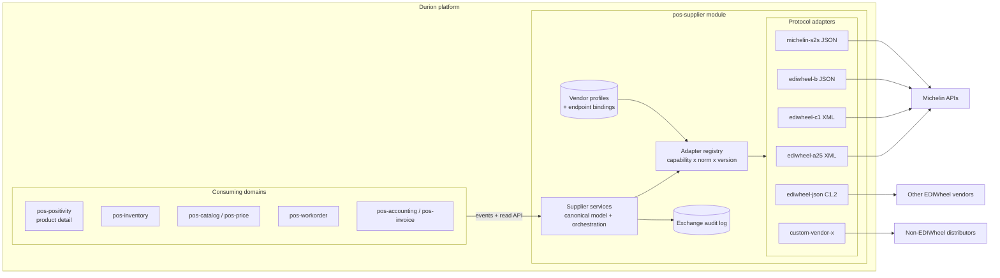

# Supplier Integration Architecture — EDIWheel and Beyond

**Status:** ACCEPTED DIRECTION — open questions resolved 2026-08-10 (see §12); shipment tracking withdrawn 2026-08-14 (§12, decision 11)
**Date:** 2026-08-10
**Author:** Architecture (drafted from `docs/ediwheel/` source specifications)
**Scope:** Outbound supplier connectivity for tire manufacturers using the EDIWheel standard (Michelin first), designed for reuse with any parts manufacturer or distributor.

---

## 1. Purpose

Durion needs to talk to the major tire manufacturers — Michelin, Continental, Goodyear, Pirelli, Bridgestone — that expose supplier connectivity through the **EDIWheel** standard (maintained by wdk, `ediwheel.net`). The near-term driver is the Michelin API suite documented in `docs/ediwheel/`.

This document proposes an implementation architecture with three explicit goals:

1. **Reusable modules with swappable endpoint information** — the same order/stock/price/invoice logic must talk to different vendors by changing configuration, not code.
2. **Reuse beyond EDIWheel** — the same architecture must extend to non-tire parts manufacturers and distributors with proprietary APIs.
3. **Deployment-level configurability** — every rollout is expected to be custom (different vendors, different capabilities, different credentials, different norm versions), so vendor wiring is data, not code.

A fourth constraint follows from the source specs themselves: **the same business service exists in multiple protocol versions** (EDIWheel norms A2.5, B2.1, B3.3, B4.0, C1.0, C1.1, C1.2), and vendors support different subsets. Multiple versions of the same service must coexist behind one interface.

## 2. Source Documents Reviewed

All files live in [`docs/ediwheel/`](../../ediwheel/).

| Document | Business service | Direction | Norm / version | Wire format | Auth |
| --- | --- | --- | --- | --- | --- |
| `EDIWHEEL Order Creation PROD_2 (2).yaml` | Create purchase orders in real time | Durion → vendor | A2.5, C1.0 | XML over HTTPS POST | Basic + API key |
| `EDIWHEEL Order Status API PROD_1.yaml` | Track order status by date or reference | Durion → vendor | A2.5, C1.0, C1.1 | XML over HTTPS POST | Basic + API key |
| `Swagger_UPX-Stock Inquiry PROD_1_2.yaml` | Real-time stock availability and quote | Durion → vendor | A2.5, C1.0 | XML over HTTPS POST | Basic + API key |
| `EDIWHEEL STOCK REPORT PROD_0 (1).yaml` | Snapshot of vendor stock at country level | Durion → vendor | B2.1, C1.0 | JSON / XML GET | Basic + API key |
| `EDIWheel Price Catalog PROD_0.yaml` | Purchasable products and prices (PRICAT) | Durion → vendor | B4.0 | JSON GET | Basic + API key |
| `EDIWHEEL Invoice PROD_0.yaml` | Retrieve AR transactions (vendor invoices) | Durion → vendor | B3.3 (B3.4 coming) | XML over HTTPS POST | Basic + API key |
| `ShipmentTrackingOAS_v1.yaml` | Shipment notice / tracking events (LEX) | **Neither — reviewed and found not to be a Durion flow** (§12, decision 11) | v1 | JSON | Bearer |
| `MKCAT_API_1.2.0.yaml` | EDIWheel marketing catalog (tread designs, suppliers, images) with change subscription | Durion → ediwheel.net | C1.2 | JSON REST + message-based | per implementation |
| `ediwheel-workorder-michelin-implementation_1.json` | S2S workorder authorization (fleet contracts, policies, vehicles, approval) | Durion → vendor | Michelin S2S v1/v2 | JSON REST | OAuth2 |
| `DOT_Spec_R2_Prod_0.yaml` | AI DOT-code recognition from sidewall image | Durion → vendor | v1 | JSON (base64 image) | OAuth2 + API key |
| `openapi_Prod_v2 (8) (1).yaml` | TireSnap sidewall scanner (tire spec from photo) | Durion → vendor | v1 | multipart JSON | OAuth2 + API key |
| `EDIWheel-XML_Order_C1.pdf`, `EDIWheel-XML_Order_Response_C1.pdf`, `EDIWHEEL-XML_Order_Status*.pdf` | Message implementation guidelines (element/occurrence definitions) for C1 XML payloads | n/a (spec) | C1, C1.1 | XML | n/a |

Key observations:

- **Everything currently in scope is outbound.** Durion is the API consumer; no spec in the folder requires Durion to host an inbound endpoint. Confirmed: workorders are always initiated in the service provider's system. Vendors may push appointment requests, but that is outside current scope (§12, decision 7).
- **One reviewed spec turned out not to be ours at all.** `ShipmentTrackingOAS_v1.yaml` declares a single write operation (`POST /shipment-tracking`) and no read. That is
  not an omission in the document: EDIWheel shipment tracking runs between logistics providers and suppliers, and a service provider is not a party to it in either
  direction (§12, decision 11). The spec stays listed above because it was reviewed and the review's conclusion is part of the record.
- **Transport is consistent, payloads are not.** All services are HTTPS request/response, but payloads span three generations: A2.x XML (legacy), B-series JSON/XML report-style, C1.x XML (current guideline, defined in the PDFs), and C1.2 JSON (the emerging `ediwheel.net` resource+message API).
- **Party identification is a first-class config concern.** Every EDIWheel message carries `BuyerParty`/`PartyID`/`AgencyCode` (and often `SellerParty`, `OrderingParty`, `Consignee`) — these are per-deployment, per-vendor account identifiers.
- **Auth differs per vendor and even per service** within one vendor (Basic + API key for EDIWheel services; OAuth2 client credentials for the S2S workorder and AI services).

## 3. Goals and Non-Goals

### Goals

- One canonical, vendor-neutral supplier integration domain inside the Durion backend.
- Per-capability ports so each vendor can implement any subset (order, stock, price, invoice, workorder authorization, catalog, tire identification).
- Multiple protocol versions of the same capability selectable by configuration.
- Vendor onboarding = new adapter (only if a new wire format) + new configuration profile. Never a change to consuming domains.
- Full auditability: every outbound exchange persisted with raw payloads, correlation ID, and outcome.
- Alignment with existing platform policy: ADR-0044 (event-only domain walls), ADR-0026 (service contract boundary), ADR-0013/0027 (UUID identifiers), ADR-0014 (internal service security), ADR-0024 (timestamps), X-Correlation-Id plan.

### Non-Goals

- Building an inbound EDI endpoint (nothing reviewed requires one; revisit if a vendor pushes events to us).
- **Shipment tracking of any kind.** Not deferred — out of scope, because the EDIWheel service by that name is a logistics-provider-to-supplier exchange Durion is not part
  of (§12, decision 11). Shipment visibility from a source that does have it — a carrier API, a freight aggregator — would be new scope with its own spec, not a resumption
  of this one.
- Implementing classic EDIFACT/X12 file-based EDI (EDIWheel API flavors are HTTP request/response; batch file EDI would be a new adapter family later).
- Frontend purchasing UX design (referenced only where the integration surfaces data).
- Selecting a specific integration middleware product; this is in-platform Spring Boot code.

## 4. Architectural Overview

The design is hexagonal (ports and adapters) with a configuration-driven adapter registry. A single new backend module owns the canonical model and orchestration; protocol adapters translate canonical requests to vendor wire formats; a vendor profile binds each capability to an endpoint, a norm version, and credentials.



### 4.1 The three layers

1. **Canonical layer (vendor-neutral).** DTOs and services expressing what Durion means: `SupplierPurchaseOrder`, `SupplierStockInquiry`, `SupplierPriceCatalogEntry`, `SupplierInvoice`, `SupplierWorkorderAuthorization`. Consuming domains only ever see this layer. Identifiers follow platform UUID policy; vendor-native references (`SupplierOrderNumber`, `DocumentID`) are carried as attributes, never as primary keys.
2. **Port (SPI) layer.** One Java interface per capability (§6). Ports are deliberately narrow and asynchronous-friendly. A vendor "supports" a capability if a binding exists for it in its profile — capability discovery is configuration, not reflection.
3. **Adapter layer.** One adapter per wire-format family, not per vendor. Michelin A2.5 order creation and (hypothetically) Continental A2.5 order creation share the `ediwheel-a25` adapter with different endpoint bindings. A vendor with a proprietary API gets its own adapter implementing the same ports.

### 4.2 Why one module, not one module per vendor

Pre-production policy favors clean, minimal structure. All supplier connectivity lives in a single deployable, `pos-supplier`, with adapters as internal packages structured for later extraction into libraries if adapter count or team ownership demands it. This keeps the blast radius of vendor onboarding inside one module and avoids premature microservice sprawl. The package layout (§5) enforces the seams that would make extraction mechanical.

## 5. Module Layout

New backend module in `durion-positivity-backend`: **`pos-supplier`** (confirmed; see §12, decision 2). Follows platform layering and ADR-0026 (service package is contract-only interfaces).

Per the repository package policy, only the `service` contract interfaces (ADR-0026) and the application class live outside `internal` — everything else sits under
`com.positivity.supplier.internal..` (ADR-0051 §1):

```text
pos-supplier/
  src/main/java/com/positivity/supplier/
    service/                      # contract-only interfaces (ADR-0026)
      SupplierOrderService.java
      SupplierStockService.java
      SupplierPriceCatalogService.java
      SupplierInvoiceService.java
      SupplierWorkorderAuthorizationService.java
      SupplierCatalogService.java         # MKCAT marketing catalog
      SupplierProfileAdminService.java
    internal/
      domain/                     # canonical model + orchestration
        model/                    # canonical DTOs and entities
        orchestration/            # retries, outbox, idempotency, sagas
      spi/                        # capability ports adapters implement
        SupplierOrderPort.java
        SupplierOrderStatusPort.java
        SupplierStockInquiryPort.java
        SupplierStockReportPort.java
        SupplierPriceCatalogPort.java
        SupplierInvoicePort.java
        SupplierWorkorderAuthorizationPort.java
        SupplierCatalogPort.java
        TireIdentificationPort.java       # DOT / sidewall AI (optional)
      registry/                   # AdapterRegistry, VendorProfileResolver
      config/                     # profile loading, secret resolution
      adapter/
        ediwheel/
          a25/                    # A2.5 XML codecs + client
          c1/                     # C1.0 / C1.1 XML codecs + client
          bseries/                # B2.1 / B3.3 / B4.0 codecs + client
          json/                   # C1.2 JSON (ediwheel.net MKCAT style)
        michelin/
          s2s/                    # S2S workorder authorization JSON
          airecognition/          # DOT + TireSnap (optional capability)
      web/                        # admin/read controllers (profiles, audit)
      events/                     # published event contracts
      persistence/                # profiles, bindings, exchange audit, outbox
```

Rules:

- `internal.adapter..` may depend on `internal.spi..` and `internal.domain.model..`, never the reverse (ArchUnit `..` package notation per ADR-0026).
- Consuming modules depend only on `com.positivity.supplier.service..` per ADR-0026, and preferentially on **events** per ADR-0044 (§8).
- Codecs (XML/JSON binding classes generated or hand-written from the C1 PDFs and OpenAPI schemas) live entirely inside their adapter package; canonical DTOs never expose wire types.

## 6. Capability Ports and Version Strategy

### 6.1 Port catalog

| Port | Canonical operation(s) | EDIWheel service(s) covered | Michelin implementation today |
| --- | --- | --- | --- |
| `SupplierOrderPort` | `createOrder`, `parseOrderResponse` | Order (A2.5, C1.0) | `POST /order/A2_5/create`, `POST /order/C1_0/create` |
| `SupplierOrderStatusPort` | `queryOrderStatus` | Order Status (A2.5, C1.0, C1.1) | `POST /order/{norm}/status` |
| `SupplierStockInquiryPort` | `inquireAvailability` (real-time, quote) | Stock Inquiry / UPX (A2.5, C1.0) | `POST /stock/{norm}/inquiry` |
| `SupplierStockReportPort` | `fetchStockSnapshot` | Stock Report (B2.1, C1.0) | `GET /stock/B2_1/report` |
| `SupplierPriceCatalogPort` | `fetchPriceCatalog` | PRICAT (B4.0) | `GET /catalog/B4_0/pricat` |
| `SupplierInvoicePort` | `fetchInvoices` | Invoice (B3.3, B3.4 future) | `POST /invoice/B3_3/invoices` |
| `SupplierWorkorderAuthorizationPort` | `requestAuthorization`, `approveCompletion`, `getVehicle`, `getContracts`, `getPolicies` | Michelin S2S (not an EDIWheel norm) | `POST /api/v1/workOrders`, `PATCH /api/v1/workOrders/{id}/approve`, `GET vehicles/contracts/policies` |
| `SupplierCatalogPort` | `fetchMarketingCatalog`, `subscribeChanges` | MKCAT (C1.2 JSON) | `ediwheel.net` API |
| `TireIdentificationPort` | `recognizeDotCode`, `recognizeSidewall` | n/a (vendor value-add AI) | DOT Image Recognition, TireSnap |

Ports accept a `SupplierRef` (the vendor profile key), a `PartyContext` (billing account plus delivery location, resolved through the profile's account mappings — §7), and canonical request objects; they return canonical responses plus an `ExchangeMetadata` (correlation ID, norm used, raw-payload audit reference).

`TireIdentificationPort` is a **placeholder** in the initial build: DOT scanning is expected to be required by most service providers, so the port and registry slot are defined up front, but no adapter is implemented until the requirement is confirmed (§12, decision 10).

### 6.2 Multiple versions of one service

The registry resolves an implementation by `(capability, protocolFamily, version)`:

- Each adapter registers codec implementations, e.g. `EdiwheelOrderCodec` for `A2_5`, `C1_0`; `EdiwheelOrderStatusCodec` for `A2_5`, `C1_0`, `C1_1`.
- The vendor profile's endpoint binding names the version to use (§7). Switching Michelin order status from C1.0 to C1.1 is a one-line configuration change.
- New norm version = new codec class in the existing adapter, registered under the new version key. Canonical model changes only when the *business* capability grows, and codec for older norms simply ignores fields they cannot express (recorded in the exchange audit as `unmappedFields` for diagnosis).
- Version-specific request/response quirks (e.g. C1.1 adds `Geolocation` to `Consignee`, `ErrorHead` structures) stay inside the codec.

This is the mechanism that satisfies "multiple versions of the same services depending on the vendor" — versioning is a registry key, not a class-hierarchy fork of business logic.

## 7. Vendor Profile and Configuration Model

The unit of deployment customization is the **vendor profile**: one per supplier account per environment. A profile's platform identity is `vendorProfileId` (UUIDv7, ADR-0027); the `supplierRef` key below is a unique human-readable alias for configuration and logs (ADR-0050 §1). Profiles are persisted (DB-backed, admin API + UI) and may alternatively be **YAML-managed**: for those, the YAML is authoritative on every startup — the database is reconciled to it, profiles removed from YAML are disabled (not deleted), and the admin API rejects edits to them (ADR-0050 §6). Secrets are always indirect references resolved from the environment/secret store — never stored in profile rows or YAML (platform secrets rule).

```yaml
supplier:
  profiles:
    - key: michelin-eu            # supplierRef alias (identity is vendorProfileId UUID)
      displayName: "Michelin Europe"
      protocolDefaults:
        family: EDIWHEEL
        connectTimeoutMs: 5000
        readTimeoutMs: 30000
        retry: { maxAttempts: 3, backoff: EXPONENTIAL }
      accounts:                    # commercial account numbers (credentials live in auth)
        billing:                   # invoicing/settlement account (legal entity
          accountNumber: "0000012345"      # level, shared across locations)
          agencyCode: "31"         # e.g. EAN/GLN agency
        delivery:                  # Durion location -> delivery account number
          - locationId: 018f6b2e-...-uuid   # pos-location UUID
            accountNumber: "0000067890"
            agencyCode: "31"
          - locationId: 018f6b2e-...-uuid2
            accountNumber: "0000067891"
            agencyCode: "31"
        sellerPartyId: "MICHELIN"
        sellerAgencyCode: "91"
      auth:
        - name: ediwheel-basic
          type: BASIC_PLUS_APIKEY
          usernameRef: env:MICHELIN_EDI_USER      # secret indirection
          passwordRef: env:MICHELIN_EDI_PASSWORD
          apiKeyHeader: apikey
          apiKeyRef: env:MICHELIN_EDI_APIKEY
        - name: s2s-oauth
          type: OAUTH2_CLIENT_CREDENTIALS
          tokenUrlRef: env:MICHELIN_S2S_TOKEN_URL
          clientIdRef: env:MICHELIN_S2S_CLIENT_ID
          clientSecretRef: env:MICHELIN_S2S_CLIENT_SECRET
      bindings:                    # capability -> endpoint + version + auth
        - capability: ORDER_CREATE
          version: C1_0
          baseUrl: https://api.michelin.com/order
          path: /C1_0/create
          auth: ediwheel-basic
        - capability: ORDER_STATUS
          version: C1_1
          baseUrl: https://api.michelin.com/order
          path: /C1_1/status
          auth: ediwheel-basic
        - capability: STOCK_INQUIRY
          version: A2_5
          baseUrl: https://api.michelin.com/stock
          path: /A2_5/inquiry
          auth: ediwheel-basic
        - capability: PRICE_CATALOG
          version: B4_0
          baseUrl: https://api.michelin.com
          path: /catalog/B4_0/pricat
          auth: ediwheel-basic
          schedule: "0 0 4 * * *"          # nightly PRICAT sync
        - capability: INVOICE_FETCH
          version: B3_3
          baseUrl: https://api.michelin.com/invoice
          path: /B3_3/invoices
          auth: ediwheel-basic
          schedule: "0 0 5 * * *"
        - capability: WORKORDER_AUTHORIZATION
          version: S2S_V1
          baseUrl: https://<michelin-s2s-host>
          path: /api/v1
          auth: s2s-oauth
      sandbox:                     # environment overlay
        baseUrlOverride: https://sandbox.api.michelin.com
```

Design points:

- **Absent binding = capability disabled** for that vendor in that deployment. The canonical services surface this as an explicit `CAPABILITY_NOT_CONFIGURED` status so callers (and the UI) can degrade gracefully, mirroring the positivity component-status pattern (DECISION-POSITIVITY-004/011).
- **One vendor, many profiles** is legal (e.g. Michelin EU vs Michelin NA accounts, or two buyer accounts for two store groups).
- **Credentials and account numbers are separate concerns.** A vendor account has one set of API credentials (userid/password, held in `auth` and shared across the legal entity) and **two account numbers per transaction**: a **billing account number** (invoicing/settlement) and a **delivery account number** (where goods ship). Credentials authenticate the call; the account numbers identify the commercial parties inside the message.
- **Account roles are canonical; field names are vendor-specific.** The canonical model uses the generic roles *billing* and *delivery*; each adapter maps them onto its vendor's terminology — `billTo`/`shipTo` in the Michelin APIs, `BuyerParty`/`Consignee` in EDIWheel XML norms, whatever a future distributor calls them. Vendor vocabulary never leaks into the canonical layer or the profile schema.
- **Account resolution is location-aware.** The billing account number is typically fixed per profile (legal entity); the delivery account number varies by location. The profile maps Durion `pos-location` UUIDs to vendor delivery account numbers; callers pass the delivery location in the `PartyContext` and the adapter stamps the correct vendor identities into the wire message. A missing delivery mapping for the requested location is a configuration error surfaced before any network call.
- **Per-binding schedules** drive the batch capabilities (PRICAT, invoice fetch, stock report) from the orchestration layer's scheduler; real-time capabilities (stock inquiry, order create/status) are request-driven.
- **Environment overlays** (sandbox vs production URLs, present in every Michelin spec) are part of the profile so promotion between environments is configuration-only, matching the tenant-cell deployment direction.
- Profile changes are audited (who, when, what) via the standard audit fields policy (ADR-0018/0024); YAML reconciliation is audited under the actor `system:yaml-bootstrap`.
- **Exchange-payload governance** (ADR-0050 §7): payloads are retained 400 days by default (configurable per deployment; accepted 2026-08-10), encrypted at rest, redacted by data classification, access-audited under `supplier:audit:read`, and capture is configurable per binding (`FULL` | `REDACTED` | `METADATA_ONLY`).

## 8. Integration with Durion Domains (ADR-0044 Alignment)

`pos-supplier` is a **domain module**, so cross-module interaction is event-first. Per ADR-0044 §3, **topics** are `supplier.commands.v1` (requests to pos-supplier) and `supplier.events.v1` (facts/results it publishes); the names below are unversioned envelope `eventType`s with `schemaVersion` carrying payload evolution — the full contract table is ADR-0049 §3:

| Flow | Mechanism | Notes |
| --- | --- | --- |
| PRICAT sync results | `supplier.pricecatalog.updated` fact; pos-catalog / pos-price consume and upsert supplier cost/eligibility data | Batch, scheduled per binding; dating and precedence rules in §8.1 |
| Stock report snapshots | `supplier.stockreport.updated` fact; pos-inventory consumes for supplier ATP hints | Batch |
| Order lifecycle | Commands in, results out: **pos-order** (purchase-order aggregate owner) emits `supplier.order.requested` on `supplier.commands.v1`; pos-supplier transmits and emits `supplier.order.confirmed` / `supplier.order.rejected` / `supplier.orderstatus.changed` | Command events with result events and pending states, per ADR-0044; idempotency per ADR-0052 |
| Vendor invoices | `supplier.invoice.received` fact; **pos-accounting** consumes and creates AP vouchers | Batch |
| Workorder authorization | **pos-workorder** emits `supplier.workorderauth.requested` on `supplier.commands.v1`; pos-supplier calls the S2S API and emits `supplier.workorderauth.granted` / `.denied`; completion approval is triggered by pos-supplier consuming `workorder.completed` on `workorder.events.v1` | Keeps `workexec` authority over workorder state |
| Real-time stock inquiry | **Synchronous read exception (approved)**: **pos-catalog** (Product Detail composition) **and pos-order procurement flows** may call `SupplierStockService` directly for live availability/quote, with the standard degradation semantics (component status, null numerics, `asOf`) | Ratified as the ADR-0044 amendment dated 2026-08-10, with class-level (named-client) enforcement in `DomainWallsTest` |

The real-time stock inquiry is the one place where event-only communication fights the use case (a counter user wants live vendor availability while quoting or raising a purchase order). `pos-supplier`'s read side is treated like the existing utility-module reads, wrapped in the positivity degradation contract: timeouts are short, failure degrades to `SUPPLIER_UNAVAILABLE` status, and no numeric field is fabricated. Live vendor availability surfaces in **both** the Product Detail composition (as an additional degradable component) and the pos-order procurement screens.

### 8.1 PRICAT dating and price precedence

The [durion#371](https://github.com/louisburroughs/durion/issues/371) investigation concluded 2026-08-10; the resulting policy is **[ADR-0053](../../adr/0053-supplier-pricat-ingestion-and-price-precedence.adr.md)** (PROPOSED, pending Pricing & Fees / Product & Catalog domain sign-off). Summary:

- Four facts, four owners: received PRICAT lines stage in pos-supplier (exchange state); the supplier cost **business fact** lives in **pos-catalog** as append-only, effective-dated, source-identified supplier price entries replacing the mutable `supplier_item_cost`; valuation cost stays in pos-inventory (ADR-0048); sell prices stay with the sell-price models.
- Every entry carries the vendor's effective date (`LocalDate`, inclusive start, half-open windows) and Durion's fetch timestamp; "latest" is always decidable and superseded entries are retained for cost-history queries.
- **Vendor prices never override service-provider or location-specific prices** — structurally: neither sell-price resolver reads supplier price entries. PRICAT suggested retail is reference-only display; net cost may appear as margin context, never as a pricing input.
- PRICAT scope is buyer account + market (no location parameter); location applicability derives from the vendor profile's delivery mappings — no per-location supplier cost is invented.
- Product matching is deterministic-only (EAN → UPC cross-reference → manufacturer+MPN), with an EAN/UPC uniqueness prerequisite in pos-catalog and quarantine for the rest; no fuzzy matching, no auto-create.
- Event contract: manifest-chunked `supplier.pricecatalog.updated` events plus a `supplier.pricecatalog.import.completed` completeness event on `supplier.events.v1` (ADR-0053 §7).
- The duplicate pos-price / pos-catalog sell-price models were reconciled via [durion#382](https://github.com/louisburroughs/durion/issues/382) → [ADR-0054](../../adr/0054-sell-price-system-of-record-split.adr.md): pos-catalog owns list/MSRP reference, pos-price owns transactional quoting; ADR-0053 is unaffected by design.

## 9. Cross-Cutting Concerns

### 9.1 Resilience and idempotency

- Every outbound exchange carries a correlation ID (X-Correlation-Id plan) and a deterministic client reference (`CustomerReference` / `DocumentID` in EDIWheel messages) derived from an immutable **`transmissionIntentId`** (UUIDv7) — not the purchase-order UUID directly, since one purchase order can legitimately produce multiple intents (splits, revisions, replacements, vendor switches). Retries of one intent always present the same reference; a new intent always gets a new one (ADR-0052 §1).
- Order creation is **exactly-once-intent**: an outbox row is written in the same transaction as the canonical order intent, and dispatch follows a persisted attempt-state machine — the `DISPATCHING` transition is committed *before* network I/O, so a crash after body-send can never be mistaken for a never-sent order. On restart, `PENDING` rows re-dispatch; `DISPATCHING` rows go to status reconciliation (or `MANUAL_REVIEW` when the vendor has no `ORDER_STATUS` binding), never automatic resend. Never auto-retry an order create after an ambiguous timeout without first querying order status — duplicate physical orders are the top operational risk in supplier EDI (ADR-0052 §§2–4).
- Circuit breakers per vendor binding; breaker state exposed as a health indicator and in the admin UI.
- Batch capabilities are checkpointed (last successful window per binding) so a missed night self-heals on the next run.

### 9.2 Audit and observability

- Persist every exchange: profile key, capability, version, endpoint, correlation ID, timing, HTTP outcome, and raw request/response payloads (with credential headers redacted). EDI disputes ("you never sent that order") are settled with raw payloads, not logs.
- Metrics per (vendor, capability, version): request rate, error rate, latency, breaker state, batch lag. Degradation is metrics/log-tracked, not evented (DECISION-POSITIVITY-015).

### 9.3 Security

- All credentials via secret store / environment indirection (`*Ref` fields); no secrets in code, profiles, or YAML committed to git.
- Outbound egress to vendor hosts must be allowed by the deployment network policy; document required hosts per profile as part of onboarding.
- Admin APIs for profiles are permission-gated (deny-by-default, ADR-0040 governance); raw-payload audit access is a distinct, tighter permission because payloads contain commercial terms.
- Internal service boundary and gateway rules per ADR-0011/0014 apply unchanged; `pos-supplier` exposes no public endpoint.

### 9.4 Contract chain

Admin/read controllers in `pos-supplier` follow the standard controller contract chain: OpenAPI annotations → regenerate `OpenAPI.yaml` → regenerate the Angular SDK.

## 10. Reuse Beyond EDIWheel

The canonical ports are format-agnostic, so a non-EDIWheel distributor (e.g. a national parts distributor with a proprietary JSON API, or a punch-out/cXML supplier) is onboarded by:

1. Writing one adapter package under `adapter/<vendor-or-family>/` implementing whichever ports the vendor supports.
2. Registering its codecs under a new `protocolFamily` (e.g. `CUSTOM_ACME`, `CXML`).
3. Adding a vendor profile with bindings pointing at that family.

Nothing in `domain/`, `service/`, `events/`, or any consuming module changes. The Michelin S2S workorder adapter is the proof case already in scope: it is *not* an EDIWheel norm, yet it slots in as just another protocol family behind `SupplierWorkorderAuthorizationPort`.

The AI services (DOT recognition, TireSnap) follow the same pattern behind `TireIdentificationPort` and can be treated as an optional, independently phased capability — they are vendor value-adds, not supply-chain primitives.

## 11. Suggested Phasing

The phasing plan is decomposed into capability stories **CAP-317 through CAP-324** (GitHub issues [durion#372](https://github.com/louisburroughs/durion/issues/372)–[durion#379](https://github.com/louisburroughs/durion/issues/379)).

**Delivery status is recorded in the table below and is current to 2026-08-16.** It records what is
merged to `main` in `durion-positivity-backend`. This is a prototype: the structure is being built out
first and will be exercised against a live vendor once it is complete, so "delivered" here means the
capability is built and proven by test, not that it is running anywhere. The deploy prerequisites are
tracked separately in [durion#389](https://github.com/louisburroughs/durion/issues/389) and are not a
gate on further construction.

| Phase | Capability | Deliverable | Rationale | Status |
| --- | --- | --- | --- | --- |
| 1 | CAP-317 ([#372](https://github.com/louisburroughs/durion/issues/372)) | `pos-supplier` foundation: canonical model, profiles/bindings/accounts, adapter registry, exchange audit, resilience, admin API/UI | The plumbing every later capability plugs into | **DELIVERED** — stories #1221–#1223 |
| 1 | CAP-318 ([#373](https://github.com/louisburroughs/durion/issues/373)) | Michelin **Price Catalog (B4.0)** sync with effective-dating (blocker [#371](https://github.com/louisburroughs/durion/issues/371) resolved by ADR-0053) | Read-only, low-risk; proves profile + adapter + version machinery | **DELIVERED** — fetch → stage → match → publish → apply, plus all three repair paths. Backend PRs #1304, #1311, #1316, #1322. The consumer is no longer blocked: [#371](https://github.com/louisburroughs/durion/issues/371) is closed, resolved by ADR-0053
| 1 | CAP-319 ([#374](https://github.com/louisburroughs/durion/issues/374)) | **Stock Inquiry (A2.5)** — live availability in Product Detail and pos-order procurement | Immediately enriches quoting; exercises the approved sync-read exception | **DELIVERED** — stories #1225 (service + Product Detail, PRs #1323/#1325) and #1329 (pos-order procurement, PR #1339). The sync-read grant is scoped by *file name* in `DomainWallsTest`, one entry per approved caller, so a third has to argue its own case |
| 2 | CAP-320 ([#375](https://github.com/louisburroughs/durion/issues/375)) | **Order Create + Order Status** (C1.0 create, C1.1 status), outbox and idempotency machinery, pos-order events | The commercial core; needs Phase 1 plumbing hardened first | **DELIVERED** — stories #1226, #1318, and the aggregate split #1333/#1334/#1330 (PRs #1336–#1338). The purchase order now lives in pos-order per the ADR-0049 amendment, and transmission is wired end to end: nothing was asking pos-supplier to send, and nothing was hearing the answers |
| 3 | CAP-321 ([#376](https://github.com/louisburroughs/durion/issues/376)) | **Invoice fetch (B3.3)** → AP vouchers in pos-accounting | Back-office reconciliation | **DELIVERED** — story #1227 (PR #1342): codec, canonical invoice, `supplier.invoice.received`, and the pos-accounting consumer that records a `VendorBill`. The "waits on Accounting-domain authority" note was retired rather than deferred: pos-accounting already models the AP side, down to `findByOriginEventId`, so the consumer wires a new event source into an existing shape. Story #1343 (PR #1344, in review) supplies the callers: a per-binding cron schedule whose window overlaps its predecessor, and an operator endpoint that fetches an explicit window without moving the checkpoint |
| 3 | CAP-322 ([#377](https://github.com/louisburroughs/durion/issues/377)) | **Stock Report (B2.1)** with an inventory consumer (the shipment-tracking half was withdrawn 2026-08-14 — §12, decision 11) | Back-office visibility | **DELIVERED** — producer #1314, pos-inventory consumer #1319, shipment scaffolding removed #1317 |
| 4 | CAP-323 ([#378](https://github.com/louisburroughs/durion/issues/378)) | **S2S workorder authorization** (fleet flows), second protocol family in production | Exercises the non-EDIWheel reuse claim | **DELIVERED** — story #1229 (PR #1345): OAuth2 adapter, 201/202 + `Location` polling, vehicle/contract/policy lookups, completion approval, `MANUAL_REVIEW` queue. The reuse claim survived with two stated exceptions (§11.2). The workexec-side mapping of outcomes onto workorder state is deliberately not included — it needs Workorder Execution domain authority, and the events are published so workexec only has to subscribe |
| 5 | CAP-324 ([#379](https://github.com/louisburroughs/durion/issues/379)) | MKCAT marketing catalog (C1.2 JSON); DOT / TireSnap scanning stays a dormant `TireIdentificationPort` placeholder | DOT scanning likely required by most service providers — port defined up front, adapter implemented once confirmed | **NOT STARTED** — stories #1230, #1257 wait on Catalog-domain authority for the enrichment attachment model |
| Next vendor | — | Second EDIWheel manufacturer via configuration (+ codec gaps only) | Validates the reusability goal; target: zero changes outside `adapter/` + profile data | **NOT STARTED** — the claim is untested until a second vendor is onboarded |

**Vendor roadmap:** after Michelin, onboard manufacturers in order of market share, favoring vendors that participate in the EDIWheel standard (they reuse existing adapters; non-participants require a new protocol family).

Each phase should land with provider contract tests per adapter codec (golden-file XML/JSON fixtures derived from the specs and C1 PDFs) and a sandbox smoke suite runnable against vendor sandbox URLs.

### 11.1 What the delivered phases add up to (2026-08-16)

Seven of the eight capabilities are merged: the foundation (CAP-317), the price catalogue (CAP-318),
stock inquiry (CAP-319), purchase orders (CAP-320), invoices (CAP-321), the stock report (CAP-322)
and fleet workorder authorization (CAP-323). Read together they are the whole commercial conversation with a vendor — prices in,
availability asked for while a customer waits, orders out, status back, goods received, and the
invoice that follows.

Seven of the eight are now merged: CAP-323 added the second protocol family. What remains is MKCAT
enrichment (CAP-324), and the claim that a second *vendor* costs configuration plus codec gaps only —
which stays untested until one is onboarded. A second *protocol family* has now been tested, and
§11.2 records what it cost.

**"Built but uninvoked" is a distinct state from unbuilt, and worth tracking as such.** CAP-321 was
in it: the codec, the canonical invoice and the accounting consumer all existed while nothing ever
called the fetch, so an invoice was only imported if something asked and nothing did. #1343 (in
review) closes that with a schedule and an operator endpoint. The lesson generalises — a capability
is not delivered when its mechanism exists, but when something reaches it on its own — and it is
worth checking each remaining phase against on the way in, because the gap is invisible from a
passing test suite.

### 11.2 What the reusability claim actually cost (CAP-323, 2026-08-16)

The architecture's central claim is that a new vendor costs an adapter plus configuration, and
nothing else. Every adapter before CAP-323 spoke EDIWheel, so the claim had never been tested: a
design that quietly assumed EDIWheel would have looked reusable right up to the moment it was not.

Michelin S2S is genuinely different — JSON REST over OAuth2 client credentials, with an asynchronous
acceptance pattern (HTTP 202 plus a `Location` to come back to) that no EDIWheel norm uses. Two
things outside the adapter package had to change, both in the shared transport, and both because no
EDIWheel norm had ever needed them:

| Change | Why it was needed | Why it is not Michelin-shaped |
| --- | --- | --- |
| `SupplierHttpResponse` gained an allowlisted response-header map | A 202's entire meaning is in `Location`; the transport discarded every response header | Any protocol with an asynchronous acceptance now has it. The allowlist is `Location`, `API-Version`, `Retry-After` — carrying every header would put vendor-controlled strings into an object that is logged and flows toward the audit |
| `SupplierRequestSpec` / `SupplierHttpRequest` gained per-request headers | The spec requires an `API-Version` header matching the URI version | The EDIWheel norms identify the buyer through credentials and query parameters, so no codec had ever set a header. Any protocol that versions by header now can |

Untouched: the orchestration, the adapter registry, the profile and binding model, the auth strategy
layer, and every consuming domain. `MichelinS2SReusabilityTest` asserts that no vendor path or wire
type appears outside `adapter/michelins2s/`, and was verified non-vacuous by temporarily adding a
violation and watching the build fail.

**The exceptions are recorded rather than waved through, because a reusability claim with no stated
cost has not been tested — it has been asserted.** Two capability-neutral transport additions is a
good result for a genuinely foreign protocol; a future family that needs more should be measured
against this line rather than against zero.

Two further findings came out of the same work and are worth carrying forward:

- **The SPI port layer is almost entirely unused.** `SupplierWorkorderAuthorizationPort` is, as of
  CAP-323, the only capability port with an implementation. Stock inquiry, orders, price catalogue,
  stock report and invoices each route through their own `*Runner` and never reference their port.
  The ports were declared by the CAP-317 foundation and the capabilities that followed did not adopt
  them. Anyone treating `internal/spi` as the module's contract surface should know that today it
  mostly is not. Whether to adopt or delete them is
  [#1349](https://github.com/louisburroughs/durion-positivity-backend/issues/1349).
- **A port signature that cannot express its operation is worse than no port.** The original
  workorder-authorization port took a party context and a workorder id, with nowhere to say how the
  vehicle is identified — so implementing it as written meant inventing a vehicle identifier from an
  account number. That compiles and passes a test and cannot work against a real vendor. The
  signature was widened to the canonical request.

**CAP-318 is the one that closed a loop rather than opening one.** Its final shape is fetch → stage →
match → publish → apply, with three distinct repair paths, and each was added because a specific way
of losing prices was identified rather than as general robustness:

| Repair path | The failure it answers |
| --- | --- |
| Product-fact replay (#1309) | The `ext_product_code` replica holds only facts published after its consumer started, so a first deployment would match nothing and quarantine an entire catalogue |
| Quarantine re-application (#1310) | A line that failed to match is made matchable by a change in the *catalogue*, which has nothing to do with when the vendor is next fetched — so it re-runs on its own cadence, with no vendor call |
| Re-publication on request (#1321) | A consumer that missed a chunk cannot fetch what it never received (ADR-0044 R1), so the owner re-emits on request from the staged lines |

Three constraints emerged during delivery that are not obvious from the plan above and are binding on
anything built after them:

1. **A synchronous read across the wall is not available as a shortcut.** Matching PRICAT lines
   against catalogue products was first written as a REST call to pos-catalog and rejected by
   `DomainWallsTest` before review. The replica is not a performance optimisation; it is the only
   permitted read (ADR-0044 R1/R3), and it is why the replay path exists at all.
2. **Chunk boundaries are data, not a computation.** Consumers deduplicate re-emitted chunks on
   `(importManifestId, chunkSequence)` because a re-emit necessarily carries new event ids. Any future
   chunked feed must record the sequence it published a row in, or its recovery path will silently
   drop the rows it was built to redeliver.
3. **One consumer group per topic per module.** `processed_events` is keyed by event id alone and
   every consumer records every event it sees, so a second group on a shared topic suppresses the
   first group's commands. `supplier.commands.v1` therefore has a single listener that dispatches by
   event type.

**Nothing is live, by plan.** All of the above is merged to `main` and none of it runs anywhere. That
is the intended order: the structure is built out first and exercised against a live vendor once it is
complete, so the deploy prerequisites — Kafka enabled in both modules, the fleet-coordinated
`CATALOG_VERSION` roll, `SUPPLIER_AUDIT_ENC_KEY` provisioned, the duplicate-EAN check against a
production snapshot, and the product-fact replay executed before the first import
([durion#389](https://github.com/louisburroughs/durion/issues/389)) — are sequenced ahead of the first
vendor test rather than gating further construction.

Several estimates are owed that same test and cannot be settled before it: the 500-line chunk default
([durion#392](https://github.com/louisburroughs/durion/issues/392)), and the poll cadences and
escalation windows in the order-status machinery. They are recorded as assumptions, not as findings.

**Known gaps, now each tracked by a story (2026-08-16).** All four were carried as prose here and had
no owner; they are filed so the next vendor onboarding does not discover them as incidents.

| Gap | Issue | Why it matters, and when |
| --- | --- | --- |
| Purchase-order lines are named to a vendor by EAN only — `supplierArticleCode` is never populated, because the vendor's own code lives in PRICAT entries in pos-catalog and is not replicated to pos-order | [#1347](https://github.com/louisburroughs/durion-positivity-backend/issues/1347) | A vendor that identifies articles by its own codes cannot be transmitted to **at all** — every line reports `ARTICLE_NOT_IDENTIFIABLE`. Michelin carries EANs, so this surfaces at the *second* vendor, as a total failure rather than a partial one |
| Fleet authorization outcomes are published but nothing consumes them | [#1346](https://github.com/louisburroughs/durion-positivity-backend/issues/1346) | CAP-323 deliberately stopped at the domain wall: the mapping onto workexec state is the Workorder Execution domain's to make, and `AWAITING_APPROVAL` already means *customer* approval, which is a different thing |
| Every codec is tested against payloads written by the codec's own author | [#1348](https://github.com/louisburroughs/durion-positivity-backend/issues/1348) | Verifies self-consistency, not that a vendor's real payload can be read. Sharpest for Michelin S2S, whose request body the spec types as `JsonNode` — those fields are marked `GUESS` in the code precisely so a sandbox run can correct them. Blocked on sandbox credentials |
| The SPI capability ports are almost entirely unimplemented | [#1349](https://github.com/louisburroughs/durion-positivity-backend/issues/1349) | Eight of nine ports have no implementation; every delivered capability routes through a runner instead. An unimplemented signature is never tested against reality and drifts into being unimplementable — which had already happened to the one CAP-323 needed |

## 12. Resolved Decisions (2026-08-10, extended 2026-08-14 and 2026-08-16)

The original open questions were reviewed and resolved as follows (1–10, 2026-08-10). Decisions 11 and 12 were added on 2026-08-14 and 2026-08-16, when building the capability surfaced questions this
review had not thought to ask. Where binding, they are promoted into ADRs (§13).

1. **Vendor roadmap.** After Michelin, implement manufacturers in order of market share, favoring vendors that participate in the EDIWheel standard.
2. **Module name.** `pos-supplier` is confirmed as the module name and home.
3. **Purchasing ownership.** `pos-order` owns the purchase-order aggregate that triggers `SupplierOrderPort`; `pos-supplier` holds only transmission state.
4. **Real-time stock inquiry UX.** Live vendor stock appears in **both** the positivity Product Detail composition and the pos-order procurement flows.
5. **ADR-0044 exception.** The synchronous read path to `SupplierStockService` is **approved** (to be ratified as an ADR-0044 amendment).
6. **Account topology.** Accounts may be shared within a legal entity. Each vendor account has one set of API credentials (userid/password); each order carries **two account numbers, modeled generically as billing and delivery** (Michelin calls them billTo/shipTo). Delivery account numbers are mapped per Durion location in the vendor profile (§7).
7. **Inbound flows.** None. Workorders are always initiated in the service provider's system. Vendors may push *appointment requests*, but that is explicitly outside current scope.
8. **Invoice destination.** Fetched vendor invoices (B3.3) become **AP vouchers in pos-accounting**.
9. **PRICAT policy.** PRICAT data is effective-dated so the latest is always decidable; vendor prices never override service-provider or location-specific prices (§8.1). The deeper investigation of the pricing data model and PRICAT integration is tracked in [durion#371](https://github.com/louisburroughs/durion/issues/371).
10. **Scanning.** `TireIdentificationPort` stays as a **placeholder** — DOT scanning is likely required for most service providers but is not yet confirmed; no adapter is built until it is.
11. **Shipment tracking (added 2026-08-14).** **Not a Durion flow, in either direction.** EDIWheel shipment tracking is an exchange between logistics providers and
    suppliers; a service provider is not a party to it. The capability is removed from this architecture — no port, no canonical model, no event — rather than deferred.
    See below.
12. **Invoice fetch windows overlap, and the checkpoint trails the work (added 2026-08-16).** Each scheduled fetch asks for everything since the last committed
    checkpoint *minus a configurable overlap* (default two days), and the checkpoint advances only inside the same transaction as the import. Both halves answer the
    same failure. A vendor may date an invoice a day or two before it becomes retrievable, so a window starting exactly where the last one ended steps over it; and a
    checkpoint advanced over a window that failed halfway means no later run ever asks for those dates again. Re-asking is cheap because the importer recognises an
    invoice it already holds by the vendor's own identity — the overlap costs duplicate rows in a response and buys immunity to the seam. The failure being bought off
    is specific: an invoice that is never fetched is not reported missing by anything, and the first anyone hears of it is a vendor asking why it has not been paid.
    The overlap is configuration rather than a constant because the right value depends on how long a given vendor takes to make an issued invoice retrievable, and
    that is only learned from a live vendor.

### 12.1 Decision 11 in full — why shipment tracking is gone rather than pending

This document listed shipment tracking as a capability from the first draft, and §6.1 hedged on what Durion would actually do with it: the port's operations were written as
`sendShipmentEvents` / `fetchTracking`, two opposite postures, with no decision recorded between them. That hedge is the tell. Nobody had established what Durion's role in
the exchange was.

Implementation forced the question (durion-positivity-backend#1228, raised as clarification #1313). `docs/ediwheel/ShipmentTrackingOAS_v1.yaml` declares exactly one
operation — `POST /shipment-tracking`, carrying `eventCode`, `carrier`, `eventSender`, `shipFrom`, `shipTo`. It is a **write**, the notice a sender announces. There is no
GET and no query by order reference, so the SPI built under CAP-317 — `fetchTrackingEvents(supplierRef, partyContext, orderReference)` — had no operation to call.

Three readings were possible, and each implied a different system: the vendor pushes notices to us (a new inbound posture, contradicting decision 7 and needing
authentication, replay protection and idempotency design first); we push notices to the vendor (but pos-supplier holds no shipment data — shipments come toward us); or a
read exists in a spec we were never given.

The Positivity (Integrations) domain resolved it as none of the three: **the EDIWheel services apply between logistics companies and suppliers, not service providers.**
Durion is neither the carrier announcing movements nor a party the norm gives anything to read. The missing read is therefore not a documentation gap — nothing exists on
the other side to expose.

Two consequences worth stating plainly, because a reader arriving later will otherwise re-open this:

- **Decision 7 is untouched and un-narrowed.** The inbound-posture question is closed by the same reasoning, not deferred behind it. "Inbound flows. None." still stands on
  its own terms.
- **This is not a decision that Durion never tracks shipments.** It is a decision about where that data does not live. A carrier API, a freight aggregator, or a Michelin
  S2S operation could supply shipment milestones; any of those enters as a new capability with its own spec, its own port, and its own row in the ADR-0049 §3 event table.

Backend effect: `pos-supplier` drops `SupplierShipmentTrackingPort`, `SupplierShipmentService`, `ShipmentEventView`, `SupplierShipmentEvent`, and the `SHIPMENT_TRACKING`
capability key, whose removal from the endpoint-binding constraint ships as Flyway V12 (durion-positivity-backend#1317). All of it was scaffolding — no codec was ever
registered against the key, so no exchange ran and nothing was lost. CAP-322 is delivered by its stock-report half alone.

## 13. ADRs

Drafted 2026-08-10 (PROPOSED status pending review):

- [ADR-0049 — Supplier integration module boundary and event contracts](../../adr/0049-supplier-integration-module-boundary.adr.md) — **amended 2026-08-14**:
  `supplier.shipment.event` and `SupplierShipmentEvent` withdrawn (§12, decision 11)
- **ADR-0044 amendment (2026-08-10)** — synchronous supplier stock-inquiry read exception for positivity composition and pos-order procurement ([ADR-0044 §Amendments](../../adr/0044-platform-event-only-domain-walls.adr.md))
- [ADR-0050 — Supplier vendor profile configuration model](../../adr/0050-supplier-vendor-profile-configuration.adr.md) (bindings, billing/delivery account roles, secret indirection)
- [ADR-0051 — Supplier protocol adapter and codec versioning policy](../../adr/0051-supplier-protocol-adapter-versioning.adr.md)
- [ADR-0052 — Supplier outbound idempotency and duplicate-order prevention](../../adr/0052-supplier-outbound-idempotency-duplicate-order-prevention.adr.md)

Still pending: PRICAT ingestion, effective-dating, and price-precedence policy — drafted after the pricing-data investigation ([durion#371](https://github.com/louisburroughs/durion/issues/371)) concludes.

---

## References

- Source specifications: [`docs/ediwheel/`](../../ediwheel/)
- EDIWheel standard body: `https://ediwheel.net`
- Positivity domain rules: [`domains/positivity/.business-rules/AGENT_GUIDE.md`](../../../domains/positivity/.business-rules/AGENT_GUIDE.md)
- ADR-0044 Event-Only Domain Walls: [`docs/adr/0044-platform-event-only-domain-walls.adr.md`](../../adr/0044-platform-event-only-domain-walls.adr.md)
- ADR-0026 Service Contract Boundary: [`docs/adr/0026-service-contract-boundary-policy.adr.md`](../../adr/0026-service-contract-boundary-policy.adr.md)
- Backend contract standards: [`docs/architecture/api/BACKEND_CONTRACT_GLOBAL_STANDARDS.md`](../api/BACKEND_CONTRACT_GLOBAL_STANDARDS.md)
