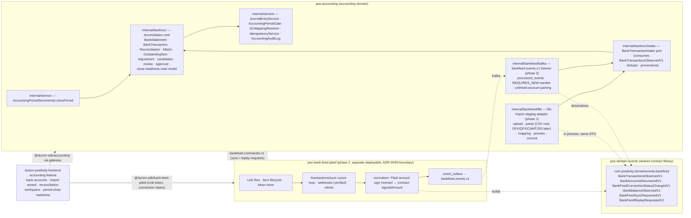
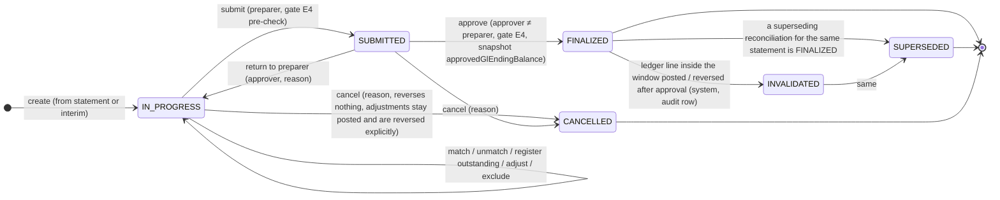

## SPEC — Manual Bank Reconciliation

> Status: PROPOSED · Created 2026-09-28 · Branch: `claude/upbeat-tesla-v8p0jy`
>
> Purpose: specify, with domain authority, how the delivered story F2 bank reconciliation (durion-positivity-backend#965, PR #978) grows into a complete manual
> bank reconciliation — statement import staging, a provider-neutral bank-feed contract, matching, non-posting outstanding items, separation of duties, immutable
> approval with explicit correction, and integration with accounting-period close — and how a later electronic connector (`pos-bank-feed-plaid`) joins the same
> workflow without touching the reconciliation core. Financial meaning and posting semantics were ruled by the Accounting Domain Agent
> (`.claude/agents/domains/accounting-domain.md`); every statement about existing behaviour was verified against source on 2026-09-28. Rules the guides do not
> fix are **not** filled in here: they are listed in §9 with a recommendation, and the body marks each place it leans on one as "(pending Dn)".
> **EXISTING** means verified in code today; **PROPOSED** means this specification.
>
> Authority: [ADR-0044](../../docs/adr/0044-platform-event-only-domain-walls.adr.md) (event-only domain walls, §3 envelope, §4 outbox and idempotent consumers,
> §6 "accounting is event-only"), [ADR-0047](../../docs/adr/0047-accounting-ledger-inalterability-and-fiscal-position-non-goals.adr.md) (soft immutability plus a
> reversal lifecycle; no hash chain), [ADR-0049](../../docs/adr/0049-supplier-integration-module-boundary.adr.md) (one owning integration module holds vendor
> credentials, wire formats and endpoints), [ADR-0062](../../docs/adr/0062-postgres-row-level-multitenancy.adr.md) (tenant-scoped tables, §9 schema conventions,
> §11 storage), [ADR-0017](../../docs/adr/0017-api-controller-http-response-codes.adr.md) (status codes, `ApiError` envelope),
> [AGENT_GUIDE.md](.business-rules/AGENT_GUIDE.md) AD-006 / AD-011 / AD-012 / AD-013 / AD-014 and "Audit requirements",
> [STORY_VALIDATION_CHECKLIST.md](.business-rules/STORY_VALIDATION_CHECKLIST.md), the accounting parity
> [plan](plan-odoo-parity-pos-accounting.md) (story F2, decisions D-6 and D-7, the 2026-07-20 accounting-owner rulings) and the sibling
> [SPEC-inventory-adjustment-gl-posting.md](SPEC-inventory-adjustment-gl-posting.md) for form.
>
> Catalog entries used: `knowledge-catalog/domains/accounting.md`, `knowledge-catalog/backend/pos-accounting.md`,
> `knowledge-catalog/adr/0044-platform-event-only-domain-walls.md`, `knowledge-catalog/adr/0047-accounting-ledger-inalterability-and-fiscal-position-non-goals.md`,
> `knowledge-catalog/adr/0049-supplier-integration-module-boundary.md`, `knowledge-catalog/adr/0062-postgres-row-level-multitenancy.md`,
> `knowledge-catalog/adr/0017-api-controller-http-response-codes.md`.

---

## 1. Findings from the existing implementation (EXISTING, verified 2026-09-28)

Backend paths are relative to `durion-positivity-backend/pos-accounting/src/main/java/com/positivity/accounting/internal/` unless stated; frontend paths to
`durion-positivity-frontend/`; durion paths to `durion/`. Line numbers are from the current `main` checkout.

### 1.1 What story F2 delivered

| Concern | EXISTING behaviour | Where |
| --- | --- | --- |
| Header | `BankReconciliation` — one row per statement import for one reconcilable GL cash account; single currency (hard invariant); `glEndingBalance` snapshotted at import from POSTED lines as-of `statementDate`; `difference` recomputed on every mutation; status `IN_PROGRESS` default. Fields: `glAccount`, `accountCode`, `accountName`, `periodStartDate`, `periodEndDate`, `statementDate`, `currency`, `statementEndingBalance`, `glEndingBalance`, `difference`, `status`, `statementLines`, `adjustments`, `createdAt/By`, `updatedAt`, `finalizedAt/By`. **No `@Version`, no opening balance, no link to `accounting_period`, no statement identity or file hash, no provenance beyond `createdBy`.** | `entity/BankReconciliation.java` l.76-136; DDL `src/main/resources/db/migration/V1__baseline_accounting.sql` l.291-311 |
| Statement line | `BankReconciliationLine` — `lineNumber`, `lineDate`, `description` (500), `amount` (signed, positive = cash increase), `reference`, `status` `UNMATCHED/MATCHED`, `matchId`. **No source transaction id, currency, bank-account identifier, dedupe hash, provenance or notes.** | `entity/BankReconciliationLine.java` l.59-94; DDL l.336-350 |
| Ledger-side match member | `BankReconciliationGlMatch` — `reconciliationId`, `matchId`, `glLineId`, `signedAmount` (debit − credit on the reconciled account), `createdAt`. Unique `(tenant_id, gl_line_id)` — a POSTED line is reconciled at most once across all reconciliations. **No actor; rows are physically deleted on unmatch.** | `entity/BankReconciliationGlMatch.java` l.49-65; DDL l.326-334, unique l.1159-1160; `service/BankReconciliationServiceImpl.java` l.277-283, l.321 |
| Adjustment | `BankReconciliationAdjustment` — `adjustmentType`, `amount` (signed), `description`, `journalEntryId` NOT NULL, `createdAt/By`; "append-only within a reconciliation". | `entity/BankReconciliationAdjustment.java` l.57-81; DDL l.313-324 |
| Enums | `ReconciliationStatus` `IN_PROGRESS, FINALIZED, CANCELLED` ("Lifecycle: IN_PROGRESS → FINALIZED (or CANCELLED)"); `BankReconciliationLineStatus` `UNMATCHED, MATCHED`; `BankAdjustmentType` `BANK_FEE(NEGATIVE_ONLY), NSF_FEE(NEGATIVE_ONLY), INTEREST_EARNED(POSITIVE_ONLY), OTHER(ANY)` with `permits(signum)` and the javadoc that `FLOAT_ADJUSTMENT` "is deliberately absent in v1 … returns as a non-posting outstanding item in the reconciliation fast-follow". | `enums/ReconciliationStatus.java` l.3-12; `enums/BankAdjustmentType.java` l.3-56 |
| Import | `importStatement`: GL account must be `reconcilable` (422 `ACCOUNT_NOT_RECONCILABLE`); `BankStatementCsvParser.parse(csv)`; `glEndingBalance = journalEntryLineRepository.getAccountBalanceAsOf(glAccountId, statementDate.atTime(MAX))`; every parsed row becomes an UNMATCHED line numbered 1..n; `difference = statementEndingBalance − glEndingBalance`. | `service/BankReconciliationServiceImpl.java` l.98-152; `repository/JournalEntryLineRepository.java` l.57-64 |
| CSV parser | Fixed columns `date, description, amount [signed], reference`; header row auto-detected; ISO and US date formats; `$`, thousands separators, parentheses negatives; raw or base64 text; **any malformed row fails the whole import** with `BankStatementParseException` → 400. | `service/BankStatementCsvParser.java` l.12-21 |
| Match | Statement lines must belong and be UNMATCHED; GL lines must post to the reconciled account, sit on a POSTED entry and not be in any `bank_reconciliation_gl_match` row; both sides net within ±0.01 (`MATCH_AMOUNT_MISMATCH`); a new `matchId` groups both sides. **Cardinality is not restricted in code** (N statement × M GL lines is accepted when the sums agree) although the interface says "1-to-1 or N-to-1". No date window, no candidate ranking, no justification, no actor on the match. | `service/BankReconciliationServiceImpl.java` l.185-230, l.270-296; `service/BankReconciliationService.java` l.37 |
| Unmatch | Resolves one match group, sets lines UNMATCHED, `glMatchRepository.deleteByReconciliationIdAndMatchId` — **physical delete, no trace**. | `service/BankReconciliationServiceImpl.java` l.301-327 |
| Adjustment posting | Non-zero amount; `type.permits(signum)` (422 `RECONCILIATION_ADJUSTMENT_SIGN_INVALID`); `txDate = statementDate.atStartOfDay()`; counter account = `glMappingResolver.resolveGLAccount("BANK_RECONCILIATION", type.name(), txDate)`; positive → Dr cash / Cr counter, negative → Dr counter / Cr cash; `createJournalEntry` then `postJournalEntry(id, null)` — **a null override justification means a CLOSED period answers 422 `PERIOD_CLOSED` and a hard-locked date 422 `PERIOD_HARD_LOCKED`**; `sourceEventId = UUIDv7Generator.generate()` — **random, so the JE is not idempotent on the adjustment identity**. | `service/BankReconciliationServiceImpl.java` l.361-423 |
| Finalize | FINALIZED → 409 `RECONCILIATION_ALREADY_FINALIZED`; `difference = statementEndingBalance − (glEndingBalance + Σ adjustments)`; `abs > 0.01` → 422 `RECONCILIATION_NOT_BALANCED`; sets FINALIZED, `finalizedAt/By`. **Unmatched lines do not block; no period-state check; the same permission imports, matches and finalizes.** | `service/BankReconciliationServiceImpl.java` l.425-444, l.570-586 |
| Report / audit | `report`: `totalMatched`, `totalAdjustments`, `totalOutstanding` (= Σ UNMATCHED statement amounts), counts, `difference`. `audit`: **derived, not stored** — IMPORT, one MATCH per surviving group (`by = null`), ADJUSTMENT, FINALIZE. | `service/BankReconciliationServiceImpl.java` l.446-489, l.491-545 |
| API | `/v1/accounting/reconciliations`: `POST /import`, `GET /adjustment-types`, `GET` list (`glAccountId`, `status` filters), `GET /{id}`, `POST /{id}/match`, `/unmatch`, `/adjustments`, `/finalize`, `GET /{id}/report`, `/audit`. Writes need `accounting:reconciliation:adjust`, reads `accounting:reconciliation:view`; ten `@EmitEvent` ids registered. | `controller/BankReconciliationController.java` l.65-592; `config/EventTypes.java` l.354-388; `security/AccountingPermissions.java` l.164-168 |
| Seed | Category `BANK_RECONCILIATION` with keys `BANK_FEE` → 6030, `NSF_FEE` → 6020, `INTEREST_EARNED` → 4920, `OTHER` → 2360 (liability clearing "so reconciliation noise never lands in revenue/expense"). `1000 Cash` (ASSET, `BANK_CASH`) is seeded **`reconcilable = FALSE`**; `1090 Undeposited Funds` is reconcilable TRUE. | `src/main/resources/db/migration/R__seed_reference_accounting.sql` l.14, l.23, l.293-357 |
| Tests | Service, guards-and-views and controller suites cover parse, sign guards, N-to-1 within tolerance, the balance gate and 403s. **No test for duplicate import, overlapping statements, period interaction, reversal of a matched line, postings after import, or finalize with unmatched lines.** | `src/test/java/com/positivity/accounting/internal/service/BankReconciliationServiceTest.java`, `BankReconciliationGuardsAndViewsTest.java`, `controller/BankReconciliationControllerTest.java` |

### 1.2 Ledger, periods and audit facts the design rests on

| Fact | EXISTING | Where |
| --- | --- | --- |
| Journal entry lifecycle | DRAFT → POSTED (immutable) → REVERSED via a **new POSTED reversal entry** with inverted lines, same `sourceEventId`, its own entry number; the original flips POSTED → REVERSED atomically (`markReversed … WHERE status = POSTED`); audit row `REVERSE`; outbox `JournalEntryReversed`. **Nothing in the reversal path consults `bank_reconciliation_gl_match`.** | `service/JournalEntryServiceImpl.java` l.399-470, l.533; `repository/JournalEntryRepository.java` l.96-102 |
| As-of balance | `getAccountBalanceAsOf`: Σ(debit − credit) over lines whose entry is `POSTED` and `transactionDate <= asOf`. The platform documents that a REVERSED original is *excluded* while its POSTED reversal is *included* and calls the pair net-zero (`repository/JournalEntryRepository.java` l.211-214, `service/FinancialReportingService.java` l.128-129). **Arithmetically an excluded +X and an included −X net to −X, not 0; §8 pins this with a test before the reconciliation balance depends on it.** | `repository/JournalEntryLineRepository.java` l.57-64 |
| Periods | `AccountingPeriod`: `periodCode` `YYYY-MM`, `status` OPEN/CLOSED only, `closedAt/By`, `reopenedAt/By`, `reopenJustification` (most recent reopen only), `@Version`. Missing row = OPEN; auto-provisioned on first posting. `closePeriod`: CLOSED → 409 `PERIOD_ALREADY_CLOSED`; DRAFT entries inside → 422 `PERIOD_HAS_DRAFT_ENTRIES` with ids; a month that has not started cannot close; audit row `PERIOD_CLOSE`. `reopenPeriod`: blank justification → 400; OPEN → 409 `PERIOD_ALREADY_OPEN`; audit `PERIOD_REOPEN`. **Close consults only DRAFT journal entries — never reconciliations, imports, adjustments or cash balances. No readiness endpoint exists; validation appears only as a refused close.** | `entity/AccountingPeriod.java` l.71-116; `service/AccountingPeriodServiceImpl.java` l.127-157, l.159-196, l.228-235 |
| Period gate | `AccountingPeriodGate.assertPostingAllowed`: order hard lock > closed > override; hard-locked date → 422 `PERIOD_HARD_LOCKED` (never overridable); period row read `FOR UPDATE`; CLOSED without justification, or with justification but without `accounting:period:override` → 422 `PERIOD_CLOSED`; otherwise audit `PERIOD_OVERRIDE_POST`. `isPostingBlocked` / `isHardLocked` are the non-throwing pre-checks. The override authority exists only in `permissions.yaml` and as `OVERRIDE_AUTHORITY`, checked programmatically. | `service/AccountingPeriodGate.java` l.69, l.97-132, l.143-157; `src/main/resources/permissions.yaml` l.81 |
| Generic audit row | `AccountingAuditLog`: `entityType`, `entityId`, `operation`, `userId`, `timestamp`, `justification`, `ipAddress`, `traceId`, `oldValue`, `newValue`. Writers: period close/reopen, override post, hard-lock set, journal reversal. **Bank reconciliation writes none; no REST endpoint reads the log.** | `entity/AccountingAuditLog.java` l.58-93 |
| Cash flows into the bank account | AR receipts post `Dr 1090 Undeposited Funds / Cr 1200 AR` (D-3); processor settlements post `Dr 1000 Cash (net) / Dr Processor Fees / Cr 1090 / Cr 2350` (D-13); AP payments credit cash. So the bank-side deposit of a card payout is the settlement JE's cash line; AR receipts alone never touch 1000. No bank-account entity, no transfer concept, no `currency` column on `GLAccount`, `JournalEntry` or `JournalEntryLine` (USD implied). | seed l.106-109, l.219-282; `entity/GLAccount.java` l.107-108 |
| Legal entity | **No legal-entity concept exists in code** (`legalEntity|legal_entity`: 0 hits over backend Java/SQL/YAML). The tenant (ADR-0062) is the only entity boundary. | ADR-0062 §1, §4 |
| Integration precedent | `pos-invoice` `internal/settlement/SettlementSourcePort` (`fetchSettlements(cursor)`, `currentConfig()`, placeholder `UnavailableSettlementSourceAdapter`) publishing `SettlementReportedV1` through the outbox; accounting consumes and offers a review controller. | `pos-invoice/src/main/java/com/positivity/invoice/internal/settlement/SettlementSourcePort.java` l.24-42; `pos-domain-events/src/main/java/com/positivity/domainevents/payment/SettlementReportedV1.java` |

### 1.3 Frontend and SDK

- `src/app/features/accounting/` has a period-close page (`pages/period-close/period-close-page.component.{ts,html}`: OPEN/CLOSED rows, close by month, reopen dialog
  with justification, error classification in `services/period-close.service.ts` l.66-95 counting `fieldErrors[draftJournalEntryIds]`) but **no pre-close checklist,
  no reconciliation UI, no journal-entry or GL-account UI**. Period status model: `'OPEN' | 'CLOSED' | 'UNKNOWN'` (`models/period-close.models.ts` l.11). Route
  `periods` is gated by `accounting:period:view` (`accounting.routes.ts` l.178); write gates `ACCOUNTING_SECTION.periodClose/periodReopen`
  (`core/security/route-permissions.ts` l.336-339).
- `@durion-sdk/accounting` 0.73.0-alpha (`.sdk-tarballs/`) already exposes `BankReconciliationService` (import/list/get/match/unmatch/addAdjustment/
  listAdjustmentTypes/finalize/report/audit) — **unused in `src/`**. `core/security/permission-catalog.ts` l.411-414 lists `accounting:period:hard_lock|override` and
  `accounting:reconciliation:adjust|view`.
- Matching-UI precedent: vendor-bill match exceptions (`pages/payables/vendor-invoices-exceptions/…`) show candidates with a score, a Select action and a
  mandatory reason on resolution.

### 1.4 Discrepancies and gaps (EXISTING state versus the documents)

| # | Finding | Evidence |
| --- | --- | --- |
| G1 | README lists `FLOAT_ADJUSTMENT` among adjustment types; the enum removed it (D-6 amendment) and the controller test `shouldNotServeFloatAdjustment` pins its absence. | `pos-accounting/README.md` l.78; `enums/BankAdjustmentType.java` l.14-18 |
| G2 | `CANCELLED` is a legal status with a check constraint but no transition sets it and no endpoint exists. | `enums/ReconciliationStatus.java`; DDL l.310 |
| G3 | The audit trail is derived from surviving rows: unmatch and any deleted match leave no entry, MATCH carries `by = null`, and nothing goes to `AccountingAuditLog`. | `BankReconciliationServiceImpl.java` l.491-545 |
| G4 | `glEndingBalance` is frozen at import; a JE posted after import but dated on/before `statementDate` is invisible to the finalize gate. | l.111-112, l.581-586 |
| G5 | Reversing a matched cash line is allowed and leaves the match intact; the reversal creates a new unmatched cash line on the same account. | `JournalEntryServiceImpl.java` l.399-470 |
| G6 | Period close ignores reconciliations, unposted adjustments, imports and cash balances; reconciliation ignores period state (only the adjustment JE hits the gate). | `AccountingPeriodServiceImpl.java` l.127-157 |
| G7 | `1000 Cash` is seeded `reconcilable = FALSE`, so the one seeded bank account cannot be reconciled without an edit through `updateGLAccount`. | seed l.14 |
| G8 | No duplicate-import, overlap, contiguity, date-window or line-date validation on import; the whole file fails on the first malformed row; no preview, column mapping or sign-convention choice. | l.98-152; parser l.12-21 |
| G9 | `sourceEventId` is random per adjustment: a retried request posts twice. | l.398 |
| G10 | `ERROR_CODES.md` describes `RECONCILIATION_NOT_BALANCED` as "unmatched items remain" (the code gate is balance-only) and `STATEMENT_IMPORT_FAILED` 422 (the code answers 400 `VALIDATION_ERROR`); `ACCOUNT_NOT_RECONCILABLE`, `MATCH_AMOUNT_MISMATCH`, `RECONCILIATION_ADJUSTMENT_SIGN_INVALID` are thrown but not catalogued. | `.business-rules/ERROR_CODES.md` l.921-1012 |
| G11 | `PERMISSION_TAXONOMY.md` §11 lists six reconciliation keys (`view`, `import_statement`, `match`, `create_adjustment`, `finalize`, `reopen`); the code uses `view|adjust`, described in `permissions.yaml` and `AccountingPermissions` as *settlement* permissions. | `.business-rules/PERMISSION_TAXONOMY.md` l.1148-1221; `permissions.yaml` l.103-106 |
| G12 | Story #187 and its wireframe say "no transitions out of FINALIZED", "N statement lines → 1 system transaction, no tolerance", and still list `FLOAT_ADJUSTMENT`; the backend accepts N×M within ±0.01. The reconciliation UI was never built ("Angular UI + SDK regen follow after the backend lands"). | `docs/capabilities/CAP-055/stories/frontend/CAP_055.187.frontend.md` l.412-429; `.ui/frontend-story-reconciliation-support-bank-cash-re-187.wf.md` l.68-71; plan l.438 |
| G13 | `accounting-questions.md` assumes a bank-account entity with `currency` and a `jel.reconciled` column; neither exists (the `gl_match` table is the marker). | `accounting-questions.md` l.1117-1128, l.1148-1166 |
| G14 | Justification minimum length is 10 characters in AGENT_GUIDE "Audit requirements" and 20 in `ERROR_CODES.md` `JUSTIFICATION_REQUIRED`. | AGENT_GUIDE l.484-496; ERROR_CODES l.469-489 |
| G15 | The as-of balance treatment of a REVERSED original (§1.2) is documented as net-zero but reads as −X; no test exercises the real filter — `PaymentApplicationReversalGLPostingLifecycleIT.reverse_postsSymmetricReversingEntry_netZero` sums the lines of both entries regardless of status, and `FinancialReportingG2ServiceTest.generalLedgerReversingPairNetsToZero` mocks both entries as POSTED. | `JournalEntryRepository.java` l.211-214; `src/test/java/com/positivity/accounting/internal/service/PaymentApplicationReversalGLPostingLifecycleIT.java` l.143-175, `FinancialReportingG2ServiceTest.java` l.173-195 |

### 1.5 Conflicts with current domain rules that this specification proposes to change

Each is called out here before the body proposes anything; the resolution is a decision in §9 unless the existing rule is kept.

| # | Current rule (EXISTING) | Proposed change | Decision |
| --- | --- | --- | --- |
| C1 | Finalize is a **balance-only** gate; "matching is documentation, not arithmetic" (accounting-owner ruling 2026-07-20, plan l.437). | Approval additionally requires **no unexplained bank transaction and no unexplained ledger line** inside the window (§4.8); the balance identity stays. | D2 |
| C2 | `FLOAT_ADJUSTMENT` is banned because a timing difference must not post a cash-moving JE. | Kept. Timing differences become **non-posting `OutstandingItem`s** (the fast-follow the ruling itself named); nothing posts for them. | none — implements the ruling |
| C3 | Adjustments are dated at `statementDate` and hit the gate with no override. | Adjustment date defaults to the explaining bank transaction's date when that period is OPEN, else a caller-chosen date in an OPEN period; override only with explicit justification + `accounting:period:override`. | D7 |
| C4 | One permission (`adjust`) prepares and finalizes. | New `accounting:reconciliation:approve`; preparer ≠ approver enforced by default. | D3 |
| C5 | `Σ matched` is excluded from the identity because the frozen snapshot already contains matched lines. | The ruling's arithmetic is kept and generalized: the GL balance is **live**, so only adjustments dated *after* the statement end are added (§3.7). `Σ matched` stays out. | none — extends the ruling |
| C6 | Cardinality unrestricted in code; interface says 1-to-1 / N-to-1. | 1:1, 1:N and N:1 with justification for non-1:1; N:M refused. | D12 covers auto-matching only; cardinality is fixed here |
| C7 | A FINALIZED reconciliation is terminal and immutable; the taxonomy proposes `reopen`. | Immutability kept. Correction is a **superseding reconciliation** or an automatic **invalidation**; no in-place reopen of an approved result. | D11 (reversal), D10 (late bank data) |
| C8 | Period close checks DRAFT entries only. | Close consults a bank-reconciliation readiness read model under a **configurable policy**; nothing is hardcoded as required. | D4, D5 |

## 2. Module and dependency diagram (PROPOSED)

The reconciliation workflow and every accounting decision (what a bank transaction means, what posts, what only explains a timing difference, when a period may
close) live in `pos-accounting`. Bank data reaches the core through **one provider-neutral contract** whether it comes from a manual file today or an electronic
connector later. The core never knows a file format, a provider, a credential, a cursor or a webhook.



### 2.1 Package split inside `pos-accounting`

| Package (PROPOSED) | Holds | May depend on | Must never depend on |
| --- | --- | --- | --- |
| `internal/bankrec/` (sub-packages `entity`, `repository`, `service`, `dto`, `controller`, `readmodel`) | The core of §3–§6: statements, transactions, reconciliations, matches, outstanding items, adjustments, candidate ranking, the review and close-readiness read models, approval and correction. | `internal/service` (journal entries, period gate, mapping resolver, idempotency, audit log), `internal/entity` (GLAccount, JournalEntryLine), `pos-domain-events` (`bankfeed` DTOs as the intake type), `pos-tenancy-common`. | `internal/bankfeed/**`, any file-format library, any HTTP client, any provider SDK, `java.nio.file` for statement bytes. |
| `internal/bankrec/intake/` | `BankTransactionIntake` port: `accept(BankTransactionsObservedV1 batch, IntakeContext ctx)`; normalization to the storage model; fingerprinting; source-id upsert; possible-duplicate flagging; statement header creation when the batch carries one. | `internal/bankrec/**` | same as core |
| `internal/bankfeed/file/` | The **phase 1 adapter**: `bank_import` staging (upload, parse, mapping, preview, row correction, commit), `BankStatementCsvParser` moved here and generalized, later `Ofx`/`Qfx`/`Camt053` parsers behind one `StatementFileParser` interface. Its commit builds a `BankTransactionsObservedV1` (with the `statement` block) and calls the intake port in-process. | `internal/bankrec/intake` (the port only), `pos-domain-events`. | `internal/bankrec/service/**` internals, `internal/bankrec/repository/**`. |
| `internal/bankfeed/kafka/` | The **phase 2 listener** on `bankfeed.events.v1` (amended ADR-0044 shape: not `@Transactional`, `processed_events` before any transaction, handler + mark in `REQUIRES_NEW`), the `bank_feed_batch` parking table for accounts not yet linked to a GL account, and the `bankfeed.commands.v1` publisher (sync / replay requests) through `OutboxEventWriter`. | `internal/bankrec/intake`, `pos-domain-events`, `config/OutboxEventWriter`. | provider types of any kind — it sees only the contract. |

ArchUnit (module `ArchitectureTest` plus a `pos-archunit` `DomainWallsTest` case): `..bankrec..` must not access `..bankfeed..`; `..bankfeed..` may access only
`..bankrec.intake..` and `..bankrec.dto..` of the core; no class under `com.positivity.accounting..` may import `com.plaid..`, `org.apache.commons.csv..` or any
statement-format library outside `..bankfeed.file..`. The existing `BankReconciliationController` and `BankReconciliationServiceImpl` move to `internal/bankrec/`
unchanged in behaviour first (a rename-only commit), then evolve per §3–§6.

### 2.2 The provider-neutral bank-feed contract

DTOs live in `pos-domain-events` under a new package `com.positivity.domainevents.bankfeed`, beside `payment/SettlementReportedV1` (the ADR-0049 precedent), and are
registered in `DomainEventContractTest`. Envelope per ADR-0044 §3 (`eventId` UUIDv7, `eventType`, `schemaVersion`, `aggregateId`, `aggregateVersion`, `occurredAtUtc`,
`sourceService`, `correlationId`, `actor`, required `tenantId`). Payload evolution is additive-only within `schemaVersion`; a breaking change is a new topic version.

| eventType | Topic | Producer → consumer | Aggregate id | Purpose |
| --- | --- | --- | --- | --- |
| `bankfeed.transactions.observed` (`BankTransactionsObservedV1`) | `bankfeed.events.v1` (phase 2); in-process call (phase 1) | connector / file adapter → accounting intake | `feedAccountRef` scope key (phase 1: `importId`) | A batch of normalized bank transactions for one feed account, each `ADDED`, `MODIFIED` or `REMOVED`, with optional statement header. |
| `bankfeed.accounts.discovered` (`BankAccountsDiscoveredV1`) | `bankfeed.events.v1` | connector → accounting | `feedConnectionId` | Accounts available under a connection, for the GL-account linking screen. |
| `bankfeed.connection.status-changed` (`BankFeedConnectionStatusChangedV1`) | `bankfeed.events.v1` | connector → accounting | `feedConnectionId` | `ACTIVE`, `LOGIN_REQUIRED`, `PENDING_DISCONNECT`, `REVOKED`, `REMOVED`, `ERROR` with a neutral `reasonCode`. |
| `bankfeed.balance.observed` (`BankBalanceObservedV1`) | `bankfeed.events.v1` | connector → accounting | `feedAccountRef` | Observed current/available balance at an instant — **informational only**; never the statement closing balance (§7.2). |
| `bankfeed.sync.requested` (`BankFeedSyncRequestedV1`) | `bankfeed.commands.v1` | accounting → connector | `feedConnectionId` | On-demand refresh (ADR-0044 R4: command with pending state + idempotency key). |
| `bankfeed.replay.requested` (`BankFeedReplayRequestedV1`) | `bankfeed.commands.v1` | accounting → connector | `feedAccountRef` | Re-emit transactions from a date (ADR-0044 §4 bootstrap/backfill). |

`BankTransactionsObservedV1` payload (all identifiers UUID-typed except external ids, which stay `String` per ADR-0027 l.70):

| Field | Type | Rule |
| --- | --- | --- |
| `sourceKind` | `FILE_IMPORT` / `MANUAL_ENTRY` / `BANK_FEED` | Provenance class; the only thing the core branches on (for dedupe policy, §4.5). |
| `connectorCode` | String, nullable | Provenance label (`"plaid"`, `"csv-v1"`); **never** used for behaviour in the core. |
| `feedConnectionId` | UUID, nullable | Connector's connection aggregate (phase 2). |
| `feedAccountRef` | String | Connector's account id, or the `importId` string for files. Resolved to a GL account through `bank_account_profile` (§6.4); unresolved batches park. |
| `currency` | String(3) | ISO code; the core refuses a currency that differs from the linked account (D18). |
| `observedAt` | Instant | When the source observed the batch. |
| `cursorRef` | String, nullable | Opaque connector cursor for traceability only; the core never interprets it. |
| `statement` | object, nullable | `{statementRef, startDate, endDate, openingBalance, closingBalance}` — present for files and manual entry (and CAMT.053 later); **null for feeds**. |
| `transactions[]` | list | Each: `sourceTransactionId` (String, nullable for files without ids), `sourceRowNumber` (Integer, nullable), `change` (`ADDED`/`MODIFIED`/`REMOVED`), `settlementState` (`PENDING`/`POSTED`), `transactionDate`, `authorizedDate` (nullable), `signedAmount` (**positive = money into the account**, the F2 convention), `currency`, `description`, `originalDescription` (nullable), `reference` (nullable), `checkNumber` (nullable), `counterpartyName` (nullable), `categoryHint` (nullable, informational), `supersedesSourceTransactionId` (nullable — a posted item replacing a pending one). |

The sign convention of the contract is the core's convention. A connector whose provider uses the opposite sign (Plaid does, §7.2) inverts **inside the connector**.

### 2.3 Alternative and decision

The alternative is a separate `pos-bank-feed` module from phase 1 that owns file parsing too, publishing over Kafka even for uploads. It buys nothing in phase 1 (the
only source is a file the accountant uploads in the accounting UI, the batch must be previewed and corrected synchronously, and a Kafka hop would turn a 200 into a
202 with polling) and costs a deployable, a tenancy adoption, an SDK package and an external-client register entry before any provider exists. **Recommendation
(D1): file adapter inside `pos-accounting` behind the contract, with the ArchUnit wall; `pos-bank-feed-plaid` as a separate deployable in phase 2**, exactly as
ADR-0049 keeps vendor protocols in one owning integration module while business aggregates stay with their domain. If a second connector family arrives (an
OFX-direct-connect or Open Banking aggregator), each is its own `pos-bank-feed-<provider>` module speaking the same contract (ADR-0051's one-adapter-per-family rule).

## 3. Domain entities, key fields, invariants, statuses, events

Every table is tenant-scoped per ADR-0062 §9 (`tenant_id uuid DEFAULT public.app_current_tenant() NOT NULL`, RLS ENABLE + FORCE with the `tenant_isolation` policy,
uniques and foreign keys scoped by `(tenant_id, …)`); every id is UUIDv7 (`@GeneratedValue` + `@UUIDv7Id`, AD-006); every entity `extends TenantScopedEntity`; actor
strings come from `SecurityContextHelper` (ADR-0018). "Today" = EXISTING, "Proposed" = this spec.

### 3.1 BankStatement (PROPOSED, new)

The statement **header**: what the bank says the account held at two instants and which window the lines cover. It is the bank's assertion, never a ledger fact.

| Field | Type | Rule |
| --- | --- | --- |
| `statementId` | UUID | PK. |
| `glAccountId` | UUID → `gl_account` | The reconciled ledger bank account (`reconcilable = true`, subtype `BANK_CASH`, pending D5). The tenant is the entity boundary (D6). |
| `sourceKind` / `sourceRef` / `connectorCode` | enum / UUID / String | Provenance: `FILE_IMPORT` (`sourceRef = importId`), `MANUAL_ENTRY` (null), `BANK_FEED` (`sourceRef = feedConnectionId`; only when a later format such as CAMT.053 carries balances). |
| `statementRef` | String(64), nullable | The bank's own statement number when the file carries one. |
| `startDate`, `endDate` | date | `startDate ≤ endDate`; never assumed to align with an accounting period (§5.7). |
| `openingBalance`, `closingBalance` | numeric(19,4) | As printed by the bank. |
| `activityTotal` | numeric(19,4) | Σ `signedAmount` of the statement's transactions at commit; invariant **E1** `openingBalance + activityTotal = closingBalance` (±0.01) or the commit is refused (`STATEMENT_ACTIVITY_MISMATCH`). |
| `currency` | String(3) | Equals the account profile currency (D18). |
| `status` | `COMMITTED` / `SUPERSEDED` | A statement is immutable once committed; a corrected re-import supersedes it (`supersededByStatementId`) and is allowed only while no FINALIZED reconciliation references it, otherwise the reconciliation must be superseded first (§4.9). |
| `createdAt/By` | Instant / String | Audit. |

Invariants: **U1** one COMMITTED statement per `(glAccountId, startDate, endDate)`; **U2** COMMITTED windows on one account never overlap (Postgres exclusion constraint on
`daterange(start_date, end_date, '[]')`, §6.5); **E2** contiguity — `openingBalance` equals the previous COMMITTED statement's `closingBalance` and `startDate` is the day
after its `endDate` unless the gap is explicitly acknowledged with a justification (D17).

### 3.2 BankTransaction (PROPOSED, replaces `bank_reconciliation_line`)

One line the bank reports. It exists independently of any reconciliation and is **not a journal entry**: it is evidence that cash moved at the bank; the ledger says
whether the books already know. Statement lines of F2 (`bank_reconciliation_line`, DDL l.336-350) become rows here; the reconciliation no longer owns lines.

| Field | Today (`BankReconciliationLine`) | Proposed (`BankTransaction`) |
| --- | --- | --- |
| Identity | `lineId`, `reconciliation` FK, `lineNumber` | `bankTransactionId`; `glAccountId`; `statementId` nullable (feeds have none); `sourceKind`, `sourceRef`, `connectorCode`, `sourceTransactionId` String(128) nullable, `sourceRowNumber` |
| Retained source data | `lineDate`, `description`(500), `amount` signed, `reference`(255) | `transactionDate`, `authorizedDate` nullable, `signedAmount` (positive = cash in), `currency`(3), `description`(500), `originalDescription`(1000) nullable, `normalizedDescription`(500), `reference`(255), `checkNumber`(32), `counterpartyName`(255), `categoryHint`(64) |
| Settlement | — | `settlementState` `PENDING` / `POSTED`; `supersedesBankTransactionId` (the pending row a posted one replaced); a `PENDING` row is visible, never matchable (D19) |
| Dedupe | — | `fingerprint` char(64) = SHA-256 of `glAccountId | transactionDate | signedAmount(4 dp) | normalizedDescription | reference-or-checkNumber`; `duplicateOfBankTransactionId` |
| Feed lifecycle | — | `feedChange` `ADDED`/`MODIFIED`/`REMOVED`, `firstObservedAt`, `lastObservedAt`, `removedAt`; a `REMOVED` row stays (status `REMOVED_BY_SOURCE`) for audit |
| Status | `UNMATCHED`, `MATCHED` | `UNMATCHED`, `POSSIBLE_DUPLICATE`, `MATCHED`, `EXCLUDED` (justified, non-posting), `REMOVED_BY_SOURCE`; plus flags `arrivedAfterApproval` (D10) |
| Concurrency | — | `@Version` |

Invariants: **U3** `(glAccountId, sourceKind, sourceRef, sourceTransactionId)` unique where `sourceTransactionId` is not null — the same source reporting the same id is
an upsert (`MODIFIED`), never a second row; **U4** a row participates in at most one active match (partial unique on `bank_reconciliation_bank_match`); **R1** a row
whose fingerprint equals an existing row's on the same account, from a different source or from a source without ids, enters as `POSSIBLE_DUPLICATE` and is never
silently dropped (§4.5); **R2** `EXCLUDED` and `REMOVED_BY_SOURCE` rows leave every sum; **R3** amounts are stored exactly as delivered after sign normalization.

### 3.3 BankImport (PROPOSED, new — the file staging session)

The adapter's own aggregate. Nothing here is accounting truth until `commit`.

| Field | Type | Rule |
| --- | --- | --- |
| `importId` | UUID | PK; `requestId` UUIDv7 from the client for idempotent creation. |
| `glAccountId`, `currency` | UUID, String(3) | Target account. |
| `fileName`, `contentType`, `fileSize`, `fileSha256` | String / String / long / char(64) | The raw bytes are retained in `bank_import_file` (D13); `fileSha256` unique per account among COMMITTED imports (`IMPORT_FILE_ALREADY_COMMITTED`). |
| `formatCode` | `CSV` now; `OFX`, `QFX`, `CAMT053` later | Chooses the `StatementFileParser`; not visible to the core. |
| `columnMapping` | jsonb | `{date, description, amount | debit + credit, reference, checkNumber, sourceTransactionId}` by header name or index; a saved mapping per account is the default for the next import. |
| `signConvention` | `SIGNED_AMOUNT` / `SIGNED_AMOUNT_INVERTED` / `DEBIT_CREDIT_COLUMNS` | Normalized to the core convention at parse time; the preview shows the result so the accountant confirms the direction. |
| `dateFormat`, `decimalFormat`, `encoding`, `delimiter` | Strings | Parser options with sensible defaults (today's parser accepts ISO and US dates). |
| statement header | `statementStartDate`, `statementEndDate`, `openingBalance`, `closingBalance`, `statementRef` | Entered with the upload; validated against parsed rows (E1) before commit. |
| Counts | `rowCount`, `acceptedCount`, `rejectedCount`, `possibleDuplicateCount`, `skippedCount`, `outOfWindowCount` | Recomputed on every re-parse. |
| `status` | `UPLOADED` → `VALIDATED` → `COMMITTED` \| `DISCARDED`; `VALIDATED` re-enters on mapping change | `COMMITTED` and `DISCARDED` are terminal. |
| Outcome | `statementId`, `reconciliationId` nullable | Set at commit (`startReconciliation = true` creates the reconciliation in the same transaction). |
| Audit | `createdAt/By`, `committedAt/By`, `discardedAt/By`, `discardReason`, `@Version` | Every transition also writes `AccountingAuditLog` (`entityType = BANK_IMPORT`). |

`BankImportRow`: `rowId`, `importId`, `rowNumber`, `rawValues` jsonb, parsed `date`/`signedAmount`/`description`/`reference`/`checkNumber`/`sourceTransactionId`,
`fingerprint`, `rowStatus` (`PARSED`, `REJECTED`, `CORRECTED`, `SKIPPED`, `POSSIBLE_DUPLICATE`, `OUT_OF_WINDOW`, `COMMITTED`), `rejectionCode`, `rejectionDetail`,
`correctedValues` jsonb, `correctedBy/At`, `bankTransactionId` (after commit). Unique `(importId, rowNumber)`. A row is corrected by editing values or skipped with a
reason; the original `rawValues` are never rewritten.

### 3.4 ReconciliationMatch (EXISTING `bank_reconciliation_gl_match` extended into a header + two member tables)

| Field | Today | Proposed |
| --- | --- | --- |
| Header | none — `matchId` is just a shared UUID on lines and gl-match rows | `bank_reconciliation_match`: `matchId`, `reconciliationId`, `matchKind` (`ONE_TO_ONE`, `ONE_TO_MANY` = 1 bank : N ledger, `MANY_TO_ONE` = N bank : 1 ledger, `ADJUSTMENT` = bank transaction ↔ the cash line of an adjustment JE), `state`, `origin` (`USER`, `RULE`), `confidenceScore` 0–100 nullable, `reasons[]` (jsonb: `EXACT_AMOUNT`, `WITHIN_TOLERANCE`, `DATE_IN_WINDOW`, `DATE_OUT_OF_WINDOW`, `REFERENCE_MATCH`, `DESCRIPTION_SIMILAR`), `bankTotal`, `ledgerTotal`, `toleranceUsed`, `justification`(1000) nullable, `proposedBy/At`, `acceptedBy/At`, `rejectedBy/At`, `unmatchedBy/At`, `unmatchReason`, `brokenByJournalEntryId` |
| Ledger members | `bank_reconciliation_gl_match(gl_line_id, signed_amount)` unique on `gl_line_id` | kept, plus FK to the header; the unique becomes **partial on active matches** (`state IN ('PROPOSED','ACCEPTED')`) so history survives unmatch |
| Bank members | `bank_reconciliation_line.match_id` | `bank_reconciliation_bank_match(match_id, bank_transaction_id)`, partial unique on active matches |
| State | implicit (row exists) | `PROPOSED` → `ACCEPTED` \| `REJECTED`; `ACCEPTED` → `UNMATCHED` (human, reason) \| `BROKEN` (ledger line reversed, §5.5); a FINALIZED reconciliation's matches are sealed (no state transition; only supersede releases their members' `active` flag, §4.9) |

Invariants: **M1** Σ bank `signedAmount` − Σ ledger `signedAmount` within ±0.01 (existing `requireAmountsAgree`, l.288-299) — the tolerance covers rounding only; a larger
residual is an adjustment, not a match; **M2** exactly one side may have more than one member (C6); **M3** every ledger member is POSTED, on the reconciled account, dated
on/before the reconciliation's `statementEndDate` (a later-dated line belongs to a later window); **M4** every bank member is `UNMATCHED` or `POSSIBLE_DUPLICATE`-resolved,
`settlementState = POSTED`, dated inside the window or carried in as unexplained from an earlier window; **M5** `justification` is required when `matchKind ≠ ONE_TO_ONE`,
when `toleranceUsed ≠ 0`, when any date is outside the window, or when a member was a `POSSIBLE_DUPLICATE` (`MATCH_REQUIRES_REVIEW`); **M6** a `RULE`-origin match is never
`ACCEPTED` by the system (D12); **M7** matches are never deleted.

### 3.5 ReconciliationAdjustment (EXISTING, extended)

| Field | Today | Proposed |
| --- | --- | --- |
| Identity, type, amount, description, `journalEntryId`, `createdAt/By` | as l.57-81 | unchanged; `requestId` UUIDv7 (unique) for idempotent creation |
| Date | implicit `statementDate` | `transactionDate` stored (the date actually posted, rule §4.7 / D7); `postedPeriodCode` |
| Link | — | `bankTransactionId` nullable — the bank item this adjustment explains; on posting, the JE's cash line is matched to it as an `ADJUSTMENT` match |
| Override | — | `overrideJustification` nullable — recorded when the caller used `accounting:period:override` |
| Reversal | — | `status` `POSTED` / `REVERSED`; `reversalJournalEntryId`, `reversedAt/By`, `reversalReason` (§4.9) |
| Type | `BANK_FEE`, `NSF_FEE`, `INTEREST_EARNED`, `OTHER` (check constraint l.323) | unchanged set; `TRANSFER` with `counterGlAccountId` is **pending D9**; returned-payment principal is **not** an adjustment (D8) |
| Idempotency | random `sourceEventId` | `sourceEventId = nameUUIDFromBytes("BANK_RECONCILIATION_ADJUSTMENT:" + adjustmentId)`; `IdempotencyService` key `BANK_RECONCILIATION_ADJUSTMENT:<adjustmentId>` registered with the `journalEntryId` |

The debit/credit rule is the existing one (l.385-394): positive → Dr reconciled cash / Cr counter; negative → Dr counter / Cr reconciled cash; the counter account is
resolved through `GLMappingResolver.resolveGLAccount("BANK_RECONCILIATION", type.name(), transactionDate)`. **No new mapping is introduced by this specification.**

### 3.6 OutstandingItem (PROPOSED, new — the non-posting timing difference)

The fast-follow the 2026-07-20 ruling named: "a non-posting outstanding-items model (deposits-in-transit / outstanding checks) so a period with genuine timing
differences finalizes with zero JE". An outstanding item **explains** a difference; it never posts.

| Field | Type | Rule |
| --- | --- | --- |
| `outstandingItemId`, `glAccountId` | UUID | PK; account. |
| `side` | `LEDGER` / `BANK` | Which side has the item the other side lacks. |
| `glLineId` | UUID, nullable | `LEDGER` side: a POSTED line on the account, dated on/before the registering window's end, in no active match. |
| `bankTransactionId` | UUID, nullable | `BANK` side: a bank transaction the ledger will never book because the bank will correct it (`BANK_ERROR_PENDING`). |
| `itemKind` | `DEPOSIT_IN_TRANSIT` (ledger, `signedAmount > 0`), `OUTSTANDING_CHECK` (ledger, `< 0`), `OTHER_LEDGER_TIMING`, `BANK_ERROR_PENDING` (bank) | The sign rule is validated (`OUTSTANDING_ITEM_NOT_ELIGIBLE`). |
| `signedAmount`, `itemDate` | numeric(19,4), date | Copied from the source line at registration. |
| `registeredInReconciliationId`, `registeredBy/At`, `justification` | UUID, String, Instant, String(1000) | Registration is an accounting judgement; justification required for `OTHER_LEDGER_TIMING` and `BANK_ERROR_PENDING`, and for any item older than `pos.accounting.bankrec.outstanding.aging-warning-days` (default 90) at registration. |
| `status` | `OPEN` → `CLEARED` (matched in a later reconciliation; `clearedInReconciliationId`, `clearedByMatchId`, `clearedAt`) \| `VOIDED` (source JE reversed; `voidedByJournalEntryId`) \| `RELEASED` (human undo with reason while the registering reconciliation is not FINALIZED) | Carried forward automatically while `OPEN` (§5.4). |

Invariants: **O1** a ledger line is in at most one `OPEN` item and never simultaneously in an active match (partial uniques + service check); **O2** an `OPEN` item
contributes to every later reconciliation on the account until it leaves `OPEN`; **O3** registering an item posts nothing — the ban on `FLOAT_ADJUSTMENT` (C2) stands.

### 3.7 Reconciliation (EXISTING `bank_reconciliation` extended) and the explicit equation

| Field | Today | Proposed |
| --- | --- | --- |
| Window | `periodStartDate`, `periodEndDate`, `statementDate` | `statementId` (FK, nullable only for an interim reconciliation keyed by hand); `statementStartDate`, `statementEndDate` (renamed from `period*` — they never were accounting periods); `statementDate` retired (= `statementEndDate`); `accountingPeriodCode` = `YearMonth.from(statementEndDate)` for attribution and readiness, **not** a constraint on the window |
| Bank side | `statementEndingBalance` | `statementOpeningBalance`, `statementClosingBalance` (from the statement, or keyed for an interim reconciliation with provenance `MANUAL_ENTRY`), `sumOutstandingLedgerItems`, `sumOutstandingBankItems`, `adjustedBankBalance` |
| Book side | `glEndingBalance` frozen at import | `glOpeningBalance` (as-of `statementStartDate − 1`), `glEndingBalance` **live** (recomputed on every read and mutation, as-of `statementEndDate` end of day), `sumLateAdjustments` (this reconciliation's adjustments with `transactionDate > statementEndDate`), `adjustedBookBalance`, `approvedGlEndingBalance` (snapshot taken at approval — the value the approver saw) |
| Explanation | `difference` | `difference`, `sumUnexplainedBank`, `countUnexplainedBank`, `sumUnexplainedLedger`, `countUnexplainedLedger`, `openingDifference` |
| Status | `IN_PROGRESS`, `FINALIZED`, `CANCELLED` | `IN_PROGRESS`, `SUBMITTED`, `FINALIZED`, `INVALIDATED`, `SUPERSEDED`, `CANCELLED` (§3.8) |
| Actors | `createdAt/By`, `finalizedAt/By` | + `submittedAt/By`, `finalizedAt/By` (the approver), `invalidatedAt`, `invalidationReason`, `invalidatedByJournalEntryId`, `supersedesReconciliationId`, `supersededByReconciliationId`, `cancelledAt/By`, `cancelReason`, `@Version` |
| Lines | `statementLines` cascade ALL | none — bank transactions are independent (§3.2); the reconciliation *selects* them by account and window |

**The equation (E3)**, with the F2 sign conventions (bank `signedAmount` positive = cash in; ledger `signedAmount` = debit − credit on the asset account):

```
adjustedBankBalance = statementClosingBalance
                    + Σ OPEN OutstandingItem(side = LEDGER).signedAmount        (deposits in transit +, outstanding checks −)
                    − Σ OPEN OutstandingItem(side = BANK).signedAmount          (bank errors the bank will reverse)
adjustedBookBalance = glEndingBalance(live, POSTED, transactionDate ≤ statementEndDate 23:59:59.999999)
                    + Σ this reconciliation's adjustments with transactionDate > statementEndDate
difference          = adjustedBankBalance − adjustedBookBalance
```

Why this is the F2 identity generalized, not replaced: F2 computed `statementEndingBalance − (glEndingBalance_frozen + Σ adjustments)` (l.581-586). Its `Σ adjustments`
existed only because the snapshot was frozen *before* the adjustments posted; with a live balance every adjustment dated on/before the statement end is already inside
`glEndingBalance`, and only the ones dated *after* it (forced into a later open period by C3/D7) need adding. `Σ matched` stays out for the reason the ruling gave —
matched ledger lines are already in the as-of balance. Outstanding items are new terms and are exactly the "non-posting" model the ruling deferred.

Diagnostics shown on the review screen (§4.8): `sumUnexplainedBank` = Σ `UNMATCHED` + `POSSIBLE_DUPLICATE` bank transactions on the account dated ≤ `statementEndDate`
(including ones carried in from earlier windows); `sumUnexplainedLedger` = Σ POSTED lines on the account dated ≤ `statementEndDate` in no active match and no `OPEN`
outstanding item; `openingDifference` = `statementOpeningBalance` − (`glOpeningBalance` + Σ `OPEN` ledger-side items dated < `statementStartDate` − Σ `OPEN` bank-side items
dated < `statementStartDate`) — a non-zero opening difference means an earlier window is wrong or stale, and the screen says so rather than letting the user "fix" it here.

**Approval gate (E4)**: `|difference| ≤ 0.01` (existing tolerance) **and** `countUnexplainedBank = 0` **and** `countUnexplainedLedger = 0` **and** `openingDifference = 0`
— the last three are pending D2; if D2 keeps the balance-only gate, the counts are shown and reported but do not block. `RECONCILIATION_NOT_BALANCED` keeps its meaning
(the difference); the new refusal for unexplained items is `RECONCILIATION_HAS_UNEXPLAINED_ITEMS` with the ids in `fieldErrors`.

### 3.8 State machines



EXISTING transitions kept: `IN_PROGRESS → FINALIZED` still exists in effect (submit + approve by the same actor is allowed only when D3 permits self-approval);
`CANCELLED` becomes reachable (G2). `FINALIZED`, `SUPERSEDED`, `CANCELLED` are terminal; `INVALIDATED` is terminal for editing and exists to be superseded.

| Aggregate | States (EXISTING → PROPOSED) | Transitions |
| --- | --- | --- |
| BankImport | — → `UPLOADED`, `VALIDATED`, `COMMITTED`, `DISCARDED` | `UPLOADED → VALIDATED` (parse with mapping; re-enters on mapping change or row correction); `VALIDATED → COMMITTED` (no `REJECTED` rows remain, E1 holds, no `OUT_OF_WINDOW` rows unless skipped, no unresolved header conflicts); `UPLOADED/VALIDATED → DISCARDED` (reason). |
| BankImportRow | — → `PARSED`, `REJECTED`, `CORRECTED`, `SKIPPED`, `POSSIBLE_DUPLICATE`, `OUT_OF_WINDOW`, `COMMITTED` | `REJECTED → CORRECTED` (edit) or `SKIPPED` (reason); `POSSIBLE_DUPLICATE → PARSED` (confirm distinct) or `SKIPPED` (confirm duplicate); `OUT_OF_WINDOW → SKIPPED` or header window widened (if no overlap); all non-skipped → `COMMITTED`. |
| BankTransaction | `UNMATCHED`, `MATCHED` → + `POSSIBLE_DUPLICATE`, `EXCLUDED`, `REMOVED_BY_SOURCE` | `UNMATCHED ↔ MATCHED` (match accepted / unmatched or broken); `POSSIBLE_DUPLICATE → UNMATCHED` (distinct) or `EXCLUDED` (duplicate, `duplicateOf`); `UNMATCHED → EXCLUDED` (justified; only while unmatched); `EXCLUDED → UNMATCHED` (restore, justified, only if no FINALIZED reconciliation covered it); any → `REMOVED_BY_SOURCE` when the feed reports `REMOVED` (an active match is `BROKEN`, §5.5). |
| ReconciliationMatch | implicit → `PROPOSED`, `ACCEPTED`, `REJECTED`, `UNMATCHED`, `BROKEN` | §3.4. |
| ReconciliationAdjustment | implicit posted → `POSTED`, `REVERSED` | `POSTED → REVERSED` through `JournalEntryService.reverseJournalEntry` with reason; the `ADJUSTMENT` match is `UNMATCHED` in the same transaction and the bank transaction returns to `UNMATCHED`. |
| OutstandingItem | — → `OPEN`, `CLEARED`, `VOIDED`, `RELEASED` | §3.6. |

### 3.9 What is what — the relationship among the concepts

- A **bank statement** is the bank's assertion about a window: two balances and the lines between them. It has no debit/credit meaning by itself.
- A **bank transaction** is one bank line. It is **not a journal entry and never becomes one**. The platform deliberately does not post statement lines to a suspense
  account the way Odoo does ("Bank statement lines _are_ moves", `comp-accounting-overview.md` l.12, 49, 52; D-6 amendment).
- A **ledger entry** on the reconciled account is a `JournalEntryLine` of a POSTED `JournalEntry` whose `glAccount` is the bank account: the books' record of a cash
  movement, created by the settlement, AP-payment, customer-credit, over/short or manual-JE flows (§1.2), or by a reconciliation adjustment.
- A **match** is a documented judgement that a set of bank transactions and a set of ledger lines describe the same cash movement(s). It changes no balance.
- An **outstanding item** is a documented judgement that one side is simply late. It changes no balance and is carried forward until the other side appears.
- An **adjustment** is the only reconciliation artefact that posts: a real balanced JE through the `BANK_RECONCILIATION` category, because the books were missing a
  movement the bank proves (fee, interest, NSF fee) — and its cash line is then matched to the bank transaction like any other ledger line.
- The **reconciliation record** is the window-level statement that, at approval, `adjustedBankBalance = adjustedBookBalance` with every item explained, who judged so and
  on what evidence. It is immutable once FINALIZED and is corrected by a **superseding** reconciliation, never by editing.

### 3.10 Events

Outbox facts on `accounting.events.v1` (ADR-0044 §4, same transaction as the state change; DTOs in `pos-domain-events/.../accounting/`):

| eventType (PROPOSED) | schemaVersion | aggregateId | Payload (beyond the envelope) | Consumer today |
| --- | --- | --- | --- | --- |
| `accounting.bankstatement.committed` | 1 | `statementId` | `glAccountId`, `startDate`, `endDate`, `openingBalance`, `closingBalance`, `transactionCount`, `sourceKind` | none named — published for analytics/readiness caches; still a legitimate owner fact (R6) |
| `accounting.bankreconciliation.submitted` | 1 | `reconciliationId` | `glAccountId`, `statementEndDate`, `difference`, counts | none |
| `accounting.bankreconciliation.approved` | 1 | `reconciliationId` | `glAccountId`, `statementStartDate`, `statementEndDate`, `accountingPeriodCode`, `approvedGlEndingBalance`, `adjustedBankBalance`, `approvedBy` | none |
| `accounting.bankreconciliation.invalidated` | 1 | `reconciliationId` | `reason` (`LEDGER_LINE_REVERSED`, `LEDGER_LINE_POSTED`, `SOURCE_REMOVED`), `journalEntryId` nullable | alerting |
| `accounting.bankreconciliation.superseded` | 1 | `reconciliationId` | `supersededByReconciliationId` | none |
| `accounting.bankreconciliation.cancelled` | 1 | `reconciliationId` | `reason` | none |
| `accounting.period.closed` / `accounting.period.reopened` | 1 | period id | `periodCode`, actor, justification (reopen) | **pending D16** — no `PeriodClosed` fact exists today (§1.2) |

`@EmitEvent` ids to add to `config/EventTypes.java` (audit-only, ADR-0044 R5) with presets: `ACCOUNTING_BANK_IMPORT_CREATE` (write), `ACCOUNTING_BANK_IMPORT_LIST` /
`_GET` / `_ROWS` (fastRead), `ACCOUNTING_BANK_IMPORT_MAPPING_SET` (write), `ACCOUNTING_BANK_IMPORT_ROW_CORRECT` (write), `ACCOUNTING_BANK_IMPORT_COMMIT` (approval),
`ACCOUNTING_BANK_IMPORT_DISCARD` (write), `ACCOUNTING_BANK_IMPORT_FILE_READ` (fastRead), `ACCOUNTING_BANK_STATEMENT_CREATE` (write), `ACCOUNTING_BANK_STATEMENT_LIST` / `_GET` (fastRead),
`ACCOUNTING_BANK_TRANSACTION_LIST` (search), `ACCOUNTING_BANK_TRANSACTION_GET` (fastRead), `ACCOUNTING_BANK_TRANSACTION_DUPLICATE_REVIEW` (write),
`ACCOUNTING_BANK_TRANSACTION_EXCLUDE` / `_RESTORE` (approval), `ACCOUNTING_RECONCILIATION_CREATE` (write), `ACCOUNTING_RECONCILIATION_CANDIDATES` (search),
`ACCOUNTING_RECONCILIATION_AUTO_MATCH` (write), `ACCOUNTING_RECONCILIATION_MATCH_ACCEPT` / `_REJECT` (write), `ACCOUNTING_RECONCILIATION_OUTSTANDING_REGISTER` /
`_RELEASE` (write), `ACCOUNTING_RECONCILIATION_ADJUSTMENT_REVERSE` (approval), `ACCOUNTING_RECONCILIATION_REVIEW` (fastRead), `ACCOUNTING_RECONCILIATION_SUBMIT`
(write), `ACCOUNTING_RECONCILIATION_RETURN` (write), `ACCOUNTING_RECONCILIATION_SUPERSEDE` (approval), `ACCOUNTING_RECONCILIATION_CANCEL` (approval),
`ACCOUNTING_PERIOD_CLOSE_READINESS` (fastRead), `ACCOUNTING_PERIOD_BANK_REC_POLICY_VIEW` (fastRead), `ACCOUNTING_PERIOD_BANK_REC_POLICY_SET` (approval), `ACCOUNTING_BANK_ACCOUNT_LIST` (fastRead), `ACCOUNTING_BANK_ACCOUNT_PROFILE_SET` (write); phase 2:
`ACCOUNTING_BANK_FEED_LINK_SET` / `_REMOVE` (approval), `ACCOUNTING_BANK_FEED_SYNC_REQUEST` (write). EXISTING ids kept: `ACCOUNTING_RECONCILIATION_MATCH` (now
"propose or create a match", carried by the replacement path `POST /{id}/matches`), `_UNMATCH` (on `POST /{id}/matches/{matchId}/unmatch`), `_ADJUSTMENT`, `_FINALIZE` (now the approve step), `_LIST`, `_GET`, `_REPORT`, `_AUDIT`, `_ADJUSTMENT_TYPES_LIST`;
`ACCOUNTING_RECONCILIATION_IMPORT` is retired with its endpoint (pending D14).

## 4. Detailed manual workflows and acceptance criteria (PROPOSED)

Actors: **preparer** (holds `accounting:reconciliation:adjust`), **approver** (holds `accounting:reconciliation:approve`, D3), **controller** (holds
`accounting:period:close`, and `accounting:period:override` for exceptions), **viewer** (`accounting:reconciliation:view`). Every mutation writes an `AccountingAuditLog`
row (actor, timestamp, `traceId`, entity, operation, redacted parameters, outcome, justification where required) — AGENT_GUIDE "Audit requirements". The `operation`
is the endpoint's `@EmitEvent` id without the `ACCOUNTING_` prefix (`BANK_IMPORT_COMMIT`, `RECONCILIATION_UNMATCH`, …) and `entityType` names the aggregate
(`BANK_IMPORT`, `BANK_STATEMENT`, `BANK_TRANSACTION`, `BANK_ACCOUNT_PROFILE`, `BANK_RECONCILIATION`, `RECONCILIATION_MATCH`, `OUTSTANDING_ITEM`). Justification
minimum length is 10 characters (pending D15). Error codes marked EXISTING are reused unchanged; codes marked NEW are catalogued in §4.10 before use.

### 4.1 Select the ledger bank account and the statement window

"Legal entity" does not exist in code (§1.2). The tenant is the entity boundary: a reconciliation belongs to the tenant bound from `X-Tenant-Id`, and the bank account
is a tenant-scoped GL account. Whether a business-unit or entity dimension is ever needed for multi-entity tenants is D6; nothing in this specification adds one.

- The preparer opens **Bank accounts** (`GET /v1/accounting/bank-accounts`): every active GL account with `reconcilable = true` and `accountSubtype = BANK_CASH`
  (pending D5), with its profile (bank name, mask, currency), `coverageFrontier` (latest COMMITTED statement `endDate`), `reconciledFrontier` (latest FINALIZED
  reconciliation `statementEndDate` in the contiguous chain), counts of unexplained bank transactions and open outstanding items, and feed link state (phase 2).
- Selecting an account and **Start reconciliation** offers: (a) a COMMITTED statement without a FINALIZED or active reconciliation, (b) *Import a statement* (§4.3),
  (c) *Enter a statement by hand* (§4.3 fallback), (d) *Interim reconciliation to a date* (window from `reconciledFrontier + 1` to a chosen date with a keyed closing
  balance; provenance `MANUAL_ENTRY`; used to reconcile to an accounting-period end when the bank cycle is mid-month, §5.7).
- **Given** account `1000 Cash` seeded `reconcilable = FALSE` (G7) **When** the preparer starts a reconciliation **Then** 422 `ACCOUNT_NOT_RECONCILABLE` (EXISTING); the
  seed is corrected to `TRUE` in phase 1 story S1 and `1090 Undeposited Funds` is excluded from the bank-account list by subtype (pending D5).
- **Given** a COMMITTED statement already has a FINALIZED reconciliation **When** a second reconciliation is created for it **Then** 409
  `RECONCILIATION_WINDOW_ALREADY_RECONCILED` (NEW) naming the existing reconciliation; the correction path is *Supersede* (§4.9).
- **Given** an `IN_PROGRESS` or `SUBMITTED` reconciliation exists for the statement **When** another is created **Then** the same 409 (partial unique, §6.5).

### 4.2 Enter statement dates and opening / closing balances

The header is entered with the import (§4.3) or by hand. Rules: `startDate ≤ endDate`; `endDate` not in the future; `currency` equals the account profile currency
(422 `CURRENCY_NOT_SUPPORTED`, NEW, pending D18); contiguity **E2** against the previous COMMITTED statement — `openingBalance` must equal its `closingBalance` and
`startDate` must be the day after its `endDate`; a gap (first statement, or a bank change) needs `gapAcknowledgement` justification (422 `STATEMENT_NOT_CONTIGUOUS`,
NEW, pending D17); an overlap is always refused (422 `STATEMENT_PERIOD_OVERLAP`, NEW, `fieldErrors` naming the overlapping `statementId`).

- **Given** the previous statement closed at 12,345.67 on 2026-08-31 **When** a new header says opening 12,300.00 from 2026-09-01 **Then** 422 `STATEMENT_NOT_CONTIGUOUS`
  with `fieldErrors[openingBalance] = "expected 12345.67"`; the preparer either corrects the header or supplies a justification (the mismatch is then shown as
  `openingDifference` on the review screen and blocks approval under D2 unless explained by outstanding items).
- **Given** an existing COMMITTED statement 2026-09-01..2026-09-30 **When** a header 2026-09-15..2026-10-14 is committed **Then** 422 `STATEMENT_PERIOD_OVERLAP`.

### 4.3 Import a file (CSV first) — with a manual-entry fallback

Formats: CSV in phase 1 (`formatCode = CSV`); OFX / QFX / CAMT.053 later as additional `StatementFileParser` implementations in `internal/bankfeed/file/` producing
the same `BankTransactionsObservedV1` — CAMT.053 also fills the `statement` block from its balances. The core is unchanged by a new format.

1. `POST /v1/accounting/bank-imports` (multipart `file` + JSON part, or JSON with base64 `content` as today's `csv` field) with `glAccountId`, the statement header,
   `formatCode`, optional `columnMapping` / `signConvention` / parser options, `requestId` (UUIDv7). Response 201 with the import in `VALIDATED` (or `UPLOADED` if the
   header row could not be mapped automatically) and the preview summary.
2. The file bytes are stored in `bank_import_file` (D13) and hashed; the same `fileSha256` already COMMITTED for the account answers 409 `IMPORT_FILE_ALREADY_COMMITTED`
   (NEW) with the earlier `importId` and `statementId` — a whole-file duplicate is refused at the door, not row by row.
3. **Manual-entry fallback**: `POST /v1/accounting/bank-statements` with the header and `transactions[]` (date, signed amount or debit/credit, description, reference,
   check number) creates a statement with `sourceKind = MANUAL_ENTRY` through the same intake port; E1 and E2 apply; a row-level "possible duplicate" review still runs.
   This is also the path when the bank offers no download at all.
- **Given** a CSV whose header names differ from the defaults **When** uploaded **Then** the import is `UPLOADED` with `mappingRequired = true` and the preview shows the
  raw columns; `PUT /{importId}/mapping` re-parses to `VALIDATED`.
- **Given** an unreadable file (wrong encoding, zero rows, binary) **Then** 422 `STATEMENT_IMPORT_FAILED` (catalogued in `ERROR_CODES.md` as 422; today's parser answers
  400 `VALIDATION_ERROR` — G10; the 422 is the ADR-0017 answer because the request is well-formed and the content is refused).

### 4.4 Validate, preview, map columns, choose the sign convention, correct rejected rows, commit

- `GET /{importId}/rows?status=` (paginated, stable order by `rowNumber`) returns each row's `rawValues`, parsed values, `rowStatus`, `rejectionCode`
  (`DATE_UNPARSEABLE`, `AMOUNT_UNPARSEABLE`, `AMOUNT_ZERO`, `AMOUNT_AND_DEBIT_CREDIT_BOTH`, `REQUIRED_COLUMN_MISSING`, `DATE_OUTSIDE_STATEMENT`) and the fingerprint
  collision, if any. The whole file is never rejected for one bad row (G8).
- `signConvention`: `SIGNED_AMOUNT` (default, positive = cash in), `SIGNED_AMOUNT_INVERTED` (banks that show withdrawals positive), `DEBIT_CREDIT_COLUMNS` (credit column
  = cash in, debit column = cash out). The preview shows the first five rows with the resulting sign and the running total against the header, so the accountant sees
  `opening + Σ = closing` **before** commit. Changing the convention re-parses every row.
- `PUT /{importId}/rows/{rowId}` with `correctedValues` (any parsed field) → `CORRECTED`; with `skip = true` and a `reason` → `SKIPPED`. Original `rawValues` are retained.
- `splitAt` (§5.7): the upload or mapping body may carry `splitAt[]` dates inside the header window plus a keyed `closingBalance` for every segment but the last (the
  file carries only the final closing balance); the adapter then commits one statement per segment through the intake, each segment's opening balance being the previous
  segment's keyed closing balance, so E1 and E2 hold per segment and the earlier segment can be reconciled as its own window.
- `POST /{importId}/commit` (idempotent on the import: a second commit answers 200 with the same result; a commit of a `DISCARDED` import 409 `IMPORT_ALREADY_COMMITTED`
  covers both terminal states — NEW). Preconditions: no `REJECTED` rows; no `POSSIBLE_DUPLICATE` rows left unreviewed at row level (they may be committed as
  `POSSIBLE_DUPLICATE` bank transactions for later review — the accountant chooses per row or in bulk); no `OUT_OF_WINDOW` rows unless skipped; **E1** holds. Otherwise
  422 `IMPORT_NOT_COMMITTABLE` (NEW) with `fieldErrors` `rows[<rowNumber>]` and/or `activityTotal`. Commit is one transaction: statement + bank transactions + optional
  reconciliation, `AccountingAuditLog` `BANK_IMPORT_COMMIT`, outbox `accounting.bankstatement.committed`.
- **Given** 240 rows of which 3 fail date parsing **When** previewed **Then** 237 `PARSED`, 3 `REJECTED` with line numbers; **When** the 3 are corrected and the totals tie
  **Then** commit succeeds and 240 bank transactions exist with `sourceRowNumber` 1..240.
- **Given** the header says closing 10,000.00 and the rows sum from opening to 9,985.00 **When** committed **Then** 422 `IMPORT_NOT_COMMITTABLE` with
  `fieldErrors[activityTotal] = "opening + activity = 9985.00, closing = 10000.00"`; there is no override — the file or the header is wrong (E1).

### 4.5 Duplicate-import and overlapping-window detection; normalization and retained source data

Three layers, none of which discards a legitimate repeated transaction:

| Layer | Key | Effect |
| --- | --- | --- |
| Statement identity | `(glAccountId, startDate, endDate)` among COMMITTED statements; window overlap (U1, U2); `fileSha256` per account | 409 `STATEMENT_ALREADY_IMPORTED` (NEW) / 422 `STATEMENT_PERIOD_OVERLAP` / 409 `IMPORT_FILE_ALREADY_COMMITTED`. A window already covered cannot be committed twice; a superseding re-import is explicit (§4.9). |
| Source id | `(glAccountId, sourceKind, sourceRef, sourceTransactionId)` (U3) | Same source, same id → upsert (`MODIFIED`), never a second row. Files that carry a bank transaction id use it; files without one have `sourceTransactionId = null` and rely on the next layer. |
| Fingerprint | SHA-256 of `glAccountId | transactionDate | signedAmount | normalizedDescription | reference-or-checkNumber` | A collision with an existing row on the account (different source, or same source without ids), or between two rows of one import, produces `POSSIBLE_DUPLICATE`, **never a silent drop**. Two genuine $5.00 fees on the same day with the same text are both kept once a human confirms "distinct". |

Review: `POST /v1/accounting/bank-transactions/{id}/duplicate-review` with `decision = DISTINCT` (→ `UNMATCHED`) or `DUPLICATE` (→ `EXCLUDED`, `duplicateOfBankTransactionId`
set, justification required); bulk review is a list of ids. A `POSSIBLE_DUPLICATE` row counts as unexplained until reviewed (E4).

Normalization at intake (the adapter normalizes formats, the intake normalizes semantics): sign to the core convention; amount scaled to 4 dp exactly as delivered;
`transactionDate` as the bank's posting date (`authorizedDate` kept separately when known); `normalizedDescription` = upper-cased, whitespace-collapsed, punctuation-stripped
copy used **only** for fingerprint and candidate scoring — `description` and `originalDescription` are retained verbatim; `currency` from the file/feed or the profile;
provenance (`sourceKind`, `sourceRef`, `connectorCode`, `sourceTransactionId`, `sourceRowNumber`, `firstObservedAt`) always retained. Nothing is inferred that the source
did not say.

- **Given** a re-download of September that includes the last three days of August already committed **When** previewed **Then** the August rows are `OUT_OF_WINDOW`
  (header says 09-01..09-30) and must be skipped; a header widened to 08-29 answers `STATEMENT_PERIOD_OVERLAP`.
- **Given** a feed (phase 2) delivers a transaction whose fingerprint matches a file-imported row from last month **Then** the feed row enters as `POSSIBLE_DUPLICATE` with
  the file row as candidate original; the migration path of §7.6 automates the common case.

### 4.6 Matching — candidates, tolerances, date windows, human approval, 1:N and N:1

Candidate generation is deterministic and explainable (no model): for a bank transaction, `GET /v1/accounting/reconciliations/{id}/candidates?bankTransactionId=` returns
POSTED ledger lines on the account, in no active match and no `OPEN` outstanding item, dated within `[transactionDate − W, transactionDate + W]` where
`W = pos.accounting.bankrec.match.date-window-days` (default 7, the questions-doc figure), scored:

| Signal | Score | Reason code |
| --- | --- | --- |
| Exact signed amount (after ledger sign = debit − credit) | +60 | `EXACT_AMOUNT` |
| Amount within ±0.01 | +40 | `WITHIN_TOLERANCE` |
| Date distance `d` days | +20 × (1 − d / W) | `DATE_IN_WINDOW`; outside `W` the line is not a candidate unless the caller widens the window explicitly (`DATE_OUT_OF_WINDOW`) |
| `checkNumber` or `reference` equals the JE description / line description token | +20 | `REFERENCE_MATCH` |
| Description token overlap (Jaccard over `normalizedDescription` tokens ≥ 0.5) | up to +10 | `DESCRIPTION_SIMILAR` |

`POST /{id}/auto-match` proposes `ONE_TO_ONE` matches (`origin = RULE`, state `PROPOSED`) for every bank transaction whose top candidate scores ≥ 90 and whose second
candidate scores < the top by at least 20; ties propose nothing and are shown as ambiguous. Proposals are **never accepted by the system** (pending D12) — the preparer
accepts singly or in bulk. A human-created match (`POST /{id}/matches` with `bankTransactionIds[]`, `glLineIds[]`, optional `justification`) is created `ACCEPTED` when
no M5 reason applies, else it is refused with 422 `MATCH_REQUIRES_REVIEW` (NEW) listing the reasons until a justification is supplied.

Cardinality: `ONE_TO_ONE`; `ONE_TO_MANY` (one bank deposit covering several ledger receipts — the typical batch deposit); `MANY_TO_ONE` (one settlement JE cash line
against several bank credits when the processor pays out in parts). N:M is refused with 422 `MATCH_CARDINALITY_NOT_ALLOWED` (NEW) — split it into two matches (C6).
Human approval is required (justification, M5) for every non-1:1 match, any tolerance use, any out-of-window date and any member that was a `POSSIBLE_DUPLICATE`.

- **Given** a bank credit 1,250.00 on 09-12 and ledger cash debits 1,000.00 (09-11) and 250.00 (09-12) **When** the preparer matches 1 bank : 2 ledger **Then** M1 holds,
  `matchKind = ONE_TO_MANY`, `justification` required; the match is `ACCEPTED`; both ledger lines and the bank row are `MATCHED`.
- **Given** bank 99.99 and ledger 100.00 **When** matched 1:1 **Then** `toleranceUsed = 0.01`, `justification` required; **Given** bank 99.50 **Then** 422
  `MATCH_AMOUNT_MISMATCH` (EXISTING) — the residual is an adjustment or a wrong pairing, never a match.
- **Given** a ledger line dated 10-02 and a reconciliation window ending 09-30 **When** matched **Then** 422 `MATCH_REQUIRES_REVIEW` with `DATE_OUT_OF_WINDOW`; with
  justification the match is allowed but flagged (M3 is enforced strictly for FINALIZED windows: a line dated after the window end cannot enter it — the bank transaction
  is carried to the next window instead).
- **Given** a ledger line already in an active match in another reconciliation **Then** 409 `RECONCILIATION_LINE_INELIGIBLE` (EXISTING).
- Unmatch: `POST /{id}/matches/{matchId}/unmatch` with `reason` → `UNMATCHED` state, members return to `UNMATCHED`, audit row `RECONCILIATION_UNMATCH` with actor and
  reason (closes G3). Only while the reconciliation is `IN_PROGRESS` or `SUBMITTED`.

### 4.7 Treatment table — what creates or proposes an accounting entry, what only explains timing

| Situation | Bank side | Ledger side | Treatment | Posts a JE? | Mapping |
| --- | --- | --- | --- | --- | --- |
| Deposit in transit | absent | debit dated ≤ end | `OutstandingItem` `DEPOSIT_IN_TRANSIT`, carried forward, cleared by a later match | **No** | — |
| Outstanding check | absent | credit dated ≤ end | `OutstandingItem` `OUTSTANDING_CHECK`, carried forward | **No** | — |
| Bank service fee | debit | absent | `ReconciliationAdjustment` `BANK_FEE` (negative) → Dr 6030 / Cr cash; cash line auto-matched (`ADJUSTMENT`) | Yes | EXISTING `BANK_FEE` |
| Interest credited | credit | absent | `INTEREST_EARNED` (positive) → Dr cash / Cr 4920 | Yes | EXISTING `INTEREST_EARNED` |
| NSF / returned-item **fee** | debit | absent | `NSF_FEE` (negative) → Dr 6020 / Cr cash | Yes | EXISTING `NSF_FEE` |
| Returned payment **principal** (customer check bounced) | debit reversing an earlier credit | receipt/settlement posted | **Not an adjustment.** The receivable must be reinstated by the payment domain (`PaymentReversedV1` exists in `pos-domain-events/payment`; accounting already consumes payment reversals). The reconciliation shows "request payment reversal" — a link to the receivable payment's record (the reversal command itself belongs to the payment domain and is outside this specification) — and later matches the bank debit to the reversal JE's cash line. | Not here | **pending D8** — no `RETURNED_PAYMENT` key is invented |
| Bank reversal / correction of an earlier fee | credit | adjustment JE posted earlier | Reverse the adjustment (`POST /adjustments/{id}/reverse`) and match the bank credit to the reversal's cash line | Yes (reversal) | existing reversal path |
| Bank error the bank will correct | debit or credit | absent, and should stay absent | `OutstandingItem` `BANK_ERROR_PENDING` (bank side), justified, aging alert | **No** | — |
| Transfer between two own bank accounts | out on A, in on B | one JE Dr B / Cr A if booked | If booked: two 1:1 matches (one per account). If not booked: **pending D9** (`TRANSFER` adjustment type between two reconcilable cash accounts, or a manual JE) | Yes if D9 | none needed — both sides are the reconciled cash accounts |
| Duplicate bank line | present twice | once | `duplicate-review` → `EXCLUDED` with `duplicateOf` | No | — |
| Unmatched bank item with no explanation | present | absent | Stays unexplained; blocks approval (pending D2). The explicit escape is `OTHER` → 2360 clearing with a justification, which the report lists under "adjustments to clearing" for follow-up | Only if `OTHER` used | EXISTING `OTHER` |
| Unmatched ledger line with no explanation | absent | present | Stays unexplained; either an outstanding item (timing) or a books error corrected by a JE reversal (never edited) | No (reversal is its own flow) | — |
| Pending (unsettled) feed transaction | pending | any | Visible, not matchable; replaced by the posted item (pending D19) | No | — |

Adjustment date rule (§3.5, pending D7): default `transactionDate` = the explaining bank transaction's date if that period is OPEN and not hard-locked; otherwise the
request's `transactionDate`, which must be in an OPEN period (the UI proposes the first day of the earliest OPEN period after the bank date); a CLOSED date is refused
with 422 `PERIOD_CLOSED` (EXISTING) unless the request carries `overrideJustification` and the caller holds `accounting:period:override` (existing gate order hard lock
> closed > override; hard-locked dates are never accepted). `GL_MAPPING_NOT_CONFIGURED` (EXISTING, 422) when the category key has no effective mapping at that date.

### 4.8 The review screen — the equation, unresolved differences, proposed adjustments, evidence

`GET /v1/accounting/reconciliations/{id}/review` is the read model the workspace renders (one call, no client arithmetic):

| Block | Content |
| --- | --- |
| Header | account (code, name, never a raw UUID as display — ADR-0064), window, statement provenance, status, preparer, approver, period code and its state (OPEN / CLOSED / hard-locked), `version` |
| Equation | every term of **E3** with its value and a drill-down list: `statementClosingBalance`; outstanding ledger items (+/−) with age; outstanding bank items; `adjustedBankBalance`; `glEndingBalance` (live) and, once approved, `approvedGlEndingBalance` with a `ledgerChangedSinceApproval` flag; late adjustments; `adjustedBookBalance`; `difference`; `openingDifference` |
| Unresolved | unexplained bank transactions (with top candidate and score), unexplained ledger lines (with top bank candidate), `POSSIBLE_DUPLICATE` rows awaiting review, `PROPOSED` matches awaiting acceptance, `BROKEN` matches |
| Proposed adjustments | the list of typed adjustments the preparer has drafted client-side is **not** stored; posted adjustments appear with `journalEntryId`, `entryNumber`, date, period, override flag, reversal state |
| Evidence | matches (members, kind, score, reasons, justification, actor), outstanding items (justification, age), exclusions, the statement header and file hash, the stored audit trail |
| Readiness | `canSubmit` / `canApprove` booleans with the blocking reasons (`NOT_BALANCED`, `UNEXPLAINED_BANK`, `UNEXPLAINED_LEDGER`, `OPENING_DIFFERENCE`, `PROPOSALS_PENDING`, `SELF_APPROVAL`) |

### 4.9 Approve / finalize, the immutable audit trail, and later correction

- `POST /{id}/submit` (preparer): gate **E4** pre-check (same refusals as approve), `SUBMITTED`, `submittedAt/By`, audit `RECONCILIATION_SUBMIT`, fact `.submitted`.
- `POST /{id}/finalize` (approver — path kept for the SDK, permission becomes `accounting:reconciliation:approve`): must be `SUBMITTED` (409
  `RECONCILIATION_NOT_SUBMITTED`, NEW); approver ≠ `submittedBy` (403 `RECONCILIATION_SELF_APPROVAL`, NEW, unless the tenant configuration key `BANK_REC_ALLOW_SELF_APPROVAL` is
  true — `accounting_configuration`, default false, set through the policy endpoint of §5.9 — pending D3); gate **E4** re-evaluated against the **live** balance inside the transaction with the reconciliation row locked (`FOR UPDATE`) so a concurrent posting
  cannot slip between check and approval; on success: `FINALIZED`, `finalizedAt/By`, `approvedGlEndingBalance` snapshot, matches sealed, audit `RECONCILIATION_APPROVE`,
  fact `.approved`. Refusals: 422 `RECONCILIATION_NOT_BALANCED` (EXISTING, `fieldErrors[difference]`), 422 `RECONCILIATION_HAS_UNEXPLAINED_ITEMS` (NEW, pending D2).
- `POST /{id}/return` (approver, reason) → `IN_PROGRESS`. `POST /{id}/cancel` (approver, reason) → `CANCELLED`: its active matches go to `UNMATCHED` with
  `unmatchReason = RECONCILIATION_CANCELLED` (members `active = false`, bank rows back to `UNMATCHED`) and the outstanding items it registered go to `RELEASED`;
  posted adjustments are **not** touched (they are real JEs — reverse them explicitly if wrong).
- **Immutable trail**: every action above is an `AccountingAuditLog` row (`entityType = BANK_RECONCILIATION`, `entityId`, operation, `userId`, `timestamp`, `traceId`,
  `justification`, `oldValue`/`newValue` as the status pair or the match/item id). `GET /{id}/audit` reads those rows (the module's first REST read of the audit log,
  §1.2) instead of deriving from surviving state (G3). Match, outstanding-item and adjustment rows themselves are never deleted.
- **Later correction never edits an approved result.** Paths:
  1. **Supersede** — `POST /{id}/supersede` (approver, justification ≥ 10) on a `FINALIZED` or `INVALIDATED` reconciliation creates a new `IN_PROGRESS` reconciliation for
     the same statement with `supersedesReconciliationId`. In the same transaction the predecessor's match members are released (`active = false`; the headers keep their
     `ACCEPTED`/`BROKEN` state as sealed history) and re-created in the successor as `PROPOSED` matches so the preparer re-confirms them; `OPEN` outstanding items are
     account-level (O2) and simply carry into the successor's E3 — nothing is re-registered. When the new one is `FINALIZED` the old one becomes `SUPERSEDED` (fact
     `.superseded`). Both remain readable; the audit chain links them.
  2. **Reverse an adjustment** — `POST /{id}/adjustments/{adjustmentId}/reverse` (approver, reason) calls `JournalEntryService.reverseJournalEntry` (period gate applies to
     the reversal date; `JE_NOT_POSTED` / `JE_ALREADY_REVERSED` 409 EXISTING; `ADJUSTMENT_ALREADY_REVERSED` 409 NEW); the `ADJUSTMENT` match is unmatched; if the owning
     reconciliation is `FINALIZED` it becomes `INVALIDATED` (§5.5).
  3. **Re-import a corrected statement** — allowed only while the original statement has no `FINALIZED` reconciliation; otherwise supersede the reconciliation first, then
     the re-import supersedes the statement (`supersededByStatementId`), and the new reconciliation is created against the new statement.
  4. There is **no** in-place reopen of a `FINALIZED` reconciliation: the taxonomy's `accounting:reconciliation:reopen` is retired in favour of supersede (§6.2).
- **Given** a `FINALIZED` reconciliation **When** the preparer calls match/unmatch/adjust/submit **Then** 409 `RECONCILIATION_ALREADY_FINALIZED` (EXISTING); for
  `INVALIDATED`, `SUPERSEDED`, `CANCELLED` **Then** 409 `RECONCILIATION_NOT_EDITABLE` (NEW).
- **Given** the preparer and approver are the same user and self-approval is off **When** approving **Then** 403 `RECONCILIATION_SELF_APPROVAL`; audit row with outcome.
- **Given** a JE dated inside the window is posted between submit and approve **When** approving **Then** the live gate recomputes; if the difference moved, 422
  `RECONCILIATION_NOT_BALANCED` and the review screen shows the new unexplained ledger line — nothing is approved on a stale figure (fixes G4).

### 4.10 Error codes

| Code | Status | EXISTING / NEW | Condition (one condition, one code — ADR-0017 §2) |
| --- | --- | --- | --- |
| `RECONCILIATION_NOT_FOUND` | 404 | EXISTING | id unknown (never reveals existence across tenants) |
| `RECONCILIATION_ALREADY_FINALIZED` | 409 | EXISTING | mutation on a `FINALIZED` reconciliation |
| `RECONCILIATION_NOT_EDITABLE` | 409 | NEW | mutation on `INVALIDATED` / `SUPERSEDED` / `CANCELLED` |
| `RECONCILIATION_NOT_SUBMITTED` | 409 | NEW | approve / return on a reconciliation not `SUBMITTED` |
| `RECONCILIATION_WINDOW_ALREADY_RECONCILED` | 409 | NEW | create for a statement that already has an active or `FINALIZED` reconciliation |
| `RECONCILIATION_LINE_INELIGIBLE` | 409 | EXISTING | bank transaction or ledger line not in a matchable state (already matched, excluded, pending, outstanding) |
| `RECONCILIATION_SELF_APPROVAL` | 403 | NEW | approver equals submitter and self-approval is disabled |
| `ACCOUNT_NOT_RECONCILABLE` | 422 | EXISTING | account not `reconcilable` (or not `BANK_CASH`, pending D5) |
| `CURRENCY_NOT_SUPPORTED` | 422 | NEW | statement/feed currency differs from the account profile (pending D18) |
| `STATEMENT_ALREADY_IMPORTED` | 409 | NEW | COMMITTED statement with the same account and window |
| `IMPORT_FILE_ALREADY_COMMITTED` | 409 | NEW | same `fileSha256` COMMITTED for the account |
| `IMPORT_ALREADY_COMMITTED` | 409 | NEW | commit / mapping / correction on a `COMMITTED` or `DISCARDED` import |
| `STATEMENT_PERIOD_OVERLAP` | 422 | NEW | window overlaps a COMMITTED statement (`fieldErrors[statementId]`) |
| `STATEMENT_NOT_CONTIGUOUS` | 422 | NEW | opening balance / start date do not continue the previous statement and no acknowledgement (pending D17) |
| `STATEMENT_ACTIVITY_MISMATCH` | 422 | NEW | E1 fails on a manual statement |
| `STATEMENT_IMPORT_FAILED` | 422 | catalogued, now thrown | file unreadable (today 400 `VALIDATION_ERROR`) |
| `IMPORT_NOT_COMMITTABLE` | 422 | NEW | rejected / unreviewed / out-of-window rows remain or E1 fails (`fieldErrors[rows[n]]`, `fieldErrors[activityTotal]`) |
| `MATCH_AMOUNT_MISMATCH` | 422 | EXISTING | sides differ by more than ±0.01 |
| `MATCH_CARDINALITY_NOT_ALLOWED` | 422 | NEW | N:M |
| `MATCH_REQUIRES_REVIEW` | 422 | NEW | an M5 reason and no justification (`fieldErrors[justification]` lists the reasons) |
| `OUTSTANDING_ITEM_NOT_ELIGIBLE` | 422 | NEW | line matched / wrong sign for kind / dated after window / not on the account |
| `RECONCILIATION_ADJUSTMENT_SIGN_INVALID` | 422 | EXISTING | sign not permitted for the type |
| `ADJUSTMENT_ALREADY_REVERSED` | 409 | NEW | reverse twice |
| `RECONCILIATION_NOT_BALANCED` | 422 | EXISTING | `abs(difference) > 0.01` at submit/approve (`fieldErrors[difference]`) |
| `RECONCILIATION_HAS_UNEXPLAINED_ITEMS` | 422 | NEW (pending D2) | unexplained bank/ledger items, unreviewed duplicates, opening difference at submit/approve |
| `PERIOD_CLOSED`, `PERIOD_HARD_LOCKED`, `GL_MAPPING_NOT_CONFIGURED` | 422 | EXISTING | adjustment / reversal posting refused by the gate or mapping |
| `PERIOD_BANK_RECONCILIATION_INCOMPLETE` | 422 | NEW | close blocked by readiness (§5.9) |
| `PERIOD_CLOSE_EXCEPTION_NOT_PERMITTED` | 403 | NEW | exception justification supplied without `accounting:period:override` |
| `BANK_ACCOUNT_FEED_NOT_LINKED` | 422 | NEW (phase 2) | sync requested for an account without a feed link |
| `OPTIMISTIC_LOCK` | 409 | NEW | stale `version` on a reconciliation, import or bank transaction (ADR-0017 §2 version class) |
| `JUSTIFICATION_REQUIRED` | 400 | EXISTING (catalogued) | justification shorter than the minimum (10, pending D15) |
| `VALIDATION_ERROR` | 400 | EXISTING | request shape only (missing field, bad UUID, blank justification) |

## 5. Period-close integration matrix (PROPOSED unless marked EXISTING)

Period states are exactly the two in code — `OPEN` and `CLOSED` (`AccountingPeriodStatus`, D-7) — plus two situations that are **not** states: a **reopened** period is
`OPEN` with `reopenedAt` set (l.180-185), and a **hard-locked** date range is every date before `HARD_LOCK_DATE` regardless of period status (gate order hard lock >
closed > override, l.97-132). The period that governs a reconciliation is the one containing its `statementEndDate` (`accountingPeriodCode`); the period that governs an
adjustment or a reversal is the one containing that JE's `transactionDate` — they are often different, and that is by design (C3).

### 5.1 What a reconciliation may do in each period state

| Operation | `OPEN` | `CLOSED` | Reopened (`OPEN` + `reopenedAt`) | Hard-locked date range |
| --- | --- | --- | --- | --- |
| Start / import / match / register outstanding / exclude | allowed | **allowed** — these post nothing; reconciling a closed month late is legitimate and the report is stamped "reconciled after close" | allowed | allowed (non-posting) |
| Post an adjustment dated in this period | allowed (gate passes) | 422 `PERIOD_CLOSED` unless `overrideJustification` + `accounting:period:override` (EXISTING gate, audit `PERIOD_OVERRIDE_POST`); default UI behaviour: date it in the earliest OPEN period instead (D7) | allowed | **never** — 422 `PERIOD_HARD_LOCKED`; the adjustment is dated in an open period |
| Submit / approve | allowed | allowed (documents the state of a closed month; cannot change it) | allowed | allowed |
| Reverse an adjustment | allowed (reversal dated at original date) | reversal dated today per `resolveReversalTransactionDate` (EXISTING) — approved reconciliation → `INVALIDATED` | allowed | reversal dated today; same invalidation |
| Supersede / cancel | allowed | allowed | allowed | allowed |
| Automatic invalidation on a ledger change inside the window | possible (any posting) | possible only through override or reversal-dated-today of a line in the window — both audited | **the main case**: reopen exists to allow late postings, each of which invalidates a covering approval | impossible for lines dated in the range (nothing can post there) |

### 5.2 Is an approved reconciliation required to close the period? — a configurable policy (D4, D5)

The current rules do not decide this (§1.2, G6). This specification does not decide it either; it makes it a policy with a recommended default:

| Setting (`accounting_configuration`, editable like `HARD_LOCK_DATE` through `PUT /v1/accounting/periods/bank-reconciliation-policy`, permission `accounting:period:hard_lock`) | Values | Recommended default |
| --- | --- | --- |
| `BANK_REC_CLOSE_POLICY` | `ADVISORY` (readiness reported, close never blocked) · `REQUIRED_WITH_EXCEPTION` (close blocked unless an exception is granted) · `REQUIRED` (blocked, no exception) | **`REQUIRED_WITH_EXCEPTION`** |
| `BANK_REC_CLOSE_SCOPE` | `BANK_CASH_SUBTYPE` (active `reconcilable` accounts with `accountSubtype = BANK_CASH`) · `ALL_RECONCILABLE` | **`BANK_CASH_SUBTYPE`** (excludes 1090 Undeposited Funds and control accounts) |
| `BANK_REC_CLOSE_COVERAGE_LAG_DAYS` | integer ≥ 0 | **0** (the reconciled frontier must reach the period end); a tenant on mid-month bank cycles may set e.g. 31 so the `STATEMENT_COVERAGE` / `RECONCILIATION_APPROVED` thresholds move back by the lag and the straddling statement no longer blocks; the shortfall is then reported by the `COVERAGE_LAG_APPLIED` WARNING (§5.3) |
| Exception grant | who: the closer must hold **both** `accounting:period:close` and `accounting:period:override`; how: `POST /{periodCode}/close` body `bankReconciliationException = {justification ≥ 10}`; audit `PERIOD_CLOSE_BANKREC_EXCEPTION` on `ACCOUNTING_PERIOD` with the justification and the readiness snapshot in `oldValue` | — | required under `REQUIRED_WITH_EXCEPTION`; refused 403 `PERIOD_CLOSE_EXCEPTION_NOT_PERMITTED` without the override authority; ignored under `ADVISORY`; refused 422 `PERIOD_BANK_RECONCILIATION_INCOMPLETE` under `REQUIRED` (the exception body is reported in `fieldErrors[bankReconciliationException]` as not permitted by policy) |

### 5.3 Checks that run before close (the readiness read model)

`GET /v1/accounting/periods/{periodCode}/close-readiness` (`accounting:period:view`) evaluates, per in-scope bank account, and the close command evaluates the same
list inside its transaction:

| Code | Severity under `REQUIRED*` | Check | References in the response |
| --- | --- | --- | --- |
| `DRAFT_JOURNAL_ENTRIES` | BLOCKING (EXISTING) | DRAFT entries dated inside the period | `draftJournalEntryIds` |
| `STATEMENT_COVERAGE` | BLOCKING | `coverageFrontier(account) ≥ periodEndDate − lag` — a COMMITTED statement (or interim window) reaches the period end | account, `coverageFrontier` |
| `RECONCILIATION_APPROVED` | BLOCKING | `reconciledFrontier(account) ≥ periodEndDate − lag` — a `FINALIZED` reconciliation covers the period end, in a contiguous chain from the account's first statement | account, `reconciledFrontier`, `reconciliationId` |
| `RECONCILIATION_IN_FLIGHT` | BLOCKING | an `IN_PROGRESS` / `SUBMITTED` reconciliation with `statementEndDate ≤ periodEndDate` exists | ids |
| `RECONCILIATION_INVALIDATED` | BLOCKING | an `INVALIDATED` reconciliation whose window intersects the period has no `FINALIZED` successor | ids, `invalidationReason` |
| `BALANCE_AGREEMENT` | BLOCKING | for the covering `FINALIZED` reconciliation, live `glBalanceAsOf(statementEndDate)` = `approvedGlEndingBalance` (belt and braces over invalidation) | account, both values |
| `UNEXPLAINED_BANK_TRANSACTIONS` | BLOCKING | `UNMATCHED` / `POSSIBLE_DUPLICATE` bank transactions dated ≤ `periodEndDate` (includes late arrivals, D10) | count, Σ, ids (first 50) |
| `UNEXPLAINED_LEDGER_LINES` | BLOCKING | POSTED lines on the account dated ≤ `periodEndDate`, unmatched, not `OPEN` outstanding items | count, Σ, ids |
| `UNPOSTED_ADJUSTMENTS` | BLOCKING | adjustment rows whose `journalEntryId` is null or whose JE is not POSTED (defensive — adjustments post synchronously today) | ids |
| `COVERAGE_LAG_APPLIED` | WARNING | lag > 0 and `reconciledFrontier < periodEndDate` — the frontier passed only because of the lag | account, `reconciledFrontier`, `lagDays` |
| `INCOMPLETE_IMPORTS` | WARNING | `UPLOADED` / `VALIDATED` imports for the account with rows dated ≤ `periodEndDate` | `importIds` |
| `OUTSTANDING_ITEMS_AGING` | WARNING | `OPEN` outstanding items older than `pos.accounting.bankrec.outstanding.aging-warning-days` | ids, ages |
| `LATE_BANK_TRANSACTIONS` | WARNING | bank transactions with `arrivedAfterApproval = true` dated inside the period, unresolved | ids |
| `RECONCILED_AFTER_CLOSE` | INFO | the covering reconciliation was approved after `closedAt` (re-close after reopen) | ids |

Response: `{periodCode, periodStatus, policy, ready, blockingCount, warningCount, accounts[]: {glAccountId, accountCode, accountName, coverageFrontier,
reconciledFrontier, checks[]: {code, severity, detail, references{}}}}`. Under `ADVISORY` every severity is reported but `ready` reflects only `DRAFT_JOURNAL_ENTRIES`.

### 5.4 Outstanding checks and deposits in transit carry forward without blocking close

An `OPEN` `OutstandingItem` is, by construction, an explained difference: it is neither an unexplained ledger line nor an unexplained bank transaction, so
`UNEXPLAINED_LEDGER_LINES` ignores it and the covering reconciliation approved with it in its `Σ outstanding` terms. It carries into every later reconciliation's
E3 automatically until `CLEARED` (a later bank transaction matched to its ledger line — the match clears the item in the same transaction), `VOIDED` (its JE was
reversed — the reversal hook, §5.5) or `RELEASED` (human undo, only while the registering reconciliation is not `FINALIZED`). Aging is a WARNING, never a block; the
accounting judgement about a stale check (void it → reversal JE) belongs to the accountant, not to the close command.

### 5.5 Late and changed data after close

| Event | Effect (PROPOSED) |
| --- | --- |
| A bank transaction arrives (feed or late file) dated inside a `FINALIZED` window | Stored with its true date; `arrivedAfterApproval = true`; status `UNMATCHED` (or `POSSIBLE_DUPLICATE`); the approved reconciliation is **not** invalidated (its `adjustedBankBalance` was the bank's own closing figure and the ledger is unchanged — pending D10); it appears as unexplained in the next window and in readiness (`LATE_BANK_TRANSACTIONS` / `UNEXPLAINED_BANK_TRANSACTIONS`); an alert fact is not needed — the readiness model surfaces it. If it should have matched an `OPEN` outstanding item, the match clears the item in the next window. |
| An adjustment is needed for a closed period | Dated in an open period by default (D7); E3 adds it as a late adjustment of the reconciliation it belongs to; the closed period's reported cash balance does not change — consistent with ADR-0057 "corrections are dated at the correction" and with `PERIOD_CLOSED` existing "precisely so that a reported figure for a closed period does not change afterwards". Override remains possible, audited, and invalidates any `FINALIZED` reconciliation whose window contains the override date. |
| A previously matched ledger line is **reversed** | `JournalEntryServiceImpl.reverseJournalEntry` gains an in-module hook after `markReversed` (the same transaction; a Spring in-process event or a direct `BankReconciliationLedgerChangeService` call — not a Kafka fact): every active match containing a line of the original becomes `BROKEN` (`brokenByJournalEntryId`); if the owning reconciliation is `FINALIZED` → `INVALIDATED` (`invalidationReason = LEDGER_LINE_REVERSED`, audit row `RECONCILIATION_INVALIDATE`, fact `.invalidated`); bank members return to `UNMATCHED`; any `OPEN` outstanding item on a line of the original → `VOIDED`. The reversal itself is **allowed** (pending D11) — refusing it would contradict ADR-0047's reversal-as-correction model. The reversal's new cash line is a fresh unexplained ledger line dated at the reversal date. |
| A JE is **posted** with a cash line dated inside a `FINALIZED` window (open period, reopened period, or override) | The same hook after `postJournalEntry`: the covering `FINALIZED` reconciliation → `INVALIDATED` (`LEDGER_LINE_POSTED`, `invalidatedByJournalEntryId`); the balance check (`BALANCE_AGREEMENT`) would catch it anyway at close. |
| A feed reports a matched transaction `REMOVED` (phase 2) | Row → `REMOVED_BY_SOURCE`; its match → `BROKEN`; `FINALIZED` owner → `INVALIDATED` (`SOURCE_REMOVED`). |

### 5.6 How reopening affects approval and audit history — decided

Reopening a period does **not** change any reconciliation and does not invalidate any approval. Justification: reopen is permission to post, not a posting; the
reconciliation attests a bank-versus-ledger state, and that state is unchanged until a ledger line inside the window actually changes — at which point the hook of
§5.5 invalidates the approval **explicitly**, with the triggering `journalEntryId` in the audit row and the fact. Re-approval is always a **superseding** reconciliation
(§4.9): the invalidated one stays readable with its original approver, approved snapshot and audit chain; nothing is rewritten. On re-close, readiness runs again and
`RECONCILIATION_INVALIDATED` blocks until the successor is `FINALIZED`. The period's own audit stays as today (`PERIOD_REOPEN` with justification, most-recent-only
columns on the row; the full history is in `AccountingAuditLog`).

### 5.7 Statement dates that differ from period boundaries — never assume a statement ends on the period's last day

| Situation | Rule |
| --- | --- |
| Statement ends mid-month (e.g. 09-15..10-14) and period 2026-09 is closing | `reconciledFrontier` for September is 09-14 (the previous statement) until the 10-14 reconciliation is `FINALIZED`. Options: (a) wait; (b) an **interim reconciliation** 09-15..09-30 with a keyed closing balance from online banking (provenance `MANUAL_ENTRY`, its own E1/E2 checks — it then becomes the "previous statement" for a 10-01..10-14 window, so the bank statement 09-15..10-14 must be split at import into two windows, which the import preview supports via `splitAt` dates, §4.4); (c) `BANK_REC_CLOSE_COVERAGE_LAG_DAYS`; (d) the exception. |
| Several statements in one period (weekly statements) | Each is its own reconciliation; the chain must be contiguous (E2); readiness looks only at the frontier. |
| A period covered by parts of two statements | The frontier rule handles it: the period is bank-reconciled once the later statement's reconciliation is `FINALIZED`. |
| Statement window straddles a period boundary with an adjustment inside the earlier, closed month | Adjustment dated in the open month (D7); E3 adds it as late. |
| `accountingPeriodCode` | Attribution only (`YearMonth.from(statementEndDate)`); it never trims or extends a window. |

### 5.8 Invariants that prevent close from producing a misleading cash balance

- **I1** Under `REQUIRED*`, a period closes only if every in-scope bank account has a `FINALIZED` reconciliation whose window reaches `periodEndDate − lag` and whose
  `approvedGlEndingBalance` equals the live as-of balance at close time (else `BALANCE_AGREEMENT` blocks).
- **I2** No unexplained bank transaction or ledger line dated on/before `periodEndDate` exists on an in-scope account (else blocked); explained timing differences are
  exactly the `OPEN` outstanding items, listed in the readiness response with their sum so the closer sees the book-to-bank bridge.
- **I3** Approval and close both re-read the live balance under a row lock in their own transaction; the period gate's `FOR UPDATE` on the period row serializes a close
  against an in-flight posting (EXISTING), and the reconciliation row lock serializes an approval against a concurrent posting.
- **I4** A closed period's reported cash balance never changes silently: any later posting into it is either refused (`PERIOD_CLOSED` / `PERIOD_HARD_LOCKED`) or audited
  as an override and invalidates the covering approval.
- **I5** An exception is never silent: it requires two authorities, a justification, an audit row and the readiness snapshot, and the period's close response carries
  `bankReconciliationException = true`.

### 5.9 Changes to the close command, validation results, UI and events

| Surface | EXISTING | PROPOSED change |
| --- | --- | --- |
| `AccountingPeriodServiceImpl.closePeriod(periodCode)` (l.127-157) | DRAFT-entry check, flip, audit | signature `closePeriod(periodCode, PeriodCloseRequest)`; after the DRAFT check, evaluate `BankReconciliationCloseReadinessService.evaluate(period)`; under `REQUIRED*` with BLOCKING checks and no valid exception → `PeriodCloseBlockedException` subtype answering 422 `PERIOD_BANK_RECONCILIATION_INCOMPLETE` with `fieldErrors` entries `{field: "unreconciledGlAccountIds", value: <glAccountId>, message: "<accountCode>: <check codes>"}` (the `PERIOD_HAS_DRAFT_ENTRIES` shape); exception path → audit `PERIOD_CLOSE_BANKREC_EXCEPTION`; the close audit row's `newValue` gains the readiness summary |
| `POST /v1/accounting/periods/{periodCode}/close` (`accounting:period:close`) | no body | optional body `{bankReconciliationException: {justification}}`; response gains `bankReconciliationReady`, `bankReconciliationException` |
| `GET /v1/accounting/periods/{periodCode}/close-readiness` | — | new, `accounting:period:view`, `@EmitEvent ACCOUNTING_PERIOD_CLOSE_READINESS` (fastRead) |
| `PUT|GET /v1/accounting/periods/bank-reconciliation-policy` | — | new, `accounting:period:hard_lock` for PUT (the same governance level as the hard lock), `accounting:period:view` for GET; `@EmitEvent` `ACCOUNTING_PERIOD_BANK_REC_POLICY_SET` / `_VIEW`; audit `BANK_REC_CLOSE_POLICY_SET` |
| Period-close page (`pages/period-close/`) | list + close-by-month + reopen dialog | a **readiness panel** per period row (expand): accounts with frontier dates and check badges, links into the reconciliation workspace; the close button is disabled with the blocking reasons under `REQUIRED`, and opens an exception dialog (justification, both permissions) under `REQUIRED_WITH_EXCEPTION`; `classifyPeriodActionError` (l.66-95) learns `PERIOD_BANK_RECONCILIATION_INCOMPLETE` (count of `unreconciledGlAccountIds`) and `PERIOD_CLOSE_EXCEPTION_NOT_PERMITTED`; six locale bundles |
| Events | `@EmitEvent` only | `@EmitEvent` `ACCOUNTING_PERIOD_CLOSE` unchanged; domain facts `accounting.period.closed/reopened` pending D16 |
| Authorization and posting controls | gate order, override, `AccountingAuditLog` | **unchanged**; the readiness service only reads; every posting still goes through `AccountingPeriodGate`; every correction is a reversal |

## 6. API / command contracts and persistence (PROPOSED unless marked EXISTING)

All endpoints are under `/v1/accounting/…` behind the gateway (`X-API-Version: 1`), tenant bound only from `X-Tenant-Id`, `@PreAuthorize` per row, `@EmitEvent` per
§3.10, `ApiError` envelope per ADR-0017 §3, list endpoints paginated with a stable sort, identifiers UUID-typed, display values beside ids (ADR-0064). Nothing in this
family carries a provider name, a file-format option the core interprets, a credential or a cursor.

### 6.1 Endpoint tables

**Bank imports (`/v1/accounting/bank-imports`, adapter surface)**

| Method / path | Permission | Body / params | Response | Status codes |
| --- | --- | --- | --- | --- |
| `POST` | `accounting:reconciliation:adjust` | multipart `file` + `meta` JSON, or JSON `{glAccountId, requestId, formatCode, content(base64), fileName, statement{startDate,endDate,openingBalance,closingBalance,statementRef}, columnMapping?, signConvention?, dateFormat?, decimalFormat?, encoding?, delimiter?, gapAcknowledgement?}` | 201 `BankImportResponse` | 400, 403, 409 `IMPORT_FILE_ALREADY_COMMITTED`, 422 `ACCOUNT_NOT_RECONCILABLE` / `STATEMENT_IMPORT_FAILED` / `STATEMENT_PERIOD_OVERLAP` / `STATEMENT_NOT_CONTIGUOUS` / `CURRENCY_NOT_SUPPORTED` |
| `GET` | view | `glAccountId?`, `status?`, page | list of imports | 200 |
| `GET /{importId}` | view | — | `BankImportResponse` (counts, header, mapping, status, outcome ids) | 200, 404 |
| `GET /{importId}/rows` | view | `status?`, page (sort `rowNumber`) | rows with raw/parsed/status/rejection/fingerprint collision | 200 |
| `PUT /{importId}/mapping` | adjust | `{columnMapping, signConvention, dateFormat, …, saveAsAccountDefault}` | re-parsed `BankImportResponse` | 200, 409 `IMPORT_ALREADY_COMMITTED` |
| `PUT /{importId}/rows/{rowId}` | adjust | `{correctedValues?}` or `{skip: true, reason}` | row | 200, 409 |
| `POST /{importId}/commit` | adjust | `{startReconciliation?: boolean, duplicateDecisions?: [{rowNumber, decision}]}` | `{statementId, bankTransactionCount, possibleDuplicateCount, reconciliationId?}` | 200 (idempotent), 409 `IMPORT_ALREADY_COMMITTED` / `STATEMENT_ALREADY_IMPORTED`, 422 `IMPORT_NOT_COMMITTABLE` |
| `POST /{importId}/discard` | adjust | `{reason}` | import | 200, 409 |
| `GET /{importId}/file` | `accounting:reconciliation:approve` | — | the retained raw bytes (`contentType`, `fileName`); audited `BANK_IMPORT_FILE_READ` (§6.4) | 200, 403, 404 (also once the bytes are purged: the metadata row stays and carries `retentionUntil`) |

**Bank statements and transactions (core)**

| Method / path | Permission | Body / params | Response | Status codes |
| --- | --- | --- | --- | --- |
| `POST /v1/accounting/bank-statements` | adjust | `{glAccountId, requestId, statement{…}, transactions[]{date, signedAmount \| debit/credit, description, reference?, checkNumber?}, gapAcknowledgement?, startReconciliation?}` | 201 statement + counts | 409 `STATEMENT_ALREADY_IMPORTED`, 422 `STATEMENT_ACTIVITY_MISMATCH` / overlap / contiguity |
| `GET /v1/accounting/bank-statements` | view | `glAccountId?`, `from?`, `to?`, page | list | 200 |
| `GET /v1/accounting/bank-statements/{statementId}` | view | — | header + reconciliation links | 200, 404 |
| `GET /v1/accounting/bank-transactions` | view | `glAccountId`, `status?`, `from?`, `to?`, `sourceKind?`, `unexplainedOnly?`, page (sort `transactionDate, bankTransactionId`) | list with match/outstanding/exclusion links | 200 |
| `GET /v1/accounting/bank-transactions/{id}` | view | — | full row incl. provenance | 200, 404 |
| `POST /v1/accounting/bank-transactions/{id}/duplicate-review` | adjust | `{decision: DISTINCT \| DUPLICATE, duplicateOfBankTransactionId?, justification}` | row | 200, 409 `RECONCILIATION_LINE_INELIGIBLE` |
| `POST /v1/accounting/bank-transactions/{id}/exclude` · `/restore` | approve | `{justification}` | row | 200, 409 |

**Reconciliations (`/v1/accounting/reconciliations`, core; EXISTING rows marked)**

| Method / path | Permission | Body / params | Response | Status codes |
| --- | --- | --- | --- | --- |
| `POST` | adjust | `{glAccountId, requestId, statementId}` or interim `{glAccountId, requestId, windowStartDate, windowEndDate, closingBalance, openingBalance}` | 201 `BankReconciliationResponse` | 409 `RECONCILIATION_WINDOW_ALREADY_RECONCILED`, 422 `ACCOUNT_NOT_RECONCILABLE` |
| `POST /import` (EXISTING) | adjust | — | — | **retired** (pending D14); the SDK `importReconciliation` operation is removed on regeneration |
| `GET` (EXISTING) | view | `glAccountId?`, `status?` + new `periodCode?`, `from?`, `to?` | list | 200 |
| `GET /{id}` (EXISTING) | view | — | header (§3.7 fields; lines are no longer embedded — link to bank-transactions and review) | 200, 404 |
| `GET /{id}/review` | view | — | §4.8 read model | 200 |
| `GET /{id}/candidates` | view | `bankTransactionId` or `glLineId`, `windowDays?` | ranked candidates with reasons | 200 |
| `POST /{id}/auto-match` | adjust | `{}` | `{proposedCount, ambiguousCount}` | 200, 409 |
| `POST /{id}/matches` (replaces `POST /{id}/match`) | adjust | `{bankTransactionIds[], glLineIds[], justification?, requestId}` | match | 201, 409 `RECONCILIATION_LINE_INELIGIBLE`, 422 `MATCH_AMOUNT_MISMATCH` / `MATCH_CARDINALITY_NOT_ALLOWED` / `MATCH_REQUIRES_REVIEW` |
| `POST /{id}/matches/{matchId}/accept` · `/reject` | adjust | `{justification?}` | match | 200, 409 |
| `POST /{id}/matches/{matchId}/unmatch` (replaces `POST /{id}/unmatch`) | adjust | `{reason}` | match | 200, 409 |
| `POST /{id}/outstanding-items` · `POST /{id}/outstanding-items/{itemId}/release` | adjust | `{glLineId \| bankTransactionId, itemKind, justification?}` · `{reason}` | item | 201/200, 422 `OUTSTANDING_ITEM_NOT_ELIGIBLE` |
| `GET /adjustment-types` (EXISTING) | view | — | served enum (`BANK_FEE, NSF_FEE, INTEREST_EARNED, OTHER`; `TRANSFER` pending D9) | 200 |
| `POST /{id}/adjustments` (EXISTING, extended) | adjust | `{type, amount, description, requestId, bankTransactionId?, transactionDate?, overrideJustification?, counterGlAccountId? (TRANSFER only)}` | adjustment with `journalEntryId`, `entryNumber`, `transactionDate` | 201 (replay 200 `replayed: true`), 422 sign / `PERIOD_CLOSED` / `PERIOD_HARD_LOCKED` / `GL_MAPPING_NOT_CONFIGURED` |
| `POST /{id}/adjustments/{adjustmentId}/reverse` | approve | `{reason, reversalDate?, overrideJustification?}` | adjustment (`REVERSED`, `reversalJournalEntryId`) | 200, 409 `ADJUSTMENT_ALREADY_REVERSED` / `JE_*`, 422 period |
| `POST /{id}/submit` · `/return` | adjust · approve | `{}` · `{reason}` | header | 200, 409, 422 `RECONCILIATION_NOT_BALANCED` / `RECONCILIATION_HAS_UNEXPLAINED_ITEMS` |
| `POST /{id}/finalize` (EXISTING path; approve step) | **approve** (was adjust) | `{}` | header | 200, 403 `RECONCILIATION_SELF_APPROVAL`, 409 `RECONCILIATION_NOT_SUBMITTED`, 422 as submit |
| `POST /{id}/supersede` · `/cancel` | approve | `{justification}` | new header · header | 201 · 200, 409 |
| `GET /{id}/report` (EXISTING, extended) | view | — | E3 terms, matched/outstanding/unexplained splits, adjustments incl. `OTHER`-to-clearing list, aging | 200 |
| `GET /{id}/audit` (EXISTING, now stored) | view | page | `AccountingAuditLog` rows for the reconciliation and its matches/items/adjustments | 200 |

**Bank accounts and periods**

| Method / path | Permission | Purpose |
| --- | --- | --- |
| `GET /v1/accounting/bank-accounts` | view | in-scope accounts with profile, frontiers, counts, feed link state |
| `PUT /v1/accounting/bank-accounts/{glAccountId}/profile` | adjust | `{bankName, accountMask, currency, defaultColumnMapping?, statementCycleHint?}` |
| `GET /v1/accounting/periods/{periodCode}/close-readiness` | `accounting:period:view` | §5.3 |
| `POST /v1/accounting/periods/{periodCode}/close` (EXISTING, extended) | `accounting:period:close` (+ `override` for the exception) | §5.9 |
| `GET|PUT /v1/accounting/periods/bank-reconciliation-policy` | `accounting:period:view` / `accounting:period:hard_lock` | §5.2 |
| phase 2: `PUT|DELETE /v1/accounting/bank-accounts/{glAccountId}/feed-link`, `POST …/feed-sync` | `accounting:bank-feed:manage` | §7.4 |

### 6.2 Permissions

| Key | EXISTING / PROPOSED | Risk | Grants |
| --- | --- | --- | --- |
| `accounting:reconciliation:view` | EXISTING (l.168) | LOW | every `GET` above, review, report, audit, candidates |
| `accounting:reconciliation:adjust` | EXISTING (l.165) | MEDIUM | import lifecycle, manual statement, duplicate review, create/match/unmatch/outstanding/adjust/submit; description in `permissions.yaml` l.103-104 and `AccountingPermissions` (settlement wording) is rewritten to cover bank reconciliation too |
| `accounting:reconciliation:approve` | PROPOSED | HIGH | finalize (approve), return, cancel, supersede, exclude/restore, reverse adjustment — the separation-of-duties key (D3); registered in `permissions.yaml`, `AccountingPermissions`, the security catalog (bit allocation by the security owner), the frontend `permission-catalog.ts` and `route-permissions.ts` |
| `accounting:period:view|close|reopen|hard_lock|override` | EXISTING | — | readiness (view), close and exception (close + override), policy (hard_lock) |
| `accounting:bank-feed:view` / `accounting:bank-feed:manage` | PROPOSED (phase 2) | MEDIUM / HIGH | connection status; link/unlink/sync |

`PERMISSION_TAXONOMY.md` §11's six-key model (`import_statement`, `match`, `create_adjustment`, `finalize`, `reopen`) is replaced by this three-key model plus the feed
keys; `reopen` has no counterpart by design (§4.9). The registry (`config/PermissionRegistration.java` reading `permissions.yaml`) and the RBAC role audit
(CONTROLLER holds `approve`; ACCOUNTING_ASSOCIATE holds `view`; the accountant role holds `adjust`) are updated, and **`API Artifacts Sync` runs** after the change.

### 6.3 Idempotency, status codes, concurrency

- Every command carries a caller-generated UUIDv7 `requestId` (AD-010 pattern): import create, manual statement, reconciliation create, match create, adjustment,
  supersede. A replay with the same `requestId` and payload returns the original result with `replayed: true`; a different payload answers 409 `IDEMPOTENCY_CONFLICT`
  (EXISTING code). The adjustment additionally uses the deterministic `sourceEventId` and the `IdempotencyService` key of §3.5, so a retried request can never post twice
  (G9).
- Status codes follow ADR-0017 §2: 403 for who the caller is (`RECONCILIATION_SELF_APPROVAL`, `PERIOD_CLOSE_EXCEPTION_NOT_PERMITTED`); 409 only for lifecycle, duplicate key
  and version (`*_ALREADY_*`, `RECONCILIATION_NOT_EDITABLE`, `RECONCILIATION_NOT_SUBMITTED`, `RECONCILIATION_LINE_INELIGIBLE`, `IMPORT_FILE_ALREADY_COMMITTED`,
  `STATEMENT_ALREADY_IMPORTED`, `RECONCILIATION_WINDOW_ALREADY_RECONCILED`, `OPTIMISTIC_LOCK`); 422 for every other refusal; 400 for shape. Synchronous commands answer
  200/201 — nothing here is a command event (the file adapter is in-process), so 202 does not appear until phase 2's `feed-sync` (202 with the pending request id).
- `@Version` on `bank_reconciliation`, `bank_import`, `bank_transaction`; the reconciliation row is locked `FOR UPDATE` during submit/approve/close-readiness-in-close;
  a stale version answers 409 `OPTIMISTIC_LOCK` (NEW — the module maps no version conflict today; ADR-0017 §2 puts it in the 409 class).

### 6.4 Flyway — tables, columns, constraints (ADR-0062 §9; add-a-table checklist in `docs/architecture/deployment/TENANCY_SCHEMA.md`)

Delivered as one versioned migration after the flattened baseline — the next free version (`V5__bank_reconciliation.sql` at the time of writing; `V2__seed_accounting.sql`,
`V3__outbox_tenant_id.sql` and `V4__accounting_event_status_skipped.sql` already exist); if the platform's flatten policy still applies at the time, the same DDL is folded
into `V1__baseline_accounting.sql` — confirm with the platform owner. Every new table: `tenant_id uuid DEFAULT public.app_current_tenant() NOT NULL`,
`ALTER TABLE … ENABLE ROW LEVEL SECURITY; … FORCE ROW LEVEL SECURITY;` with the `tenant_isolation` policy, `UNIQUE (tenant_id, <pk>)`, composite FKs
`(tenant_id, …)`; none is added to `db/tenancy-global-tables.txt`. Requires `btree_gist` for the exclusion constraint (`CREATE EXTENSION IF NOT EXISTS btree_gist` as the migration's first statement; precedent
`pos-people/src/main/resources/db/migration/V1__baseline_people.sql` l.18).

| Table | Action | Key columns and constraints |
| --- | --- | --- |
| `bank_account_profile` (pending D21) | new | `gl_account_id` PK (FK `gl_account(tenant_id, gl_account_id)`), `bank_name`, `account_mask`(8), `currency`(3), `default_column_mapping` jsonb, `statement_cycle_hint`, phase 2: `feed_connector_code`, `feed_connection_id`, `feed_account_ref`(128), `feed_linked_at/by`, `feed_start_date`; UNIQUE `(tenant_id, feed_connector_code, feed_connection_id, feed_account_ref)` WHERE `feed_account_ref IS NOT NULL` |
| `bank_import` | new | `import_id` PK, `request_id` UNIQUE `(tenant_id, request_id)`, `gl_account_id`, `format_code`, `file_name`, `content_type`, `file_size`, `file_sha256`(64), `column_mapping` jsonb, `sign_convention`, parser options, statement header columns, counts, `status` CHECK (`UPLOADED`,`VALIDATED`,`COMMITTED`,`DISCARDED`), `statement_id`, `reconciliation_id`, audit columns, `version`; UNIQUE `(tenant_id, gl_account_id, file_sha256)` WHERE `status = 'COMMITTED'`; INDEX `(tenant_id, gl_account_id, status)` |
| `bank_import_file` | new | `import_id` PK/FK, `file_bytes` bytea, `retention_until` date (D13); read only through the adapter; never returned by an API except an audited download (`accounting:reconciliation:approve`) |
| `bank_import_row` | new | `row_id` PK, `import_id` FK, `row_number`, `raw_values` jsonb, parsed columns, `source_transaction_id`(128), `fingerprint`(64), `row_status` CHECK, `rejection_code`, `rejection_detail`, `corrected_values` jsonb, `corrected_by/at`, `bank_transaction_id`; UNIQUE `(tenant_id, import_id, row_number)`; INDEX `(tenant_id, import_id, row_status)` |
| `bank_statement` | new | `statement_id` PK, `gl_account_id` FK, `source_kind`, `source_ref`, `connector_code`, `statement_ref`, `start_date`, `end_date`, `opening_balance`, `closing_balance`, `activity_total`, `currency`, `status` CHECK (`COMMITTED`,`SUPERSEDED`), `superseded_by_statement_id`, audit; CHECK `start_date <= end_date`; UNIQUE `(tenant_id, gl_account_id, start_date, end_date)` WHERE `status = 'COMMITTED'`; `EXCLUDE USING gist (tenant_id WITH =, gl_account_id WITH =, daterange(start_date, end_date, '[]') WITH &&) WHERE (status = 'COMMITTED')` |
| `bank_transaction` | new (replaces `bank_reconciliation_line`) | `bank_transaction_id` PK, `gl_account_id` FK, `statement_id` FK nullable, provenance columns, `source_transaction_id`(128), `source_row_number`, `supersedes_bank_transaction_id`, `settlement_state` CHECK, `transaction_date`, `authorized_date`, `signed_amount` numeric(19,4) CHECK `<> 0`, `currency`, `description`(500), `original_description`(1000), `normalized_description`(500), `reference`(255), `check_number`(32), `counterparty_name`(255), `category_hint`(64), `fingerprint`(64), `status` CHECK (`UNMATCHED`,`POSSIBLE_DUPLICATE`,`MATCHED`,`EXCLUDED`,`REMOVED_BY_SOURCE`), `duplicate_of_bank_transaction_id`, `arrived_after_approval` bool, `exclusion_reason`, `excluded_by/at`, `feed_change`, `first_observed_at`, `last_observed_at`, `removed_at`, audit, `version`; UNIQUE `(tenant_id, gl_account_id, source_kind, source_ref, source_transaction_id)` WHERE `source_transaction_id IS NOT NULL`; INDEX `(tenant_id, gl_account_id, fingerprint)`; INDEX `(tenant_id, gl_account_id, transaction_date, status)`; INDEX `(tenant_id, statement_id)` |
| `bank_reconciliation` | **altered** | add `statement_id` FK nullable, `statement_opening_balance`, `statement_closing_balance` (rename of `statement_ending_balance`), `gl_opening_balance`, `approved_gl_ending_balance`, `sum_outstanding_ledger_items`, `sum_outstanding_bank_items`, `sum_late_adjustments`, `adjusted_bank_balance`, `adjusted_book_balance`, `sum_unexplained_bank`, `count_unexplained_bank`, `sum_unexplained_ledger`, `count_unexplained_ledger`, `opening_difference`, `accounting_period_code`(7), `submitted_at/by`, `invalidated_at`, `invalidation_reason`, `invalidated_by_journal_entry_id`, `supersedes_reconciliation_id`, `superseded_by_reconciliation_id`, `cancelled_at/by`, `cancel_reason`, `version`; rename `period_start_date/period_end_date` → `statement_start_date/statement_end_date`; drop `statement_date`; status CHECK extended to `IN_PROGRESS, SUBMITTED, FINALIZED, INVALIDATED, SUPERSEDED, CANCELLED`; UNIQUE `(tenant_id, statement_id)` WHERE `status IN ('IN_PROGRESS','SUBMITTED')` (one active reconciliation per statement; a `FINALIZED` predecessor and its superseding successor coexist, so "already reconciled" — `RECONCILIATION_WINDOW_ALREADY_RECONCILED` for a `FINALIZED` reconciliation without a successor — is a service rule, not a constraint); INDEX `(tenant_id, gl_account_id, statement_end_date, status)` |
| `bank_reconciliation_line` | **dropped** | rows in alpha are converted into `bank_transaction` (+ a synthetic `bank_statement` per reconciliation) by the same migration; `match_id` moves to `bank_reconciliation_bank_match`. Conversion rules: the synthetic statement takes `start_date`/`end_date` from `period_start_date`/`period_end_date`, `closing_balance` from `statement_ending_balance`, `activity_total` = Σ line amounts and `opening_balance = closing_balance − activity_total` (E1 holds by construction; the F2 header carries no opening balance); F2's `statement_date` is not carried (the two F2 call sites read `statement_end_date`); an F2 match group with more than one member on **both** sides (accepted by the F2 code, §1.1) fits no `match_kind` — the migration fails naming the `match_id` rather than guess |
| `bank_reconciliation_match` | new | header per §3.4 (`match_id` PK, `reconciliation_id` FK, `match_kind`, `state` CHECK, `origin`, `confidence_score`, `reasons` jsonb, `bank_total`, `ledger_total`, `tolerance_used`, `justification`(1000), actor/timestamp pairs, `broken_by_journal_entry_id`); INDEX `(tenant_id, reconciliation_id, state)` |
| `bank_reconciliation_gl_match` | **altered** | add FK `(tenant_id, match_id)` → header; replace `bank_reconciliation_gl_match_gl_line_uk` with a **partial** unique index on `(tenant_id, gl_line_id)` restricted to rows whose header `state IN ('PROPOSED','ACCEPTED')` (implemented as a denormalized `active` boolean maintained by the service, since Postgres partial indexes cannot join: `UNIQUE (tenant_id, gl_line_id) WHERE active`) |
| `bank_reconciliation_bank_match` | new | `match_id` FK, `bank_transaction_id` FK, `active` bool; UNIQUE `(tenant_id, bank_transaction_id) WHERE active`; PK `(match_id, bank_transaction_id)` |
| `bank_reconciliation_adjustment` | **altered** | add `request_id` UNIQUE `(tenant_id, request_id)`, `transaction_date`, `posted_period_code`, `bank_transaction_id`, `override_justification`, `status` CHECK (`POSTED`,`REVERSED`), `reversal_journal_entry_id`, `reversed_at/by`, `reversal_reason`, `counter_gl_account_id` (D9); type CHECK gains `TRANSFER` only if D9 accepts |
| `bank_reconciliation_outstanding_item` | new | per §3.6; UNIQUE `(tenant_id, gl_line_id) WHERE status = 'OPEN'`; UNIQUE `(tenant_id, bank_transaction_id) WHERE status = 'OPEN'`; INDEX `(tenant_id, gl_account_id, status, item_date)` |
| `accounting_audit_log` | reused | new `entity_type` values `BANK_IMPORT`, `BANK_STATEMENT`, `BANK_TRANSACTION`, `BANK_RECONCILIATION`, `RECONCILIATION_MATCH`, `OUTSTANDING_ITEM`; INDEX `(tenant_id, entity_type, entity_id, timestamp)` if absent |
| `accounting_configuration` | reused | keys `BANK_REC_CLOSE_POLICY`, `BANK_REC_CLOSE_SCOPE`, `BANK_REC_CLOSE_COVERAGE_LAG_DAYS`, `BANK_REC_ALLOW_SELF_APPROVAL` (tenant-scoped like `HARD_LOCK_DATE`) |
| phase 2 `bank_feed_batch` | new | `batch_id` PK, `event_id` (envelope, UNIQUE), `feed_connection_id`, `feed_account_ref`, `connector_code`, `cursor_ref`, `received_at`, `status` (`APPLIED`,`PARKED_UNLINKED`,`REJECTED`), `payload` jsonb (redacted per AD-009), `applied_transaction_count` |

Retention: raw file bytes are kept for `pos.accounting.bankrec.import.file-retention-days` (default 2,555 = 7 years, the audit retention in `PERMISSION_TAXONOMY.md`
l.821-852; pending D13) and then hard-deleted by a per-tenant scheduled job (`TenantIterator.forEachActiveTenant`, ADR-0062 §8) that keeps the `bank_import` metadata row;
parsed rows (`bank_import_row`) and bank transactions are kept indefinitely as accounting records. Downloads of the raw file are audited (`BANK_IMPORT_FILE_READ`).

### 6.5 Contract DTOs (`pos-domain-events`, phase 1)

`com.positivity.domainevents.bankfeed`: `BankTransactionsObservedV1` (§2.2 fields, constructor validation: non-blank `feedAccountRef`, non-null `currency`,
`observedAt`, non-empty `transactions`, each with non-null `change`, `settlementState`, `transactionDate`, non-zero `signedAmount`, non-blank `description`),
`BankTransactionObserved` (element record), `StatementHeader` (nested record), `BankAccountsDiscoveredV1`, `BankFeedConnectionStatusChangedV1`, `BankBalanceObservedV1`,
`BankFeedSyncRequestedV1`, `BankFeedReplayRequestedV1`; `DomainTopics.BANKFEED_EVENTS_V1 = "bankfeed.events.v1"`, `BANKFEED_COMMANDS_V1 = "bankfeed.commands.v1"`; all
registered in `DomainEventContractTest`. No class in the package references a provider.

## 7. Phased implementation plan

### 7.1 Phase 1 — manual import, reconciliation core, period-close integration (implementation-ready stories)

| Story | Scope | Depends on | Acceptance anchor |
| --- | --- | --- | --- |
| **S1 Foundation** | Move F2 classes to `internal/bankrec/` (behaviour-preserving); Flyway per §6.4 (new tables, altered `bank_reconciliation*`, drop of `bank_reconciliation_line` with data conversion); entities with `@Version`; `bank_account_profile`; seed fix `1000 Cash reconcilable = TRUE` (G7); the 409 `OPTIMISTIC_LOCK` mapping (§6.3); `TenancySchemaConformanceIT` green; ArchUnit walls of §2.1 (core ↔ adapter) | — | §3, §6.4, §2.1 |
| **S2 Contract + intake** | `pos-domain-events` `bankfeed` package (§6.5) + `DomainEventContractTest`; `BankTransactionIntake` port with normalization, fingerprint, source-id upsert, `POSSIBLE_DUPLICATE`, statement creation with E1/E2/U1/U2; bank-transaction and bank-statement endpoints incl. duplicate review, exclude/restore, manual statement entry; `GET /bank-accounts` and `PUT /bank-accounts/{glAccountId}/profile`; the `accounting.bankstatement.committed` fact from the intake commit (§4.4); registers the `accounting:reconciliation:approve` constant and `permissions.yaml` row that exclude/restore need (catalog bit, roles and the frontend catalog stay with S5) | S1 | §3.1, §3.2, §4.1, §4.5, §6.1 |
| **S3 File import adapter** | `internal/bankfeed/file/`: `StatementFileParser` interface, CSV implementation generalized from `BankStatementCsvParser` (column mapping, sign conventions, parser options, per-row rejection), `bank_import` lifecycle endpoints, raw-file retention job and the audited download `GET /{importId}/file`, `splitAt` (§4.4), `IMPORT_*`/`STATEMENT_*` codes; retire `POST /reconciliations/import` (pending D14) | S2 | §3.3, §4.3, §4.4 |
| **S4 Reconciliation core** | Create from statement / interim; live E3 with outstanding items and late adjustments; review read model; match header + member tables with states, cardinality, M1–M7, candidates and `auto-match` (propose only); outstanding items; adjustment date rule (D7), `requestId`, deterministic `sourceEventId`, `ADJUSTMENT` auto-match, reversal endpoint; report extension | S2 | §3.4–§3.7, §4.6–§4.8 |
| **S5 Approval, audit, invalidation, facts** | `SUBMITTED` state, `accounting:reconciliation:approve` (registry, yaml, catalog, frontend catalog), self-approval rule (D3), supersede/cancel/return, stored `AccountingAuditLog` trail + `GET /audit` on it, ledger-change hook in `JournalEntryServiceImpl` post/reverse paths (§5.5) with `BROKEN`/`INVALIDATED`/`VOIDED` effects, the reconciliation facts of §3.10 (`.submitted`, `.approved`, `.invalidated`, `.superseded`, `.cancelled`), `@EmitEvent` registrations | S4 | §3.8, §3.10, §4.9, §5.5, §5.6 |
| **S6 Period-close integration** | `BankReconciliationCloseReadinessService`, readiness endpoint, policy configuration (`accounting_configuration` keys + endpoint), `closePeriod` change with `PeriodCloseRequest`, `PERIOD_BANK_RECONCILIATION_INCOMPLETE` + exception path + audit | S5 | §5.2, §5.3, §5.8, §5.9 |
| **S7 Frontend** | `features/accounting/pages/bank-accounts`, `bank-import` wizard (upload → mapping/sign preview → corrections → commit), `reconciliation-workspace` (two-column bank/ledger with candidates, match/outstanding/adjust actions, review panel with the equation, submit/approve), period-close readiness panel + exception dialog; SDK regen; ADR-0031 state machine, ADR-0041 SDK-only, ADR-0040 §6a per-control gating, ADR-0063, ADR-0064, six locale bundles | S3–S6 (backend merged), `API Artifacts Sync` | §4.8, §5.9 |
| **S8 SDK integration tests + simulator** | `durion-positivity-sdk` suite for the accounting flow of §8.4; accelerated-year simulator generates a monthly statement from the bank account's own ledger activity plus injected fees/interest/timing items and reconciles it before each period close | S6, S7 | §8.4 |
| **S9 Documentation + sync** | README, `ERROR_CODES.md`, `PERMISSION_TAXONOMY.md`, `BACKEND_CONTRACT_GUIDE.md`, `STORY_VALIDATION_CHECKLIST.md`, `DOMAIN_NOTES.md`, catalog regeneration; `API Artifacts Sync` after every controller/permission change | each story | §10 |

Sequencing: S1 → S2 → (S3 ∥ S4) → S5 → S6 → S7 → S8, with S9 running alongside each. Decisions that gate a story: D2/D3/D7 before S4–S5, D4/D5 before S6, D13/D14 before S3,
D17/D18 before S2, D9/D8 whenever the transfer/returned-payment paths are cut (they can ship after S4 without blocking approval of ordinary windows).

### 7.2 Phase 2 — `pos-bank-feed-plaid` (separate deployable, ADR-0049 boundary)

A new reactor module (`pom.xml` `<modules>`, l.260-303), `com.positivity.bankfeedplaid`, `Pos…Application` at the root, `internal/**` private, tenancy adopted
(`pos-tenancy-common`, `TenancyArchitectureTest.ADOPTED_MODULES`), registered in the external-client register of `INTERNAL_TRANSPORT_AND_SERVICE_DISCOVERY.md` §2 as an
`external` client (explicit base URL, never Eureka), DevOps class `integration-external`. It is the **only** module that holds Plaid credentials, speaks Plaid's wire
format or calls a Plaid endpoint. Accounting sees only `bankfeed.events.v1` / `bankfeed.commands.v1`.

| Concern | Design (PROPOSED) |
| --- | --- |
| Connection and account mapping | Tables `feed_connection` (tenant-scoped: `connection_id`, `provider_item_ref` = Plaid `item_id`, `status`, `consent_expiration`, `webhook_url`, `last_error_code`, `linked_by/at`), `feed_account` (`account_id` PK, `connection_id`, `provider_account_ref` = `account_id`, `persistent_account_ref` = `persistent_account_id` when present, `name`, `official_name`, `mask`, `type`, `subtype`, `currency`, `next_cursor`, `loop_original_cursor`, `sync_status`, `last_synced_at`), `feed_sync_run`, `feed_webhook_receipt`, `feed_exchange_audit` (ADR-0050 §7 governance: redaction, retention, audited reads). The link *to a GL account* lives in accounting (`bank_account_profile.feed_*`, §6.4) — the connector never knows a GL account. On `NEW_ACCOUNTS_AVAILABLE` or after Link, the connector publishes `BankAccountsDiscoveredV1`; the accounting UI shows discovered accounts and the controller links one to a GL account (`accounting:bank-feed:manage`). |
| User consent via Link | Frontend calls `POST /v1/bank-feed/plaid/link-tokens` (SDK `@durion-sdk/bank-feed-plaid`) → connector calls `/link/token/create` (`products: ["transactions"]`, `transactions.days_requested`, `webhook`, `redirect_uri`, `country_codes`); Link runs in the browser; `public_token` → `POST /v1/bank-feed/plaid/connections` → `/item/public_token/exchange` → `access_token` + `item_id` stored per the token rule below. Update mode (`link_token` created with the `access_token`) resolves `ITEM_LOGIN_REQUIRED` and consent renewal. |
| Secure token handling | `access_token` is a per-Item runtime credential, so the positivity `env:` reference scheme (ADR-0050 §4 "secret references only") cannot hold it; it is stored **encrypted at rest** in `feed_connection.access_token_ciphertext` under a key referenced from the environment (`${BANK_FEED_PLAID_TOKEN_KEY}` — a secret reference, never a value), decrypted only in the process that calls Plaid; **never** logged, serialized into an API response, placed on an event, or copied to accounting; rotated via `/item/access_token/invalidate`; client id / secret from `${BANK_FEED_PLAID_CLIENT_ID}` / `${BANK_FEED_PLAID_SECRET}`; the choice of key management (KMS vs vault) is D22. |
| `/transactions/sync` | Per `feed_account` (`account_id` option → "effectively creates a separate incremental update stream"): call with `access_token`, `cursor` (omitted on the first call), `count` up to 500, `options.include_original_description = true`; loop while `has_more`; persist `next_cursor` only after all pages are applied (it "will be valid for at least 1 year"); keep `loop_original_cursor` and, on `TRANSACTIONS_SYNC_MUTATION_DURING_PAGINATION`, restart the whole loop from it; map `added[]`/`modified[]`/`removed[]` to contract `change`; build one `BankTransactionsObservedV1` per page per account with `cursorRef = next_cursor` and write it to `event_outbox` in the same transaction as the cursor update (ADR-0044 §4). `transactions_update_status` is recorded for operations. |
| Normalization (connector-only rule) | `signedAmount = −amount` — Plaid: "Positive values when money moves out of the account; negative values when money moves in"; the core convention is positive = cash in. `transactionDate = date`, `authorizedDate = authorized_date`, `description = name`, `originalDescription = original_description`, `counterpartyName = merchant_name`, `checkNumber = check_number`, `categoryHint = transaction_code`, `currency = iso_currency_code` (`unofficial_currency_code` → refuse the transaction into a `REJECTED` exchange record; never guess), `sourceTransactionId = transaction_id`, `settlementState = pending ? PENDING : POSTED`, `supersedesSourceTransactionId = pending_transaction_id`. `account_id` reassignment ("a new account_id will be assigned" when Plaid cannot reconcile the account) is detected on `/accounts/get` and surfaces as `BankAccountsDiscoveredV1` for re-linking, never as silent re-keying. |
| Webhooks | `POST /v1/bank-feed/plaid/webhooks` (public through the gateway, unauthenticated by JWT, **signature verification mandatory** although Plaid calls it optional): parse the `Plaid-Verification` JWT header; reject unless `alg == ES256`; fetch the JWK by `kid` from `/webhook_verification_key/get` (cached); reject if `iat` older than 5 minutes; compare `request_body_sha256` with a constant-time comparison; store a `feed_webhook_receipt` (verified/rejected, reason). `SYNC_UPDATES_AVAILABLE` → enqueue a sync for the Item; `ERROR` (`ITEM_LOGIN_REQUIRED`) / `PENDING_DISCONNECT` / `PENDING_EXPIRATION` / `USER_PERMISSION_REVOKED` / `USER_ACCOUNT_REVOKED` / `LOGIN_REPAIRED` → connection status + `BankFeedConnectionStatusChangedV1`; `NEW_ACCOUNTS_AVAILABLE` → `/accounts/get` + `BankAccountsDiscoveredV1`; `WEBHOOK_UPDATE_ACKNOWLEDGED` → log. Legacy `INITIAL_UPDATE` / `HISTORICAL_UPDATE` / `DEFAULT_UPDATE` / `TRANSACTIONS_REMOVED` are accepted and treated as "sync now". Webhook processing is idempotent on `(item_id, webhook_code, request_body_sha256)`. |
| Retries / backoff | Sync runs are jobs (`feed_sync_run`: `QUEUED → RUNNING → DONE | FAILED`) with exponential backoff, a max attempt count and a dead state that raises an alert; a webhook that cannot be verified is stored and dropped (never retried against the API); transient Plaid errors retry, `ITEM_LOGIN_REQUIRED` stops the job and flips the connection. |
| Disconnection / re-authentication | `LOGIN_REQUIRED` → accounting shows the account as feed-degraded (from the status fact) and the UI offers "Reconnect" (Link update mode); `PENDING_DISCONNECT` / `consent_expiration_time` → a renewal prompt N days ahead; `REVOKED` / `/item/remove` → connection `REMOVED`, cursors kept for audit, no further sync; accounting keeps every transaction already observed (bank transactions are accounting records). |
| On-demand refresh | `bankfeed.sync.requested` (from accounting's `POST /bank-accounts/{glAccountId}/feed-sync`, 202) → optionally `/transactions/refresh` (paid; §7.5) then sync on `SYNC_UPDATES_AVAILABLE`. |
| Monitoring / metrics | `bankfeed_sync_runs_total{status}`, `bankfeed_transactions_observed_total{change}`, `bankfeed_webhooks_total{code, verified}`, `bankfeed_connection_status{status}` (bounded labels; tenant as exemplar per ADR-0062 §11), `bankfeed_cursor_age_seconds`, `bankfeed_api_calls_total{endpoint, outcome}`; alerts on dead runs, rejected webhooks and `LOGIN_REQUIRED` older than a threshold; consumer lag / DLQ on `bankfeed.events.v1` in accounting. |

### 7.3 How electronic transactions enter the same reconciliation workflow

`internal/bankfeed/kafka/BankFeedEventsListener` (amended ADR-0044 shape) receives `BankTransactionsObservedV1`, checks `processed_events` before any transaction,
resolves `(connectorCode, feedConnectionId, feedAccountRef)` → `bank_account_profile.gl_account_id`; unresolved → `bank_feed_batch` `PARKED_UNLINKED` (re-applied when
the link is created) and mark processed; resolved → `BankTransactionIntake.accept(batch)` in a `REQUIRES_NEW` transaction with the mark. From there a feed transaction is
a `BankTransaction` with `sourceKind = BANK_FEED` and the same statuses, dedupe, matching, outstanding items, adjustments, approval and readiness as a file row. What a
feed does **not** provide: a statement (no `statement` block), so a feed-backed reconciliation is created as an **interim window** with a keyed closing balance (the
`BankBalanceObservedV1` "current" figure is offered as a suggestion, marked as such, never as the bank's statement balance); `PENDING` rows are shown but not matchable
(D19); `MODIFIED` updates the retained fields and, if the row is in an active match and the amount changed, breaks the match; `REMOVED` per §5.5. Plaid provides no
accounting matches, no period-close semantics and no statement balances — every accounting decision stays in the core.

### 7.4 Plaid facts the design relies on (verified against plaid.com/docs on 2026-09-28; field names quoted as documented)

| Area | Fact used |
| --- | --- |
| Sync | `/transactions/sync` "retrieves transactions associated with an Item and can fetch updates using a cursor"; request `access_token`, `cursor` (omit on the first call; "upper-bound length of this cursor is 256 characters of base64"), `count` ("Default: 100 Minimum: 1 Maximum: 500"), `options.include_original_description`, `options.days_requested` ("only applies to calls for Items where the Transactions product has not already been initialized … Minimum: 1 Maximum: 730 Default: 90"; changing history depth later requires `/item/remove` and a new Link), optional `account_id` ("effectively creates a separate incremental update stream"). |
| Response | `added[]`, `modified[]`, `removed[]` (each removed item carries `transaction_id` and `account_id`), `next_cursor` ("valid for at least 1 year … should be persisted"; empty string when transactions are not yet available), `has_more` ("it's important to pull all available pages"), `transactions_update_status` (e.g. `HISTORICAL_UPDATE_COMPLETE`), `accounts[]`. |
| Pagination failure | `TRANSACTIONS_SYNC_MUTATION_DURING_PAGINATION` — "Restart the pagination loop beginning at the original cursor value used for the first request in the pagination loop"; the client must track both `next_cursor` and the original cursor. |
| Transaction fields | `transaction_id` ("case sensitive"), `account_id` (may be reassigned when Plaid "can't reconcile the account"), `amount` ("Positive values when money moves out of the account; negative values when money moves in"), `iso_currency_code` / `unofficial_currency_code`, `date` (posted date for posted transactions, occurrence date for pending), `authorized_date`, `datetime` / `authorized_datetime`, `name`, `merchant_name`, `original_description`, `pending` ("Not all institutions provide pending transactions"), `pending_transaction_id`, `check_number`, `payment_channel`, `transaction_code` (European and "certain institutions in the United States … otherwise null"; values include `bank charge`, `interest`, `cheque`, `transfer`), `personal_finance_category`, `payment_meta`, `account_owner`; `transaction_type` is deprecated. |
| Webhooks | `SYNC_UPDATES_AVAILABLE` (flags `initial_update_complete`, `historical_update_complete` — "full history (up to 24 months)"); legacy `INITIAL_UPDATE` ("after Plaid has successfully pulled 30 days"), `HISTORICAL_UPDATE`, `DEFAULT_UPDATE` ("one to four times per day, depending on factors such as the institution and account type"), `TRANSACTIONS_REMOVED`; on-demand `/transactions/refresh`. Verification: `Plaid-Verification` header JWT, `alg` must be `ES256`, JWK by `kid` via `/webhook_verification_key/get`, `iat` within 5 minutes, `request_body_sha256` constant-time compare; "The verification process is optional" per Plaid — **mandatory here**. |
| Item lifecycle | `/link/token/create` (`products`, `transactions.days_requested`, `webhook`, `redirect_uri`, `country_codes`) → Link → `public_token` → `/item/public_token/exchange` → `access_token` + `item_id` ("should be stored with the access_token … used to identify an Item in a webhook"); `/item/get`, `/item/remove`, `/item/webhook/update`, `/item/access_token/invalidate` ("Rotate an access token without deleting the Item"); update mode with a `link_token` "configured with the access_token"; item webhooks `ERROR` (`ITEM_LOGIN_REQUIRED`), `LOGIN_REPAIRED`, `NEW_ACCOUNTS_AVAILABLE`, `PENDING_DISCONNECT` (US/CA), `PENDING_EXPIRATION` (UK/EU), `USER_PERMISSION_REVOKED` ("may not always fire"), `USER_ACCOUNT_REVOKED`, `WEBHOOK_UPDATE_ACKNOWLEDGED`; `consent_expiration_time`. |
| Accounts | `/accounts/get` (`account_id`, `mask` "may be non-unique between an Item's accounts", `name`, `official_name`, `type` / `subtype`, `balances` `available` / `current` / `limit` / `iso_currency_code`), `/accounts/balance/get` (paid, real-time), `persistent_account_id` ("currently supported only for Items at institutions that use Tokenized Account Numbers"); `/auth/get` is a separate product and consent. |
| Not provided | Statement-level balances or statement periods (the Transactions product has none); accounting matches; period-close semantics; complete institution coverage ("Not all institutions provide pending transactions"; "not all institutions calculate the available balance"; coverage by `country_codes`). |

### 7.5 Provider capabilities that must still be verified before phase 2 implementation

| Item to verify | Why it matters | How |
| --- | --- | --- |
| Per-institution coverage for the tenant's banks (country, Transactions product, OAuth) | A bank the tenant uses may be absent or OAuth-only | `/institutions/get` with `country_codes` and `products` in sandbox and production keys |
| Pending-transaction availability per institution | Determines whether `PENDING` rows and `pending_transaction_id` supersession ever occur | Sandbox and a production pilot |
| Refresh cadence actually observed ("one to four times per day") | Sets expectations for "why is yesterday's fee not here" | Measure `SYNC_UPDATES_AVAILABLE` timing in a pilot |
| History depth actually returned (`days_requested` up to 730 vs institution reality) | Governs the feed start date and whether file backfill is needed | Pilot with `historical_update_complete` |
| Whether any statement-period balances exist at all | **They do not in the Transactions product**; confirm no other product changes that before designing anything around it | Docs re-check at implementation time |
| Sandbox parity with production behaviour (webhooks, `removed[]`, mutations during pagination) | Test fidelity | Sandbox test-item tooling |
| Data-retention and consent-expiry terms (`consent_expiration_time`, regional rules) | Renewal prompts and the 7-year accounting retention of observed data | Plaid terms + regional docs |
| Regional OAuth requirements and `redirect_uri` registration | Link flow in the tenant's region | Dashboard configuration |
| Cost of `/transactions/refresh` and `/accounts/balance/get` | Whether on-demand refresh and balance suggestions are enabled by default | Commercial terms |
| Behaviour of `account_id` reassignment and `persistent_account_id` availability | Re-linking UX | Pilot |

### 7.6 Migration path — files first, Plaid later, no duplicate transactions and no change to approved reconciliations

1. Link the feed account to the GL account with a **feed start date** = the day after the account's `coverageFrontier` (latest COMMITTED statement `endDate`); the
   connector is asked (`bankfeed.replay.requested` semantics on first sync) to deliver from that date; anything earlier that Plaid returns (its default 90-day history)
   is still stored, so the intake applies rule 2.
2. (pending D20) Every feed transaction dated on/before `coverageFrontier` is fingerprint-matched against existing file/manual transactions on the account within ±3 days; an exact
   fingerprint hit **on a row that is already `MATCHED`, `EXCLUDED` or covered by a `FINALIZED` reconciliation** is auto-marked `EXCLUDED` with `duplicateOf` and
   `exclusionReason = FEED_BACKFILL_ALREADY_RECONCILED` (audited); a hit on an `UNMATCHED` row becomes `POSSIBLE_DUPLICATE` for review; no hit → `UNMATCHED` with
   `arrivedAfterApproval = true` if inside a `FINALIZED` window (D10) — a genuinely missed transaction is surfaced, never buried.
3. Approved reconciliations are untouched: no status change, no recomputation; readiness reports `LATE_BANK_TRANSACTIONS` if rule 2 left anything unexplained.
4. After the start date the feed is the source of truth for new rows; a file import for an overlapping window is refused (`STATEMENT_PERIOD_OVERLAP` against the
   interim windows) unless the tenant deliberately keeps statements as the reconciliation anchor, in which case file rows dedupe against feed rows by fingerprint the
   same way (source-id dedupe does not apply across sources).
5. Rollback: unlinking the feed keeps every observed transaction (accounting record); a later re-link repeats rules 1–3 idempotently.

## 8. Focused test scenarios

Backend unit and integration tests run Spring-backed with a real transaction manager and Testcontainers Postgres (ADR-0062 §12) so RLS, partial uniques and the
exclusion constraint are exercised; mutation checks use `mutation-check-hook.sh` on the guarantees marked **[M]**.

### 8.1 Balance equations

- E1 at commit: opening + Σ rows = closing passes at exactly ±0.01 and fails at 0.02 **[M]** (mutate the tolerance).
- E3 with no items: live `glEndingBalance` equals `getAccountBalanceAsOf` at `statementEndDate` 23:59:59.999999; a JE dated `statementEndDate` 23:30 is inside, one dated
  the next day 00:00 is outside.
- E3 with a deposit in transit +500 and an outstanding check −200: `adjustedBankBalance = closing + 300`; approval passes when the ledger has both lines **[M]** (mutate the
  sign of the bank-side term).
- Late adjustment: a bank fee for a CLOSED month posted in the open month is added exactly once to the closed window's `adjustedBookBalance` and **not** double-counted
  in the next window (it is inside that window's live balance and matched to last month's bank row) **[M]**.
- `openingDifference` is non-zero when the previous window is `INVALIDATED`; the review reports it and approval refuses under D2.
- **Reversal arithmetic (G15)**: post Dr cash 100, reverse it, assert `getAccountBalanceAsOf` returns 0 — pins the platform's documented net-zero claim before the live
  balance is trusted; if it returns −100, the query (or the documentation) is corrected first.
- Rounding: amounts are stored at 4 dp exactly as delivered; a CSV amount `1,234.5` becomes `1234.5000`; the E1/E3 tolerance compares at 2 dp.

### 8.2 Duplicate data, statements and imports

- Same file twice → 409 `IMPORT_FILE_ALREADY_COMMITTED`; same window from a different file → 409 `STATEMENT_ALREADY_IMPORTED`; overlapping window → 422
  `STATEMENT_PERIOD_OVERLAP` enforced by the exclusion constraint even when two commits race **[M]** (drop the service check; the constraint still refuses).
- Two identical $5.00 fees on one day in one file → both `POSSIBLE_DUPLICATE`; review `DISTINCT` on both → both `UNMATCHED`; neither is ever dropped.
- Feed row with a source id delivered twice → one row (`MODIFIED`), `lastObservedAt` advances; delivered with a changed amount while matched → match `BROKEN`.
- Row rejection: three bad dates out of 240 → three `REJECTED`, 237 `PARSED`; commit refused until corrected; corrections preserve `rawValues`.
- Sign conventions: `DEBIT_CREDIT_COLUMNS` and `SIGNED_AMOUNT_INVERTED` produce the core sign; the preview running total ties to the header only under the right convention.
- Manual statement entry passes the same E1/E2/U1/U2 checks as a file.

### 8.3 Matching, outstanding items, adjustments

- 1:1 exact → `ACCEPTED` without justification; 1:N and N:1 → `MATCH_REQUIRES_REVIEW` until justified; N:M → `MATCH_CARDINALITY_NOT_ALLOWED` **[M]**; tolerance 0.01 ok,
  0.02 → `MATCH_AMOUNT_MISMATCH` (EXISTING test kept).
- Candidate ranking is deterministic: fixture with amounts/dates/references yields the documented scores and reason codes; a tie proposes nothing.
- `auto-match` never creates an `ACCEPTED` match **[M]**.
- Unmatch keeps the header (`UNMATCHED` state) and writes an audit row with actor and reason; the partial unique lets the ledger line be matched again.
- Outstanding item on a matched line → `OUTSTANDING_ITEM_NOT_ELIGIBLE`; wrong sign for `OUTSTANDING_CHECK` → same; an `OPEN` item is cleared by a later match and
  voided by a reversal of its JE.
- Adjustment idempotency: the same `requestId` twice posts one JE (`replayed: true`); the deterministic `sourceEventId` is found by `findBySourceEvent` **[M]** (mutate to
  a random id and the replay test fails).
- Adjustment date rule: bank date in an OPEN period → dated there; in a CLOSED period without override → 422 `PERIOD_CLOSED` when the request date is closed, success
  when the request date is open; hard-locked bank date with `overrideJustification` → still 422 `PERIOD_HARD_LOCKED` (EXISTING `PeriodEnforcementGateTest` pattern).
- Adjustment reversal unmatches the `ADJUSTMENT` match and invalidates a `FINALIZED` owner.

### 8.4 Close, reopen, late transactions, audit history

- Policy matrix: for each of `ADVISORY` / `REQUIRED_WITH_EXCEPTION` / `REQUIRED` × (reconciled / in-flight / invalidated / unexplained items / mid-month coverage lag),
  assert `ready`, the check codes and the close outcome (`PERIOD_BANK_RECONCILIATION_INCOMPLETE` with `unreconciledGlAccountIds`, `PERIOD_CLOSE_EXCEPTION_NOT_PERMITTED`
  without override, audit `PERIOD_CLOSE_BANKREC_EXCEPTION` with it) **[M]** (mutate the policy default).
- Approval in a CLOSED period succeeds and stamps "reconciled after close"; an adjustment for that window is dated in the open month.
- Concurrency: approval and a posting dated inside the window race — exactly one of "approved on the old figure" and "posted after approval" happens; in both orders the
  end state is either `RECONCILIATION_NOT_BALANCED` or `INVALIDATED`, never a `FINALIZED` reconciliation whose `approvedGlEndingBalance` differs from the live balance.
- Reopen: reopening changes no reconciliation; a subsequent posting into the window invalidates it with `invalidatedByJournalEntryId`; re-close is blocked by
  `RECONCILIATION_INVALIDATED` until a superseding reconciliation is `FINALIZED`; the invalidated one stays readable with its audit chain.
- Late bank transaction inside a `FINALIZED` window → `arrivedAfterApproval = true`, no invalidation (D10), readiness `LATE_BANK_TRANSACTIONS`; resolving it in the next
  window clears the warning.
- Supersede releases the predecessor's match members and copies the matches as `PROPOSED`, leaves `OPEN` items in place, links both records, and the old one becomes
  `SUPERSEDED` only when the new one is `FINALIZED`; the partial uniques on `statement_id`, `gl_line_id` and `bank_transaction_id` hold throughout.
- Audit: every mutation in §4 writes exactly one `AccountingAuditLog` row with actor, `traceId`, operation and justification where required; `GET /audit` lists unmatch
  and rejected proposals (G3 closed) **[M]** (remove one write; the trail test fails).
- Security: every endpoint answers 403 without its permission and never reveals existence; `TenantIsolationIT` shows a second tenant sees no statement, transaction,
  reconciliation or import; `RECONCILIATION_SELF_APPROVAL` when preparer = approver.
- Frontend (Vitest, ChromiumHeadless): import wizard state machine (`state` before `errorKey`), sign-convention preview, corrections; workspace candidate selection and
  justification prompts; review panel renders every E3 term from the read model without client arithmetic; period-close readiness panel and the exception dialog gated
  per control; `classifyPeriodActionError` new codes; i18n keys in all six bundles; a11y smoke on the new routes.
- SDK integration (`durion-positivity-sdk`): create ledger activity on the bank account (settlement payout, AP payment), import a generated statement, auto-match,
  register a deposit in transit, post a bank fee, submit, approve as a second user, assert `approvedGlEndingBalance` = `getGLAccountBalance` as-of, run close readiness,
  close the period; then reverse a matched JE and assert `INVALIDATED` + readiness block; accelerated-year simulator: one statement per month per bank account,
  reconciliation approved before each period close, Σ approved `adjustedBankBalance` chain continuous across the year.
- Contract: `DomainEventContractTest` covers the `bankfeed` DTOs; `*ContractBehaviorIT` pins every new code, envelope and enum; ArchUnit walls of §2.1 fail when a core
  class imports the adapter or a format library **[M]**.

## 9. Unresolved accounting or product decisions for the platform owner

None of these is resolved in the body; where the body assumes the recommendation it says "(pending Dn)".

| # | Decision | Recommendation | Consequence of the recommendation |
| --- | --- | --- | --- |
| D1 | File-import adapter inside `pos-accounting` (`internal/bankfeed/file/`, ArchUnit-walled) in phase 1, with `pos-bank-feed-plaid` as a separate deployable in phase 2 — or a separate `pos-bank-feed` module from phase 1? | **In-module adapter now; separate connector module per provider family in phase 2** (§2.3). | One deployable fewer in phase 1; the contract is still the only seam, so phase 2 adds a module without touching the core. |
| D2 | Approval gate: keep the balance-only identity (2026-07-20 ruling) or add matching-complete conditions (no unexplained bank or ledger items, no unreviewed duplicates, zero opening difference)? | **Matching-complete**, with `OTHER` → 2360 as the explicit, reported escape. | `RECONCILIATION_HAS_UNEXPLAINED_ITEMS` exists; a window cannot be approved by balancing alone; the readiness checks `UNEXPLAINED_BANK_TRANSACTIONS` / `UNEXPLAINED_LEDGER_LINES` become meaningful. *Reverses part of an accounting-owner ruling — requires the owner.* |
| D3 | Separation of duties: new `accounting:reconciliation:approve`; is preparer ≠ approver enforced (403 `RECONCILIATION_SELF_APPROVAL`) or advisory, and may a tenant switch it off (`BANK_REC_ALLOW_SELF_APPROVAL` in `accounting_configuration`) for single-accountant tenants? | **Enforce by default; tenant-level switch off with an audit row when used.** | Three-key permission model replaces the taxonomy's six; roles and the security catalog bit allocation change; `API Artifacts Sync`. |
| D4 | Period-close policy: `ADVISORY` / `REQUIRED_WITH_EXCEPTION` / `REQUIRED`, default, and who grants an exception? | **`REQUIRED_WITH_EXCEPTION`; exception needs `accounting:period:close` + `accounting:period:override` + justification.** | Close can be blocked by bank reconciliation for the first time; the exception is audited with the readiness snapshot. |
| D5 | Which accounts are in the readiness scope: `reconcilable AND subtype BANK_CASH` or every reconcilable account? | **`BANK_CASH` subtype**, and fix the seed so `1000 Cash` is reconcilable. | 1090 Undeposited Funds, 1200 AR and 2000 AP (seeded reconcilable) stay out of bank readiness; a tenant adds bank accounts by subtype. |
| D6 | Is a legal-entity / business-unit dimension needed on statements and reconciliations, or is the tenant the entity boundary? | **Tenant only; no new dimension.** | Multi-entity tenants would need a later dimension on `bank_account_profile`; nothing here precludes it. |
| D7 | Adjustment transaction date: keep `statementDate` (F2), or the explaining bank transaction's date when its period is OPEN, else a caller-chosen date in an OPEN period, override only explicitly? | **The latter.** | Adjustments for closed months land in the open month (ADR-0057 movement basis); E3 adds them as late adjustments. |
| D8 | Returned-payment (NSF) principal: no adjustment type (route through the payment domain's reversal, `PaymentReversedV1`), or a new `RETURNED_PAYMENT` mapping key against the AR control account? | **No new mapping; payment reversal path; `NSF_FEE` only.** | Accounting stays event-only for the receivable side; the reconciliation UI links to "request payment reversal". *A new key would be a debit/credit mapping the agent must not invent.* |
| D9 | Interbank transfer not yet booked: add adjustment type `TRANSFER` with a user-selected `counterGlAccountId` that must be a reconcilable `BANK_CASH` account (Dr target / Cr source, no mapping key), or require a manual JE outside reconciliation? | **Add `TRANSFER`** (no seeded mapping is needed — both sides are the reconciled cash accounts). | Enum + DB check constraint change; both accounts' bank transactions match their own cash line. |
| D10 | A bank transaction arriving after approval inside a `FINALIZED` window: flag and resolve in the next window, or invalidate the approval automatically? | **Flag (`arrivedAfterApproval`), readiness warning, resolve next window.** | Approvals are stable against late bank data; a genuinely missed item is still visible and blocks close if unexplained. |
| D11 | Reversing a ledger line that is in an approved reconciliation: allow and invalidate the approval, or refuse (422) until the reconciliation is superseded? | **Allow and invalidate** — consistent with ADR-0047's reversal-as-correction. | Reversal responses do not change; the invalidation is explicit and audited. |
| D12 | Auto-matching: propose only, or auto-accept exact 1:1 matches with a reference/check-number hit? | **Propose only in v1.** | Bulk accept in the UI covers the volume; no system-made accounting judgement without a human. |
| D13 | Raw statement file retention: `bank_import_file` bytea in accounting with encryption at rest and a 7-year default, or store in `pos-documents`? | **In accounting, encrypted at rest, retention configurable (default 7 years).** Encryption at rest means the database volume / managed-Postgres encryption the platform already relies on for every other financial record; no application-level cipher in phase 1 (application-level envelope encryption is D22's question for provider tokens). | One audited download path; no cross-module call (ADR-0044 §6). |
| D14 | Retire `POST /v1/accounting/reconciliations/import` or keep it as a composite (upload + commit + start with the default mapping)? | **Retire** (pre-production policy: no compatibility shims). | SDK operation `importReconciliation` disappears on regeneration; no frontend uses it today. |
| D15 | Justification minimum length: 10 (AGENT_GUIDE) or 20 (`ERROR_CODES.md`)? | **10**, and fix the catalog. | One rule for every justified action in this spec. |
| D16 | Publish `accounting.period.closed` / `.reopened` outbox facts now? | **Defer until a consumer is named** (ADR-0044 R6 — a fact needs an owner and a purpose). | Readiness and the connector work without them. |
| D17 | Statement continuity: refuse gaps and overlaps, or allow a gap with `gapAcknowledgement` justification (overlaps always refused)? | **Allow acknowledged gaps; refuse overlaps.** | First statements and bank changes are possible; `openingDifference` exposes any consequence at review. |
| D18 | Currency: refuse a statement/feed currency different from the profile (USD-only platform, no `currency` on the ledger) until multi-currency exists? | **Refuse (`CURRENCY_NOT_SUPPORTED`).** | No FX terms in E3; foreign-currency bank accounts are out of scope. |
| D19 | Pending feed transactions: visible but not matchable, replaced by the posted item, or matchable provisionally? | **Not matchable.** | Simpler match invariants; a pending fee is visible for planning only. |
| D20 | Feed backfill (§7.6 step 2): auto-exclude a fingerprint hit on an already-reconciled file row as `FEED_BACKFILL_ALREADY_RECONCILED`, or send every hit to human review? | **Auto-exclude on reconciled rows, review on unmatched rows.** | Connecting Plaid after months of files needs no re-review of approved windows. |
| D21 | Bank account model: a thin `bank_account_profile` 1:1 with the GL account (bank name, mask, currency, feed link) or a full bank-account entity (routing/account numbers, signatories)? | **Thin profile.** | No account numbers stored anywhere in accounting; `/auth/get` is never called. |
| D22 | Key management for Plaid `access_token` encryption at rest in `pos-bank-feed-plaid` (a KMS key referenced from the environment vs a vault integration), given the positivity `env:`-only credential scheme? | **KMS-backed envelope encryption with the key reference in the environment; vault when the platform adopts one.** | A first departure from `env:`-only credentials — needs the platform owner and possibly an ADR before phase 2. |

## 10. Documentation changes

Made with this specification (durion, branch `claude/upbeat-tesla-v8p0jy`):

- [`index.md`](index.md) "Comparisons, plans and research" list: this document is linked beside the inventory-adjustment specification (the link was pre-wired; this file now exists).
- `knowledge-catalog/`: regenerate (`scripts/generate-knowledge-catalog.py --dry-run`, then `--check`) so the accounting domain entry indexes this `type: Specification`
  document, and record the addition under today's heading in `knowledge-catalog/log.md`.

Must change when the design is accepted (in the story that lands each part; `API Artifacts Sync` after every controller or permission change):

| Document | Change |
| --- | --- |
| `durion-positivity-backend/pos-accounting/README.md` | Remove `FLOAT_ADJUSTMENT` from the adjustment-type list (G1); document the `bank-imports`, `bank-statements`, `bank-transactions`, `bank-accounts`, reconciliation and readiness endpoints, the `BANK_REC_CLOSE_*` configuration keys, the `pos.accounting.bankrec.*` properties, the new error codes and events; retire the `/import` bullet (D14) |
| `.business-rules/ERROR_CODES.md` | Rewrite `RECONCILIATION_NOT_BALANCED` to the balance meaning; catalogue `ACCOUNT_NOT_RECONCILABLE`, `MATCH_AMOUNT_MISMATCH`, `RECONCILIATION_ADJUSTMENT_SIGN_INVALID` and every NEW code of §4.10; make `STATEMENT_IMPORT_FAILED` the thrown 422; align `JUSTIFICATION_REQUIRED` to 10 characters (D15); use the ADR-0017 `code`/`fieldErrors` envelope in the examples |
| `.business-rules/PERMISSION_TAXONOMY.md` | Replace §11's six keys with `view` / `adjust` / `approve` (+ `accounting:bank-feed:view|manage` for phase 2), record the retirement of `reopen`, and list the implemented `accounting:period:*` keys including `override` and `hard_lock` (checklist open question) |
| `.business-rules/STORY_VALIDATION_CHECKLIST.md` | Add the bank-reconciliation items (E1–E4, U1–U4, M1–M7, O1–O3, I1–I5) under "Data Model & Validation" and "Performance & Failure Modes"; move the taxonomy question and add D2/D3/D4/D5/D7/D8/D9 to "Open Questions (require owner ruling)" until ruled |
| `.business-rules/BACKEND_CONTRACT_GUIDE.md` | Extend the F2 rows (l.122-128) and the CAP-054 period rows (l.477-502) with the new operations, the readiness endpoint, the close body and the policy; name the `*ContractBehaviorIT` classes; regenerate `BACKEND_API_REFERENCE.generated.md` (dated 2026-07-16, predates periods and reconciliation) |
| `.business-rules/CROSS_DOMAIN_INTEGRATION_CONTRACTS.md` §3.1 and `AGENT_GUIDE.md` "Events / Integrations" | Add the `bankfeed.*` contract (§2.2) and the `accounting.bankreconciliation.*` / `accounting.bankstatement.committed` facts; note that returned-payment principal flows through the payment reversal contract (D8) |
| `.business-rules/DOMAIN_NOTES.md` l.730 | Replace the "Reconciliation: … known gap" bullet with a pointer here |
| `AGENT_GUIDE.md` decision index | If the owner rules D2–D5, record them as `AD-016…` entries (period-close bank-reconciliation policy, separation of duties, approval gate) |
| `accounting-questions.md` #187 and `docs/capabilities/CAP-055/stories/frontend/CAP_055.187.frontend.md`, `.ui/…-187.wf.md` | Mark superseded by this specification (states, cardinality, `FLOAT_ADJUSTMENT`, "no transitions out of FINALIZED" → supersede model) |
| `pos-accounting/openapi.yaml`, `@durion-sdk/accounting`, frontend `.sdk-tarballs/` | Regenerated by `API Artifacts Sync`; phase 2 adds `@durion-sdk/bank-feed-plaid` |
| `docs/architecture/INTERNAL_TRANSPORT_AND_SERVICE_DISCOVERY.md` §2 | Phase 2: add Plaid to the closed external-client register |
| `domains/security/rbac-permission-role-audit-2026-08.md` | `accounting:reconciliation:approve` on CONTROLLER; `adjust` on the accountant role; feed keys |
| `docs/journeys/journey-gap-report.md` l.3103 | Period-close journey gains the readiness step once S6/S7 land |
